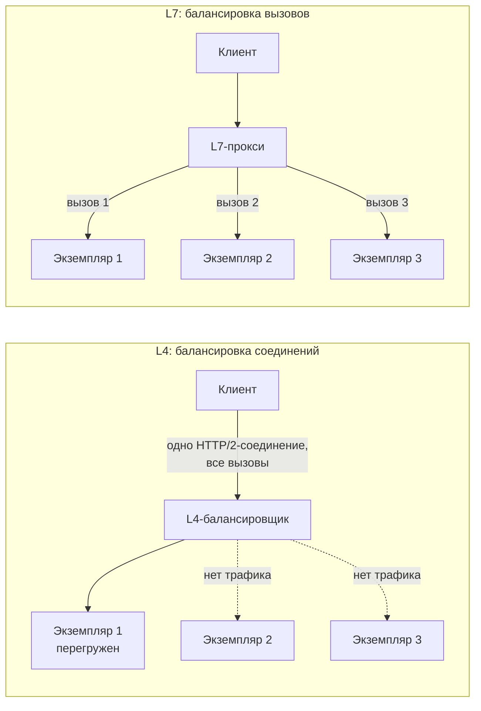

# 8.2 gRPC и GraphQL: когда не REST

## Зачем это аналитику

REST — не единственный вариант синхронного API. gRPC выигрывает во внутренних высоконагруженных взаимодействиях, GraphQL — там, где клиентам нужна гибкая выборка данных. Архитектор должен уметь обосновать выбор и знать, чем каждый из них платит.

## Что понять

- [ ] gRPC: HTTP/2, Protocol Buffers, генерация клиентов из контракта, четыре вида вызовов (унарный, серверный, клиентский и двунаправленный стриминг).
- [ ] Protobuf и эволюция контракта: номера полей, добавление и удаление полей без поломки клиентов.
- [ ] Плюсы и минусы gRPC: производительность и строгий контракт против сложности для браузеров, отладки и балансировки на L7.
- [ ] Дедлайны, отмена, статусы ошибок в gRPC; балансировка долгоживущих HTTP/2-соединений.
- [ ] GraphQL: схема, запросы, мутации, подписки; клиент выбирает поля.
- [ ] Проблемы GraphQL: N+1 и DataLoader, сложность и глубина запросов, кэширование, авторизация на уровне полей.
- [ ] Где уместен каждый: публичный API, внутренние сервисы, BFF для мобильного и веб-клиента, партнёрские интеграции.

## Урок

<!-- LESSON:START -->
REST над HTTP и JSON стал вариантом по умолчанию, потому что он понятен всем: браузеру, партнёру, тестировщику с curl. У этого удобства есть цена: текстовый формат, отсутствие строгого контракта «из коробки» и фиксированная форма ответа, которую задаёт сервер. gRPC и GraphQL устраняют разные части этой цены и добавляют свою. gRPC делает вызов быстрым и строго типизированным, GraphQL отдаёт клиенту право выбирать форму ответа. Решают они разные задачи, и сравнивать их между собой имеет смысл только в контексте конкретного потребителя.

Сквозной пример урока — сервис остатков розничной сети: остаток товара в магазине, список остатков по магазину, поток изменений остатков.

### gRPC: механика

gRPC — фреймворк удалённого вызова процедур, который использует три опоры.

**HTTP/2 как транспорт.** Одно TCP-соединение несёт много параллельных потоков (streams), запросы не ждут друг друга, заголовки сжимаются. Соединение долгоживущее: клиент открывает его один раз и гоняет по нему тысячи вызовов.

**Protocol Buffers как язык контракта и формат сериализации.** Контракт пишется в файле `.proto`, данные передаются в компактном бинарном виде. В бинарном сообщении нет имён полей, только их номера и значения, поэтому оно меньше JSON и быстрее разбирается.

**Генерация кода.** Из `.proto` компилятор `protoc` с плагинами генерирует клиентские заглушки (stubs) и серверные интерфейсы на нужных языках. Клиент на Java и сервер на Go работают с одним контрактом, а ошибки несовпадения типов ловятся при сборке, а не в проде.

Контракт сервиса остатков может выглядеть так:

```protobuf
syntax = "proto3";

package retail.stock.v1;

import "google/protobuf/timestamp.proto";

service StockService {
  // Унарный: остаток одного товара в одном магазине
  rpc GetStock(GetStockRequest) returns (StockLevel);
  // Серверный стриминг: все остатки магазина потоком
  rpc ListStoreStock(ListStoreStockRequest) returns (stream StockLevel);
  // Серверный стриминг: изменения остатков в реальном времени
  rpc WatchStock(WatchStockRequest) returns (stream StockChange);
}

message GetStockRequest {
  string store_id = 1;
  string sku = 2;
}

message ListStoreStockRequest {
  string store_id = 1;
}

message WatchStockRequest {
  repeated string store_ids = 1;
}

message StockLevel {
  string store_id = 1;
  string sku = 2;
  int64 quantity = 3;       // в минимальных единицах учёта
  google.protobuf.Timestamp updated_at = 4;
}

message StockChange {
  StockLevel level = 1;
  int64 delta = 2;
  string reason = 3;        // продажа, приёмка, списание
}
```

#### Четыре вида вызовов

| Вид | Сигнатура | Пример в рознице |
|---|---|---|
| Унарный (unary) | один запрос, один ответ | получить остаток товара в магазине |
| Серверный стриминг (server streaming) | один запрос, поток ответов | выгрузить все остатки магазина, подписаться на изменения |
| Клиентский стриминг (client streaming) | поток запросов, один ответ | касса отправляет пачку чеков за смену, сервер отвечает итогом приёма |
| Двунаправленный стриминг (bidirectional streaming) | два независимых потока | терминал сборщика на складе: отправляет сканы, получает подсказки и корректировки заданий |

Стриминг — одно из реальных преимуществ gRPC перед REST: не нужно изобретать long polling или отдельный WebSocket-протокол. Но и цена стриминга реальна: долгие потоки нужно переустанавливать при обрыве, продолжать с места остановки и учитывать в балансировке.

### Protobuf и эволюция контракта

Главное, что нужно понять про protobuf: идентичность поля — это его **номер**, а не имя. В бинарных данных записано «поле 3, значение 42». Отсюда выводятся все правила совместимости.

- **Добавлять поля можно.** Старый клиент, получив сообщение с неизвестным полем, пропустит его (в актуальных версиях protobuf неизвестные поля ещё и сохраняются при пересылке). Новый клиент, не получив поле от старого сервера, увидит значение по умолчанию.
- **Удалять поле можно, но номер нужно зарезервировать.** Если номер позже переиспользовать под другое поле, старые клиенты прочитают новые данные как старые, с другим смыслом. Это тихая порча данных, худший вид ошибки.
- **Менять номер поля нельзя.** Для протокола это удаление старого поля и добавление нового.
- **Менять тип поля в общем случае нельзя.** Есть узкие пары совместимых типов, но полагаться на них в командном правиле не стоит.
- **Переименовывать поле** безопасно для бинарного формата, но ломает JSON-представление и сгенерированный код клиентов, которые его используют.
- **Значения по умолчанию.** В proto3 у скалярного поля без пометки `optional` нельзя отличить «не передано» от «передан ноль». Для остатка это критично: ноль и «нет данных» — разные вещи. Решение — `optional` или обёртки из стандартных типов.
- **Перечисления.** Первое значение должно быть нулевым; его принято делать `..._UNSPECIFIED`. Добавление значений допустимо, но старые клиенты получат неизвестное число и должны уметь с ним жить.

Удаление поля выглядит так:

```protobuf
message StockLevel {
  reserved 5;
  reserved "reserved_quantity";
  string store_id = 1;
  string sku = 2;
  int64 quantity = 3;
  google.protobuf.Timestamp updated_at = 4;
}
```

Ломающие изменения, которые всё-таки нужны, выпускают в новом пакете (`retail.stock.v2`) и какое-то время поддерживают обе версии. Проверку совместимости стоит автоматизировать: существуют линтеры и детекторы ломающих изменений для protobuf, которые сравнивают новый контракт с предыдущим и блокируют сборку.

### Плюсы и минусы gRPC

Плюсы: компактный формат и HTTP/2 дают меньшую задержку и нагрузку на CPU при большом потоке вызовов; строгий контракт с генерацией кода; стриминг в обе стороны; единый набор механизмов для дедлайнов, отмены, метаданных и ошибок.

Минусы:

- **Браузеры.** Браузерный JavaScript не даёт достаточно низкоуровневого контроля над HTTP/2, чтобы работать с gRPC напрямую. Нужен gRPC-Web и прокси, который его переводит, причём gRPC-Web поддерживает не все виды вызовов: клиентский и двунаправленный стриминг недоступны.
- **Отладка.** Бинарный трафик не прочитать глазами, для ручного вызова нужны специальные утилиты и доступ к контракту или reflection-сервису.
- **Балансировка** требует особого подхода (ниже).
- **Инфраструктура.** Не каждый корпоративный прокси, WAF или API-шлюз корректно пропускает HTTP/2 с трейлерами.
- **Внешние партнёры** обычно ожидают REST или файлы; требовать от них gRPC — повышать порог входа.

### Дедлайны, отмена, ошибки

**Дедлайн (deadline)** — момент, после которого ответ клиенту уже не нужен. Клиент задаёт его при вызове, gRPC передаёт оставшееся время серверу в метаданных. Если сервер сам вызывает другие сервисы, он должен передать им дедлайн дальше (deadline propagation). Тогда вся цепочка знает общий бюджет времени, и нижний сервис не будет десять секунд считать ответ, который верхнему был нужен через две. Вызов без дедлайна в gRPC ждёт сколь угодно долго, поэтому правило «каждый вызов с дедлайном» стоит записать в стандарты команды.

**Отмена (cancellation)** распространяется так же: если клиент отменил вызов или истёк дедлайн, сервер получает сигнал и может прекратить работу. Сервер должен этот сигнал проверять, иначе он продолжит тратить ресурсы впустую.

**Статусы ошибок.** Вместо HTTP-кодов gRPC возвращает собственный код статуса и сообщение. Самые частые:

- `INVALID_ARGUMENT` — некорректный запрос, повторять бессмысленно;
- `NOT_FOUND`, `ALREADY_EXISTS`, `PERMISSION_DENIED`, `UNAUTHENTICATED`;
- `FAILED_PRECONDITION` — система не в том состоянии для операции;
- `RESOURCE_EXHAUSTED` — превышена квота или лимит;
- `DEADLINE_EXCEEDED` — истёк дедлайн;
- `UNAVAILABLE` — временная недоступность, типичный кандидат на повтор с задержкой;
- `INTERNAL` — ошибка на стороне сервера.

Для аналитика важна та же дисциплина, что и в REST: в постановке перечислить, какие коды возвращает метод и в каких случаях, какие из них клиент может повторять. Для бизнес-деталей ошибки (какие строки не прошли проверку) используется расширенная модель ошибок с типизированными деталями.

### Балансировка долгоживущих соединений

Балансировщик уровня L4 распределяет TCP-соединения, а не запросы. Клиент gRPC открывает одно соединение и мультиплексирует через него все вызовы. В итоге весь трафик клиента попадает на один экземпляр сервера, пока соединение живо. Когда под нагрузку добавляют новые экземпляры, существующие клиенты про них не узнают: соединения уже установлены.



Способы решения:

- **L7-прокси**, понимающий HTTP/2 и распределяющий отдельные вызовы (например, Envoy или sidecar сервисной сетки).
- **Балансировка на клиенте**: клиент получает список адресов экземпляров через сервис имён и сам раскладывает вызовы по нескольким соединениям.
- **Ограничение возраста соединения на сервере**: сервер периодически корректно закрывает соединения, клиенты переподключаются и заново распределяются. Это смягчает проблему, но не решает её полностью.

### GraphQL: механика

GraphQL — язык запросов к API и среда выполнения для них. Сервер публикует **схему** — типизированный граф сущностей и связей. Клиент присылает запрос, в котором перечисляет, какие поля и связи ему нужны, и получает ответ ровно такой формы. Как правило, всё идёт через одну конечную точку методом POST.

Тот же сервис остатков в виде GraphQL-схемы:

```graphql
type Query {
  stock(storeId: ID!, sku: ID!): StockLevel
  store(id: ID!): Store
}

type Store {
  id: ID!
  name: String!
  stock(first: Int = 50, after: String): StockPage!
}

type StockPage {
  items: [StockLevel!]!
  nextCursor: String
}

type StockLevel {
  store: Store!
  product: Product!
  quantity: Int!
  updatedAt: String!
}

type Product {
  sku: ID!
  name: String!
  category: String
}

type Mutation {
  adjustStock(storeId: ID!, sku: ID!, delta: Int!, reason: String!): StockLevel!
}

type Subscription {
  stockChanged(storeId: ID!): StockLevel!
}
```

Мобильное приложение для сотрудника магазина делает запрос:

```graphql
query StoreShelf {
  store(id: "S-015") {
    name
    stock(first: 20) {
      items {
        quantity
        product { sku name }
      }
      nextCursor
    }
  }
}
```

Три вида операций:

- **Запрос (query)** — чтение. Поля выполняются независимо, поэтому могут выполняться параллельно.
- **Мутация (mutation)** — изменение. Корневые поля мутации выполняются последовательно.
- **Подписка (subscription)** — поток событий от сервера, обычно поверх WebSocket.

Каждое поле в схеме обслуживает функция-резолвер (resolver). Схема ничего не говорит о том, откуда берутся данные: резолвер может сходить в базу, в REST-сервис, в gRPC-сервис. Поэтому GraphQL часто ставят слоем над несколькими источниками.

Сравнение размеров контрактов: `.proto` и GraphQL-схема здесь сопоставимы, а эквивалентный OpenAPI обычно заметно длиннее, потому что описывает пути, коды ответов и схемы для каждого. Но длина не главное: `.proto` описывает операции, GraphQL — граф данных, по которому клиент сам строит нужные ему операции.

### Проблемы GraphQL

**N+1.** В запросе выше резолвер `stock` возвращает 20 строк, и для каждой вызывается резолвер `product`. Если он делает отдельный запрос в каталог, получается 1 запрос за остатками и 20 за товарами. При вложенности число запросов растёт быстро. Решение — пакетная загрузка через DataLoader: резолверы в пределах одного запроса не ходят в источник сразу, а регистрируют ключи; загрузчик собирает их и делает один запрос `WHERE sku IN (...)`, заодно кэшируя результат в рамках запроса. Кэш DataLoader живёт в пределах одного запроса, это не кэш между пользователями.

**Тяжёлые запросы.** Клиент сам решает, что запросить, значит может запросить слишком много: глубоко вложенные связи (магазин, остатки, товар, поставщики товара, их магазины) или огромные списки. Защита строится в несколько слоёв:

- ограничение глубины запроса;
- анализ стоимости: каждому полю назначается вес, списки умножаются на запрошенный размер страницы, запрос выше порога отклоняется до выполнения;
- обязательная пагинация с максимальным размером страницы;
- таймаут выполнения и лимит запросов с учётом стоимости, а не только числа;
- для собственных клиентов — сохранённые запросы (persisted queries) или белый список: клиент отправляет идентификатор заранее зарегистрированного запроса, и произвольные запросы в проде не принимаются.

**Кэширование.** Одна конечная точка и POST лишают GraphQL обычного HTTP-кэширования по URL. Варианты: сохранённые запросы через GET, которые можно кэшировать на CDN; нормализованный кэш на клиенте по типу и идентификатору; кэш на уровне резолверов и источников данных.

**Авторизация на уровне полей.** Проверки «можно ли вызвать эндпоинт» недостаточно: один и тот же тип доступен через разные пути графа. Если поле `purchasePrice` у товара видно только категорийным менеджерам, проверка должна жить в резолвере этого поля или в бизнес-слое под ним, а не в обработчике конкретного запроса. Иначе кто-нибудь дойдёт до этого поля по другой связи.

**Ошибки.** Ответ GraphQL может одновременно содержать данные и массив ошибок, а HTTP-статус при этом часто 200. Мониторинг по HTTP-кодам ничего не покажет; клиенты должны уметь работать с частичным ответом.

### Где что уместно

| Сценарий | Разумный выбор | Почему |
|---|---|---|
| Публичный API, партнёрские интеграции | REST (OpenAPI) | Низкий порог входа, стандартные инструменты, кэширование и шлюзы |
| Внутренние вызовы между сервисами с высокой нагрузкой | gRPC | Производительность, строгий контракт, стриминг, дедлайны |
| BFF для мобильного и веб-клиента с разными экранами | GraphQL | Клиент берёт ровно нужные поля одним запросом, меньше версий BFF |
| Потоковая передача изменений между сервисами | gRPC-стриминг или брокер сообщений | Зависит от того, нужна ли персистентность и много потребителей |
| Партнёр, которому нужна гибкая выборка из большого каталога | GraphQL возможен | Только с лимитами стоимости, пагинацией и контрактом на поддержку |

Эти варианты не исключают друг друга. Частая схема: сервисы внутри общаются по gRPC, GraphQL-слой для своих клиентов собирает ответы из них, наружу для партнёров выставлен REST. Для большого числа команд GraphQL-слой собирают из подграфов (федерация), где каждая команда владеет своей частью схемы.

При выборе стоит задать вопросы: кто клиенты и на каких платформах; насколько разнородны их потребности в данных; какой поток вызовов и требования к задержке; какая у команды экспертиза и какие шлюзы, прокси и средства мониторинга уже есть.

### Типичные ошибки

- Выбирать gRPC для публичного API ради производительности и получить партнёров, которые не могут подключиться без прокси и специальных инструментов.
- Переиспользовать номер удалённого protobuf-поля вместо резервирования и получить тихую порчу данных у старых клиентов.
- Не задавать дедлайны на вызовах и не передавать их по цепочке, из-за чего запросы висят и копят нагрузку.
- Ставить gRPC за L4-балансировщик и удивляться, что новые экземпляры простаивают.
- Открывать GraphQL наружу без ограничений глубины, стоимости и размера страницы.
- Проверять права в GraphQL только на уровне запроса, а не поля, и открыть чувствительное поле через обходную связь.
- Не использовать пакетную загрузку и получать сотни запросов к базе на один запрос клиента.

### Как говорить об этом на собеседовании

Senior-кандидат не выбирает технологию «потому что быстрее» или «потому что модно», а начинает с потребителей и ограничений. Хорошая формулировка: «Внутри контура между сервисом остатков и сервисом резервирования — gRPC: высокий поток, оба сервиса наши, нужен стриминг изменений. Мобильному приложению сотрудников — GraphQL-слой, потому что экранов много и каждому нужен свой срез. Партнёрам — REST, потому что у них разные стеки и нам важен низкий порог входа».

Покажите знание цены каждого решения: для gRPC — балансировка, браузеры, дедлайны, правила эволюции protobuf; для GraphQL — N+1 и DataLoader, лимиты стоимости, авторизация по полям, кэширование. Если спрашивают «когда не GraphQL», нормальный ответ — «когда клиентов мало, их потребности одинаковы и REST с парой вариантов ответа проще сопровождать».

### Коротко

- gRPC — HTTP/2, protobuf и генерация кода; четыре вида вызовов, включая стриминг в обе стороны.
- В protobuf поле определяется номером: добавлять можно, удалять — с резервированием номера, менять номер и тип нельзя.
- gRPC силён во внутренних высоконагруженных вызовах, слаб для браузеров, отладки и внешних партнёров.
- Каждый вызов должен иметь дедлайн, передаваемый по цепочке; коды статусов определяют, можно ли повторять.
- Долгоживущие HTTP/2-соединения требуют L7-балансировки или балансировки на клиенте.
- GraphQL отдаёт клиенту выбор полей и хорош как BFF над несколькими источниками.
- Цена GraphQL — N+1, тяжёлые запросы, сложное кэширование и авторизация на уровне полей.
- Типичная архитектура сочетает gRPC внутри, GraphQL для своих клиентов и REST для партнёров.
<!-- LESSON:END -->

## Читать дальше

- grpc.io — Core concepts, Deadlines, Error handling.
- protobuf.dev — Language Guide (proto3), раздел об обновлении сообщений.
- graphql.org/learn — основы, Best Practices, Security.

На system-design.space:

- [Удалённые вызовы API: REST, gRPC и GraphQL](https://system-design.space/chapter/remote-call-approaches/)
- [Learning GraphQL (short summary)](https://system-design.space/chapter/learning-graphql-book/)
- [API Design Patterns (short summary)](https://system-design.space/chapter/api-design-patterns-book/)
- [Web API Design: The Missing Link (short summary)](https://system-design.space/chapter/web-api-design-book/)

## Практика

1. Описать один и тот же сервис (например, «остатки товаров») в трёх вариантах: OpenAPI, .proto и GraphQL-схема. Сравнить размер контракта и удобство для разных клиентов.
2. Составить правила эволюции protobuf-контракта для команды: что можно менять, что нельзя.
3. Для GraphQL-API сформулировать ограничения: глубина, стоимость запроса, пагинация, авторизация по полям.

## Вопросы для самопроверки

1. Когда выбрать gRPC вместо REST?
2. Как менять protobuf-контракт, не ломая клиентов?
3. Почему gRPC плохо работает с L4-балансировщиком?
4. Какую проблему решает GraphQL и какую создаёт?
5. Что такое проблема N+1 в GraphQL и как её решают?
6. Как защитить GraphQL-API от слишком тяжёлых запросов?

## Заметки

<!-- Свои формулировки, ошибки, ссылки. -->
