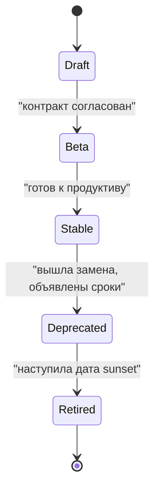
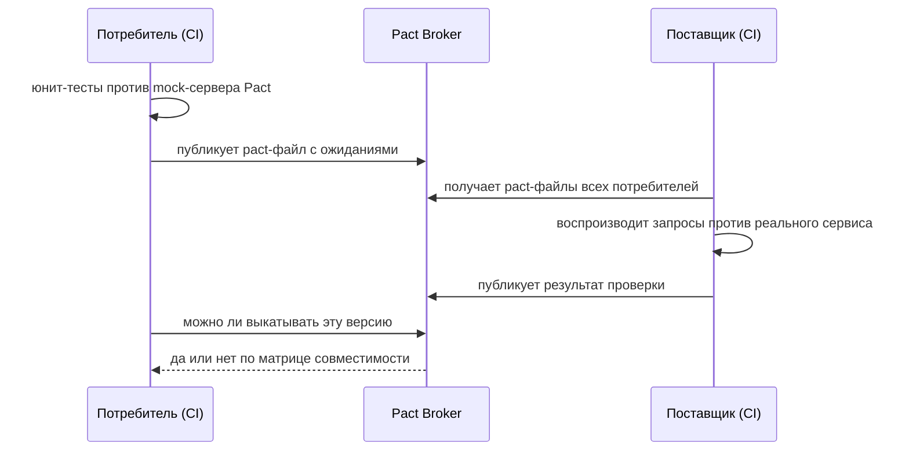

# 8.3 Жизненный цикл API: контракты, версии, управление

## Зачем это аналитику

API живёт годами и переживает несколько поколений клиентов. Контракт-первый подход, правила совместимости, каталог API, процесс вывода версий из эксплуатации — это то, что отличает «сделали эндпоинт» от «управляем API как продуктом». Для аналитика, который пишет контракты, это прямая зона ответственности.

## Что понять

- [ ] Contract-first против code-first: плюсы, инструменты (OpenAPI, AsyncAPI, protobuf), генерация кода и документации.
- [ ] Совместимость: обратная и прямая; правила «можно добавлять, нельзя удалять и менять смысл»; tolerant reader.
- [ ] Стратегии версионирования и вывода из эксплуатации: заголовки Deprecation и Sunset, сроки, коммуникация с потребителями.
- [ ] Контрактное тестирование (consumer-driven contracts, Pact): как поймать ломающее изменение до релиза.
- [ ] Линтинг контрактов и стиль API: единые правила именования, ошибок, пагинации.
- [ ] Каталог API и портал разработчика; API как продукт; метрики использования.
- [ ] API management: gateway, ключи, тарифы, аналитика.

## Урок

<!-- LESSON:START -->
Эндпоинт делается за день, а живёт годами. За это время у него появляются клиенты, о которых команда не знала, меняются требования, уходят разработчики, писавшие первую версию. Управление жизненным циклом API — это набор практик, которые позволяют менять API, не ломая клиентов, и в любой момент ответить на вопросы: какие API у нас есть, кто ими владеет, кто их вызывает, какие версии живы и когда умрут.

Сквозной пример — API регистратора доменов для реселлеров: регистрация и продление доменов, управление контактами, выписка по балансу реселлера.

### Contract-first и code-first

**Code-first**: разработчик пишет контроллеры, а спецификация генерируется из кода аннотациями. **Contract-first** (он же design-first): сначала пишется и согласуется контракт, потом по нему генерируется или пишется код.

Преимущества contract-first:

- Контракт обсуждается до реализации, когда изменение стоит дёшево. Потребители могут дать обратную связь по макету, а не по готовому сервису.
- Клиенты и сервер разрабатываются параллельно: по контракту поднимается заглушка (mock server), клиентская команда не ждёт бэкенд.
- Контракт становится единым источником правды для кода, документации, тестов и шлюза.
- Контракт проходит ревью и автоматические проверки стиля и совместимости как обычный код.

Где contract-first неудобен:

- На ранней стадии, когда модель данных ещё меняется каждый день, и поддерживать синхронность спецификации и прототипа дороже, чем пользы от неё.
- Во внутренних API одной команды, у которых один потребитель в том же репозитории.
- Когда генераторы кода плохо поддерживают нужные конструкции спецификации, и команда тратит время на борьбу с генератором.

Code-first тоже может давать качественные контракты, если спецификация генерируется в сборке и проходит те же проверки. Главное различие не в том, что написано первым, а в том, считается ли контракт артефактом, который проектируют и ревьюят, или побочным продуктом кода.

Инструменты по типу взаимодействия:

| Тип API | Язык контракта | Что генерируется |
|---|---|---|
| Синхронный HTTP (REST) | OpenAPI | клиенты, серверные заглушки, документация, mock-сервер |
| Асинхронный (события в брокере) | AsyncAPI, схемы в реестре (Avro, JSON Schema, protobuf) | модели сообщений, документация каналов |
| gRPC | protobuf | клиенты и серверные интерфейсы |
| GraphQL | SDL-схема | типы для клиента и сервера |

### Совместимость

**Обратная совместимость (backward compatibility)**: новая версия API работает с клиентами, написанными под старую. Это главное требование к серверу: выкатили изменение — старые клиенты не заметили.

**Прямая совместимость (forward compatibility)**: старая сторона корректно обрабатывает данные от новой. Для HTTP API это прежде всего клиент, который получает в ответе поля, появившиеся после его выпуска. Для событий — старый потребитель, читающий сообщение новой схемы.

Прямая совместимость достигается поведением читателя. Паттерн **терпимый читатель (tolerant reader)**: клиент берёт из сообщения только нужные ему поля, игнорирует незнакомые, не проверяет порядок полей и не падает на незнакомом значении перечисления. Строгая валидация ответа по схеме с запретом дополнительных полей на стороне клиента превращает любое добавление поля в ломающее изменение.

Базовое правило: **можно добавлять, нельзя удалять и менять смысл.** На практике список ломающих изменений длиннее, чем кажется.

| Изменение | Ломающее? | Комментарий |
|---|---|---|
| Новое необязательное поле в ответе | Нет | при условии терпимых читателей |
| Новый необязательный параметр в запросе | Нет | если отсутствие параметра даёт прежнее поведение |
| Новый эндпоинт | Нет | |
| Удаление или переименование поля | Да | |
| Изменение типа или формата поля | Да | например, сумма из числа в строку |
| Необязательный параметр стал обязательным | Да | |
| Ужесточение валидации | Да | старые клиенты начнут получать 400 |
| Новое значение в перечислении ответа | Зависит | ломает клиентов со строгой обработкой перечислений |
| Изменение значения по умолчанию | Да, по смыслу | формально контракт не изменился, поведение изменилось |
| Изменение кодов ошибок или статусов | Да | клиенты ветвятся по ним |
| Изменение смысла поля при той же схеме | Да | самое опасное: схема проверки не поймает |

Пример смены смысла: в API регистратора поле `period` в запросе продления означало число лет, а новая команда решила, что это месяцы, «потому что так гибче». Схема не изменилась, линтер промолчал, а реселлеры продлили домены на 1 месяц вместо 1 года. Такие изменения ловятся только описанием семантики в контракте и контрактными тестами на реальных сценариях.

### Версионирование и вывод из эксплуатации

Сначала о том, как избежать новых версий. Большинство изменений можно сделать аддитивно: добавить поле, добавить эндпоинт, добавить параметр со старым поведением по умолчанию. Версия нужна, когда без поломки не обойтись: меняется модель ресурса, структура ошибок, правила авторизации.

Способы указать версию:

- **В пути**: `/v2/domains`. Наглядно, просто маршрутизировать на шлюзе, легко увидеть в логах. Самый распространённый вариант.
- **В заголовке или типе содержимого**: версия передаётся в собственном заголовке или в параметре медиатипа. URL остаются стабильными, но версию сложнее увидеть и протестировать вручную.
- **В параметре запроса**: встречается, но смешивает версию с параметрами ресурса.
- **Датированные версии**: клиент закрепляет дату версии, сервер применяет к ответу преобразования между датами. Удобно для потребителя, но требует от поставщика инфраструктуры преобразований.

Что версионировать — весь API или отдельные ресурсы — решается один раз и записывается в гайдлайн. Смешивание подходов внутри одной организации создаёт путаницу.

Вывод версии из эксплуатации — отдельный процесс со сроками и коммуникацией, а не день, когда удалили код.



Шаги вывода из эксплуатации:

1. **Решение и срок.** Срок зависит от потребителей: для внутренних клиентов бывает достаточно нескольких недель, для внешних партнёров и публичных API речь идёт о месяцах, часто полугоде или годе. Срок фиксируется в политике API заранее, до того как понадобится.
2. **Объявление.** Статус в каталоге и документации, рассылка владельцам известных клиентов, руководство по миграции со сравнением старого и нового контракта.
3. **Сигналы в самом API.** Ответы устаревшей версии несут заголовки, которые клиентские библиотеки и мониторинг могут заметить автоматически. Заголовок `Sunset` описан в RFC 8594 и указывает дату, после которой ресурс перестанет отвечать. Заголовок `Deprecation` стандартизирован позже, в RFC 9745 (2025): его значение — дата в формате structured fields (`@` и Unix-время), с которой ресурс устарел; дата `Sunset` не должна быть раньше неё. Ссылка с отношением `deprecation` указывает на документ с деталями.

```http
HTTP/1.1 200 OK
Content-Type: application/json
Deprecation: @1790812800
Sunset: Thu, 01 Apr 2027 00:00:00 GMT
Link: </docs/migration/v1-to-v2>; rel="deprecation"
```

4. **Отслеживание миграции.** По метрикам шлюза видно, какие ключи и клиенты ещё вызывают старую версию. Им пишут персонально, а не общей рассылкой.
5. **Плановые отключения (brownouts).** За некоторое время до финальной даты старая версия отключается на короткие окна по расписанию. Клиенты, которые пропустили все письма, узнают о проблеме, пока её ещё можно исправить.
6. **Отключение.** После даты sunset версия возвращает понятную ошибку, например `410 Gone` со ссылкой на новую версию, а не просто исчезает с `404`.

Для асинхронных контрактов логика та же, но сложнее: публикатор не всегда знает потребителей, поэтому реестр схем и каталог подписок становятся обязательными. На время миграции событие публикуют в двух версиях схемы или в двух топиках.

### Контрактное тестирование

Интеграционные тесты «поднять все сервисы и прогнать сценарий» медленные, хрупкие и находят проблему поздно. Контрактные тесты проверяют каждую пару «потребитель — поставщик» по отдельности и быстро.

**Consumer-driven contracts**: контракт формируют потребители. Каждый потребитель фиксирует, какие запросы он делает и какие части ответа использует. Поставщик обязан удовлетворять всем таким ожиданиям. Ценность в том, что поставщик узнаёт не «что написано в спецификации», а «что на самом деле используют клиенты», и может смело менять всё остальное.

Как это работает в Pact:



- Потребитель пишет тест, в котором описывает взаимодействие: «при запросе продления домена `example.shop` на 1 год ожидаю ответ 200 с полями `domain`, `expiresAt`, `status`». Тест выполняется против mock-сервера, который Pact поднимает сам, и на выходе появляется pact-файл.
- Pact-файл публикуется в брокер с версией потребителя.
- Сборка поставщика забирает контракты всех потребителей и воспроизводит запросы против настоящего сервиса. Для подготовки данных используются состояния поставщика (provider states): «домен существует и оплачен».
- Перед выкладкой любая сторона спрашивает брокер, совместима ли её версия с версиями партнёров, развёрнутыми в целевом окружении. Если нет — релиз блокируется.

Организационные вопросы важнее инструмента. Кто пишет тесты — команда-потребитель. Где они запускаются — в CI обеих сторон. Что блокирует релиз — провал проверки поставщика против контрактов потребителей, развёрнутых в проде. Если у потребителей нет своего CI или это внешние партнёры, подход работает хуже: тогда поставщик полагается на проверку совместимости спецификаций и на тесты по примерам из документации.

Альтернатива — сравнение спецификаций: инструменты для OpenAPI и protobuf сравнивают новую версию контракта с предыдущей и перечисляют ломающие изменения. Это дешевле, но ловит только структурные поломки, а не изменения смысла и поведения.

### Линтинг и стиль API

Гайдлайн по API — документ, который отвечает на повторяющиеся вопросы один раз для всех команд: именование ресурсов и полей (множественное число, регистр), формат дат и сумм, структура ошибок, пагинация, фильтрация и сортировка, идемпотентность, версии и совместимость, заголовки.

Гайдлайн без автоматической проверки быстро перестают читать. Правила переносят в линтер спецификаций: для OpenAPI распространён Spectral с собственными наборами правил, для protobuf есть линтеры в составе инструментов сборки контрактов. Линтер запускается в CI на каждом изменении контракта, и ревьюеры обсуждают смысл, а не регистр букв.

Примеры правил, которые стоит автоматизировать:

- все ответы с ошибкой используют единую схему (например, формат problem details);
- списки поддерживают пагинацию с ограниченным максимальным размером страницы;
- у каждой операции есть описание и уникальный идентификатор;
- поля в одном стиле именования, даты в ISO 8601;
- у каждого API указан владелец и статус жизненного цикла.

### Каталог API и API как продукт

Когда API десятки и сотни, возникают вопросы, на которые без каталога никто не ответит: есть ли уже API для выписки по балансу, кто владелец этого эндпоинта, кого затронет изменение, почему две команды сделали почти одинаковые сервисы.

**Каталог API** — реестр всех API с метаданными: владелец, назначение, контракт, статус жизненного цикла, среды, известные потребители, SLA. Каталог наполняется из репозиториев автоматически, иначе он устаревает за квартал. Для внутренних сервисов роль каталога часто играет портал разработчика общего назначения.

**Портал разработчика** — витрина для потребителей: документация, руководство по началу работы, песочница, самостоятельный выпуск ключей, журнал изменений, объявления о выводе из эксплуатации.

Подход **«API как продукт»** означает, что у API есть владелец, целевая аудитория, дорожная карта и метрики успеха, а не только исполнитель задачи. Типичные метрики:

- число активных потребителей и динамика подключений;
- время до первого успешного вызова (time to first call) для нового потребителя;
- распределение вызовов по версиям и скорость миграции с устаревших;
- доля ошибок по кодам, задержка по перцентилям;
- обращения в поддержку на тысячу вызовов.

Для реселлерского API регистратора это прямо связано с выручкой: если подключение нового реселлера занимает недели из-за документации и ручной выдачи доступов, продукт теряет партнёров.

### API management

Платформа управления API объединяет несколько функций.

- **Шлюз (gateway)**: единая точка входа, аутентификация по ключам или токенам OAuth, ограничение частоты и квоты, маршрутизация на версии, TLS, базовая трансформация заголовков, журналирование.
- **Ключи и клиенты**: выпуск, отзыв и ротация, привязка к приложению и владельцу. Ключ нужен не только для безопасности: без идентификации клиента нельзя понять, кого затронет вывод версии из эксплуатации.
- **Тарифы (plans)**: наборы лимитов и доступных API для разных категорий клиентов, например бесплатный тестовый доступ, стандартный реселлер, крупный реселлер с повышенными квотами.
- **Аналитика**: вызовы по клиентам, версиям и операциям, ошибки, задержки. Это источник метрик продукта и основа для решений о выводе версий.

Граница ответственности: шлюз решает сквозные задачи, но не должен содержать бизнес-логику. Когда в шлюзе появляются правила вроде «для реселлеров из этой группы подставлять скидку», логика расползается между шлюзом и сервисом, и её никто не тестирует.

### Типичные ошибки

- Считать «добавить обязательный параметр» или «ужесточить валидацию» неломающим изменением.
- Менять смысл поля при неизменной схеме и полагаться на то, что линтер или сравнение спецификаций это поймает.
- Писать клиентов со строгой валидацией ответа, которые падают на любом новом поле.
- Объявлять вывод версии из эксплуатации только в документации, без заголовков, метрик по клиентам и персональных писем.
- Выпускать API без идентификации клиентов и потом не знать, кого затронет изменение.
- Вести гайдлайн по API как текст без линтера в CI.
- Заводить каталог API, который заполняется вручную и устаревает через несколько месяцев.

### Как говорить об этом на собеседовании

Senior-уровень виден по тому, что вы говорите о процессе и последствиях, а не о синтаксисе OpenAPI. Сильные формулировки: «контракт у нас проходит ревью и линтер до реализации, по нему поднимается mock для клиентской команды»; «ломающее изменение мы определяем не только по схеме, но и по смыслу — пример с периодом продления»; «версию выводим по политике: объявление, заголовки Deprecation и Sunset, метрики по ключам, персональная работа с отстающими, плановые отключения, 410 после даты».

Хорошо показать связь между практиками: идентификация клиентов на шлюзе даёт метрики, метрики позволяют выводить версии, каталог показывает владельцев и потребителей, контрактные тесты не дают сломать их незаметно. Если у вас был опыт миграции партнёров со старой версии API, расскажите его с цифрами: сколько было клиентов, сколько длилась миграция, что пошло не так.

### Коротко

- Contract-first делает контракт проектным артефактом: ревью, mock-сервер, параллельная разработка, единый источник для кода и документации.
- Обратная совместимость защищает старых клиентов от нового сервера, прямая — старого читателя от новых данных; второе обеспечивает tolerant reader.
- Добавлять можно, удалять и менять смысл нельзя; изменение смысла при той же схеме — самая опасная поломка.
- Большинство изменений делается аддитивно; новая версия — крайняя мера со своим процессом вывода старой.
- Вывод из эксплуатации включает сроки, заголовки Deprecation и Sunset, метрики по клиентам, коммуникацию и плановые отключения.
- Consumer-driven contracts показывают поставщику, что реально используют клиенты, и блокируют ломающий релиз до выкладки.
- Каталог, портал и метрики превращают набор эндпоинтов в управляемый продукт.
- Шлюз решает сквозные задачи — ключи, лимиты, тарифы, аналитика — но не содержит бизнес-логику.
<!-- LESSON:END -->

## Читать дальше

- James Higginbotham, *Principles of Web API Design* (2021).
- Mehdi Medjaoui et al., *Continuous API Management* (2nd ed.).
- Документация Pact (docs.pact.io).

На system-design.space:

- [Continuous API Management (short summary)](https://system-design.space/chapter/continuous-api-book/)
- [Customer-friendly API: удобное API для клиентов](https://system-design.space/chapter/customer-friendly-api/)
- [API Design Patterns (short summary)](https://system-design.space/chapter/api-design-patterns-book/)

## Практика

1. Написать для своей команды гайдлайн по API на 2–3 страницы: именование, ошибки, пагинация, версии, совместимость, вывод из эксплуатации.
2. Взять обезличенный OpenAPI из модуля 1.3 и выпустить «версию 2» с ломающим изменением: описать план миграции клиентов и сроки.
3. Описать, как внедрить контрактные тесты между двумя сервисами: кто пишет, где запускаются, что блокирует релиз.

## Вопросы для самопроверки

1. Чем contract-first лучше code-first, и когда он неудобен?
2. Какие изменения контракта ломающие, а какие нет?
3. Как вывести версию API из эксплуатации, не сломав клиентов?
4. Что такое consumer-driven contract testing?
5. Зачем компании каталог API?

## Заметки

<!-- Свои формулировки, ошибки, ссылки. -->
