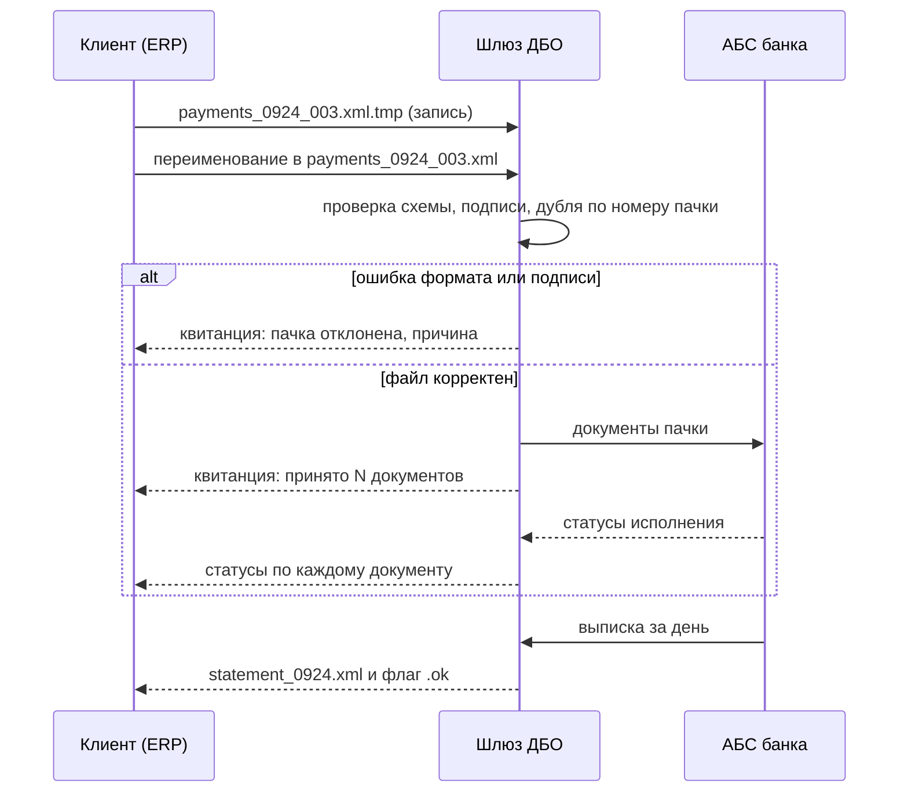
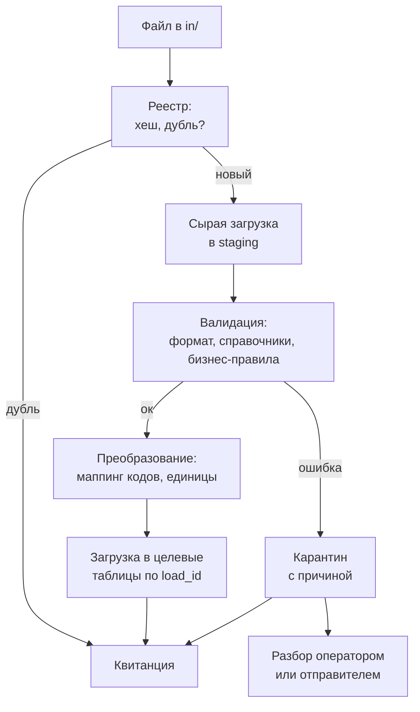

# 8.4 Пакетные и файловые интеграции, ETL и сверки

## Зачем это аналитику

Банки, поставщики, государственные системы и ERP до сих пор обмениваются файлами по расписанию. Это не «устаревший» способ, а часто лучший для больших объёмов и слабосвязанных партнёров. Но у него свои риски: частичные файлы, повторная загрузка, расхождения. Сверки и квитирование — обязательная часть таких интеграций, и их почти никогда не описывают в курсах.

## Что понять

- [ ] Когда пакетный обмен лучше онлайн-интеграции: объёмы, окна обработки, слабая связность, требования партнёра.
- [ ] Транспорт: SFTP, объектное хранилище, файловые шлюзы; безопасность (ключи, шифрование, подпись).
- [ ] Форматы: CSV, XML с XSD, JSON Lines, фиксированная ширина, EDI; кодировки и разделители — источник половины инцидентов.
- [ ] Протокол обмена: именование файлов, флаг готовности или атомарное переименование, контрольные суммы, квитанции о приёме.
- [ ] Идемпотентная загрузка: повторный приём того же файла, частичные файлы, откат пачки.
- [ ] ETL-конвейер: извлечение, валидация, преобразование, загрузка; карантин для ошибочных записей.
- [ ] Сверки (reconciliation): количественные и суммовые, построчные; квитирование платежей; разбор расхождений.
- [ ] Мониторинг: «файл не пришёл вовремя» — тоже инцидент.

## Урок

<!-- LESSON:START -->
### Файл как интерфейс

В пакетной интеграции контрактом служит не метод API, а файл: его имя, место, формат, момент появления и правила того, что считать «принятым». Всё, что в онлайн-интеграции делает протокол (HTTP-статусы, таймауты, повторы), здесь приходится явно договорить и записать в постановку. Если этого не сделать, каждая сторона додумает правила сама, и инциденты начнутся с первой нестандартной ситуации.

Удобно держать в голове, что пакетный обмен — это асинхронный обмен сообщениями с очень крупным сообщением и очень медленным каналом. Почти все вопросы, знакомые по брокерам, здесь те же: доставка, дубли, порядок, подтверждение, обработка ядовитых сообщений. Меняются только механизмы.

### Когда пакет лучше онлайна

Пакетный обмен выигрывает не потому, что он проще, а потому, что лучше подходит под определённые условия.

- **Объём и природа данных.** Выписка за день по сотням счетов, остатки по всем магазинам и SKU, прайс-лист поставщика на десятки тысяч позиций. Передавать это поштучными вызовами — значит платить накладными расходами на каждую запись и строить сложную логику «а всё ли дошло». Файл даёт естественную единицу целостности: «остатки на конец дня» — это один согласованный срез.
- **Окна обработки.** Закрытие операционного дня в банке, ночной расчёт прогноза и автозаказа в рознице. Потребителю не нужно каждое изменение по мере возникновения, ему нужен полный срез к определённому часу.
- **Слабая связность.** Стороны не должны быть одновременно доступны. Поставщик выложил файл в 02:00, ритейлер забрал в 04:00 — и никто не зависел от аптайма другого. Для партнёров с разным уровнем зрелости ИТ это часто единственный реалистичный вариант.
- **Требования партнёра и регулятора.** Банк, налоговая, крупная сеть задают свой формат и канал, и спорить с этим бессмысленно.
- **Аудит.** Файл — готовый артефакт для разбора споров: что именно пришло, когда и в каком виде. Его можно хранить, пересчитать хеш, показать контрагенту.

Где пакет проигрывает: когда нужна реакция в секундах (проверка лимита при платеже, резерв товара при заказе), когда объём мал, а частота высокая, и когда ошибка должна вернуться отправителю сразу, а не утренним отчётом. Типичная зрелая архитектура комбинирует оба способа: онлайн для операций, пакет для срезов и сверок.

### Транспорт и безопасность

**SFTP** — самый распространённый канал. Работает поверх SSH, аутентификация по ключам предпочтительнее паролей. Практические вопросы для постановки: кто генерирует ключевую пару и как передаётся открытый ключ, как проходит плановая смена ключей без остановки обмена (обычно сервер некоторое время принимает оба ключа), какие каталоги есть и у кого на что права. Классическая структура: `in/`, `out/`, `archive/`, `error/` с каждой стороны.

**Объектное хранилище** (S3-совместимое) удобно, когда обе стороны в облаке или когда нужны события о появлении объекта. Доступ — через временные ссылки или роли, а не общие долгоживущие ключи. Важное отличие от файловой системы: объект появляется атомарно, после завершения загрузки, поэтому проблемы «прочитали недописанный файл» здесь нет, а проблема «загрузили два файла из пачки из трёх» — есть.

**Файловые шлюзы и MFT** (managed file transfer) — отдельный продукт, который берёт на себя расписания, повторы, шифрование, журнал передачи и уведомления. В банках и крупном ритейле часто стоит именно он, и интегрироваться приходится с ним, а не с конечной системой.

Защита строится в несколько слоёв:

- канал: SSH или TLS защищают данные в пути;
- содержимое: шифрование файла ключом получателя (часто PGP/GPG или отечественные криптосредства в банковском контуре) — файл остаётся защищённым, даже если лёг на промежуточный диск;
- подпись: электронная подпись отправителя подтверждает авторство и целостность. Для платёжных поручений это не опция, а юридическое требование: банк исполняет только подписанный документ;
- контрольная сумма: защищает от повреждения, но не от подмены — злоумышленник пересчитает хеш вместе с содержимым. Эту разницу полезно проговаривать явно.

### Форматы и их ловушки

| Формат | Где встречается | Главные риски |
|---|---|---|
| CSV | остатки, продажи, прайсы поставщиков | разделитель, кавычки, десятичный знак, потеря ведущих нулей |
| Фиксированная ширина | старые банковские и учётные системы | сдвиг на один символ ломает все поля, многобайтные символы |
| XML с XSD | банковские форматы, ISO 20022, госсистемы | большой объём, пространства имён, версии схем |
| JSON Lines | выгрузки из современных систем, логи | нет схемы по умолчанию, типы чисел и дат |
| EDI (EDIFACT) | заказы, отгрузки, счета в ритейле | сложный синтаксис, обычно через EDI-провайдера |
| Текстовый обмен «клиент — банк» | выписки и платёжки в 1С-совместимых системах | кодировка обычно Windows-1251 (формат допускает и DOS/CP866), пары «ключ=значение», разные трактовки полей у банков |

Половина инцидентов происходит не из-за логики, а из-за байтов. Самые частые случаи:

- **Кодировка.** Файл в Windows-1251 читают как UTF-8 — кириллица превращается в мусор или загрузка падает на первом непечатаемом байте. Обратная ситуация — UTF-8 с BOM, где первые три байта попадают в имя первой колонки, и поле `sku` перестаёт находиться.
- **Разделитель и десятичный знак.** Выгрузка из Excel с русской локалью даёт `;` и запятую в дробях. Код, ожидающий `,` и точку, прочтёт `12,50` как две колонки.
- **Ведущие нули и длинные числа.** Штрихкоды, коды поставщиков, номера счетов, открытые в Excel, теряют ведущие нули или превращаются в экспоненциальную запись. Правило: идентификаторы всегда строки, даже если состоят из цифр.
- **Даты и часовые пояса.** `03.04.2026` — это 3 апреля или 4 марта? Остатки «на конец дня» — по времени магазина или по Москве?
- **Концы строк и хвосты.** CRLF против LF, пустая строка в конце, итоговая строка «Итого» в конце CSV, которую загрузчик пытается разобрать как товар.
- **Трактовки полей.** В обмене с банками одно и то же поле формата разные банки заполняют по-разному. Постановка должна фиксировать не «формат такой-то», а конкретный профиль с примерами файлов.

Защита — явная спецификация (кодировка, разделитель, формат дат и чисел, обязательность полей), валидация по схеме (XSD для XML, описание колонок для CSV) до любой бизнес-логики и набор эталонных файлов, включая заведомо плохие, для приёмочного тестирования.

### Протокол обмена

Главный вопрос пакетного обмена: как получатель узнаёт, что файл готов и цел. Файловая система не знает, что отправитель ещё пишет, — загрузчик, запущенный по расписанию, может взять половину файла.

Рабочие механизмы:

1. **Атомарное переименование.** Отправитель пишет во временное имя (`stock_20260924.csv.tmp`) и по окончании переименовывает. Переименование в пределах одной файловой системы атомарно, получатель забирает только файлы без суффикса. Это самый дешёвый и надёжный вариант.
2. **Флаг готовности.** После основного файла кладётся пустой или служебный файл `stock_20260924.ok` (или `.done`). Удобно для пачки из нескольких файлов: флаг ставится, когда готовы все.
3. **Манифест.** Служебный файл со списком файлов пачки, их размерами, числом записей и хешами. Получатель сверяет манифест с фактом до загрузки.
4. **Контроль внутри файла.** Заголовок и итоговая строка (trailer) с числом записей и контрольной суммой. Если trailer не найден или не сходится — файл обрезан.

Имя файла — часть контракта. Хорошее имя однозначно определяет содержимое: тип, отправитель, дата среза, порядковый номер. Например, `STOCK_SUP0421_20260924_001.csv`. Порядковый номер позволяет заметить пропуск и отличить исправленную повторную отправку от дубля.

Квитанция замыкает цикл. Получатель кладёт в `out/` ответ: файл принят, отклонён целиком или принят частично со списком ошибок. В банковском обмене так устроены статусы документов: принят к обработке, отказ по формату, отказ по подписи, исполнен. В ISO 20022 это отдельное сообщение о статусе (pain.002) в ответ на поручение (pain.001), а выписка приходит сообщением camt.053.



### Идемпотентная загрузка

Повторный приём одного и того же файла — нормальная ситуация, а не исключение. Отправитель не получил квитанцию и отправил снова; оператор вручную перезапустил задание; файл пришёл в исправленном виде. Загрузка должна давать тот же результат, сколько бы раз её ни повторили.

Инструменты:

- **Реестр принятых файлов.** Таблица с именем, хешем содержимого, отправителем, временем и статусом. Совпал хеш — файл уже обработан, повторно не грузим, отвечаем той же квитанцией. Одно имя и другой хеш — это исправление или ошибка, решение по правилу из постановки, а не «как получится».
- **Естественные ключи записей.** Платёжное поручение идентифицируется номером, датой, счётом плательщика и отправителем; строка остатков — магазином, товаром и датой среза. Загрузка через upsert по такому ключу идемпотентна сама по себе.
- **Семантика среза против семантики дельты.** Файл остатков — полный срез: повторная загрузка просто перезаписывает то же состояние. Файл продаж или движений — дельта: повторная загрузка удваивает суммы. Для дельт идемпотентность обеспечивается только ключами или реестром, и это надо проверить до того, как кто-то перезапустит задание.

Частичные файлы и откат. Нужно заранее решить, что является единицей транзакции: весь файл или запись. Для платёжной пачки обычно правило «всё или ничего» на уровне формата (битый файл отклоняется целиком) и «по документу» на уровне бизнес-проверок (одно поручение с неверным счётом получает отказ, остальные исполняются). Для остатков поставщика разумнее принять корректные строки и отправить ошибочные в карантин. Если требуется откат уже загруженной пачки, удобно, когда каждая запись помечена идентификатором загрузки (`load_id`): откат — это удаление или сторнирование по нему, а не восстановление из бэкапа.

```sql
-- загрузка из промежуточной таблицы: повтор той же пачки ничего не меняет
INSERT INTO supplier_stock (supplier_id, sku, snapshot_date, qty, load_id)
SELECT supplier_id, sku, snapshot_date, qty, $LOAD_ID
FROM stg_supplier_stock
WHERE load_id = $LOAD_ID AND is_valid
ON CONFLICT (supplier_id, sku, snapshot_date)
DO UPDATE SET qty = EXCLUDED.qty, load_id = EXCLUDED.load_id;
```

### ETL-конвейер и карантин

Надёжный конвейер разделяет стадии, чтобы ошибка на одной была видна и не портила другие.



- **Извлечение** — файл как есть кладётся в архив и сырой слой. Исходник нельзя терять: без него невозможно ни повторить загрузку, ни разобрать спор.
- **Валидация** идёт уровнями: структура файла (читается ли, сходится ли trailer), формат полей (типы, длины, обязательность), ссылочная целостность (известен ли товар, магазин, счёт), бизнес-правила (остаток не отрицательный, сумма платежа положительная, дата среза не в будущем).
- **Карантин** — отдельная таблица с исходной строкой, номером строки в файле, кодом и текстом ошибки. Строки из карантина можно исправить и догрузить. Это лучше, чем отклонять весь файл из-за одной строки, и лучше, чем молча пропускать.
- **Порог отказа.** Если в карантин ушло больше заданной доли строк (порог оговаривается с бизнесом), файл скорее всего сломан целиком — сдвиг колонок, не та кодировка — и принимать остаток опасно. Такой файл отклоняется полностью.
- **Преобразование** — перекодировка справочников (код товара поставщика во внутренний SKU), единиц (упаковки в штуки), дат и валют.
- **Загрузка** — в одной транзакции на пачку либо с пометкой `load_id` для отката.

Вариант ELT отличается порядком: сырые данные сначала грузятся в хранилище, преобразования выполняются уже там средствами SQL. Для аналитических хранилищ это стандарт, но для операционных интеграций (платёжки, остатки для автозаказа) валидация до загрузки в рабочие таблицы остаётся обязательной.

### Разобранный пример: остатки поставщиков для автозаказа

Розничная сеть получает от поставщиков ежедневные остатки на их складах, чтобы система автопополнения не заказывала то, чего у поставщика нет. Поставщиков несколько десятков, у каждого своя учётная система.

Как это можно устроить:

- **Контракт.** Единый CSV-профиль: UTF-8 без BOM, разделитель `;`, точка в дробях, заголовок обязателен, колонки `supplier_sku; gtin; qty; unit; snapshot_ts`. Штрихкод — строка. Имя файла: `STOCK_<код поставщика>_<ГГГГММДД>_<номер>.csv`. Готовность — атомарное переименование.
- **Семантика.** Файл — полный срез на момент `snapshot_ts`. Товар, отсутствующий в срезе, считается с нулевым остатком только если в договоре так записано; иначе — «нет данных», и автозаказ использует прежнее значение с пометкой устаревания. Эта развилка важнее любых технических деталей: ошибка в ней обнуляет заказы по сотням позиций.
- **Валидация.** Неизвестный `supplier_sku` — в карантин и в ежедневный отчёт поставщику, остальные строки грузятся. Если в карантине больше оговорённой доли строк — файл отклоняется целиком, поставщику уходит уведомление, категорийному менеджеру — предупреждение.
- **Повтор.** Второй файл за ту же дату с большим номером замещает срез; файл с тем же хешем игнорируется.
- **Срок.** Расчёт автозаказа стартует в 05:00. Если файла нет к 04:00 — алерт дежурному и поставщику; в 05:00 автозаказ идёт на вчерашнем срезе с флагом «данные устарели».

Аналогично для банка: клиент выгружает платёжные поручения из своей учётной системы, система ДБО принимает пачку, проверяет формат и подписи, возвращает квитанцию, затем статусы по документам, а вечером — выписку. Выписка, в свою очередь, загружается в учётную систему клиента — и здесь начинается сверка.

### Сверки и квитирование

Сверка (reconciliation) — регулярное сравнение данных двух систем, которые должны описывать одну реальность. Пакетная интеграция без сверки работает на доверии: если строка потерялась на карантине, а оператор не разобрал, никто не узнает, пока не всплывёт финансовое последствие.

| Уровень | Что сравнивается | Когда достаточно |
|---|---|---|
| Количественная | число записей в файле, в staging, в целевой таблице | каждая загрузка, дёшево и быстро |
| Суммовая | итоги по суммам, количествам, в разрезе дня, счёта, магазина | ежедневно, ловит искажения значений |
| Построчная | каждая запись по ключу: есть ли в обеих системах, совпадают ли атрибуты | когда суммы расходятся или для критичных данных |

Количественная и суммовая сверки — быстрые индикаторы, построчная — инструмент разбора. Классический банковский контроль выписки: входящий остаток плюс обороты по кредиту минус обороты по дебету должен давать исходящий остаток, а входящий остаток сегодня — совпадать с исходящим вчера. Разрыв цепочки означает пропущенную выписку.

**Квитирование** — сопоставление пар записей из разных источников: платёжного поручения с его отражением в выписке, счёта поставщика с поступлением товара, заказа в ERP с заказом в складской системе. Сопоставление идёт по ключам (номер документа, дата, сумма, контрагент), часто с нечёткими правилами: номер в выписке может быть обрезан, сумма — совпадать, а дата отличаться на день из-за времени проводки. Результат квитирования — три группы: сквитировано, есть только слева, есть только справа, плюс группа «сквитировано с расхождением атрибутов».

Разбор расхождений — процесс, а не отчёт. В постановке фиксируется: кто владелец расхождений каждого типа, в какой срок разбирает, что считается допустимым временным расхождением (документ в пути между системами), когда расхождение эскалируется. Без владельца отчёт о расхождениях через месяц перестают открывать.

### Мониторинг

Интеграция, работающая раз в сутки, ломается тихо. Ошибка в коде падает с исключением, а неприход файла не порождает никакого события — отсутствие события нужно отслеживать специально.

Что мониторить:

- **Приход по сроку.** Для каждого ожидаемого файла — окно прихода и крайний срок. Не пришёл к сроку — инцидент, даже если все сервисы зелёные. Учитывать календарь: выходные, праздники, дни без обмена у конкретного партнёра.
- **Результат обработки.** Статус загрузки, доля строк в карантине, время обработки.
- **Правдоподобие.** Число строк и суммы сравниваются с обычными значениями для этого отправителя. Файл остатков на 200 строк от поставщика, который всегда присылает 40 тысяч, технически корректен, но почти наверняка ошибочен.
- **Свежесть данных у потребителя.** Метрика «возраст последнего успешного среза» для каждого источника показывает проблему там, где её видит бизнес.
- **Квитанции.** Отправили пачку, а квитанции нет дольше оговорённого — тоже алерт.

Удобный приём — таблица ожиданий: отправитель, тип файла, расписание, крайний срок, ответственный. Мониторинг сравнивает её с реестром принятых файлов.

### Типичные ошибки

- Не договорились о признаке готовности файла: загрузчик периодически читает недописанный файл, и ошибки «плавают».
- Файл-дельта грузится без идемпотентности: ручной перезапуск задания удваивает продажи или платежи.
- Кодировка, разделитель и формат чисел описаны словами «стандартный CSV», без эталонных файлов и проверки на них.
- Весь файл отклоняется из-за одной плохой строки, или наоборот — плохие строки молча пропускаются без карантина и отчёта.
- Не определена семантика отсутствующей записи в срезе: «нет строки» трактуется как ноль, и автозаказ или остатки обнуляются.
- Сверка есть как отчёт, но у расхождений нет владельца и срока разбора.
- Мониторинг следит только за падениями заданий, а неприход файла или подозрительно маленький файл никого не будят.

### Как говорить об этом на собеседовании

Уровень senior виден по тому, что вы начинаете не с формата, а с контракта обмена: единица целостности, признак готовности, идемпотентность повторной отправки, квитанции, семантика среза или дельты, владельцы расхождений. Полезно явно сказать, почему выбран пакет, а не онлайн (объём, окно обработки, возможности партнёра), и где вы всё же используете онлайн-вызовы.

Хорошо работают конкретные истории: как в ДБО пачка платёжек проходит проверку формата, подписи и дубля, как клиент получает статусы, как выписка проверяется цепочкой остатков; как файл остатков поставщика с потерянными ведущими нулями в штрихкодах ушёл бы в автозаказ, если бы не порог карантина. Формулировки вида «отсутствие файла — такой же инцидент, как ошибка» и «сверка без владельца — это отчёт, а не контроль» показывают, что вы эксплуатировали такие интеграции, а не только проектировали.

### Коротко

- Пакетный обмен уместен для больших срезов, окон обработки, слабосвязанных партнёров и требований регулятора; онлайн — для операций, где нужна мгновенная реакция.
- Файл — это контракт: имя, место, формат, кодировка, признак готовности и квитанция должны быть описаны явно, с эталонными примерами.
- Готовность файла подтверждается атомарным переименованием, флагом, манифестом или trailer с контрольными итогами.
- Повторный приём — норма: реестр файлов по хешу, естественные ключи, upsert, `load_id` для отката.
- Конвейер разделяет сырую загрузку, валидацию, карантин и загрузку; порог карантина защищает от целиком испорченного файла.
- Сверки бывают количественные, суммовые и построчные; квитирование сопоставляет пары документов; у расхождений должен быть владелец.
- Мониторинг следит за приходом по сроку, правдоподобием объёма и свежестью данных у потребителя.
<!-- LESSON:END -->

## Читать дальше

- Enterprise Integration Patterns — раздел о файловом обмене (File Transfer).
- Документация по банковским форматам обмена (например, 1С:Клиент банка, ISO 20022 обзорно).

На system-design.space:

- [Архитектура конвейеров данных: ETL и ELT](https://system-design.space/chapter/data-pipeline-etl-elt-architecture/)

## Практика

1. Спроектировать обмен с банком выписками и платёжными поручениями для обезличенной компании: форматы, расписание, квитанции, повторная загрузка, сверки, реакция на ошибки.
2. Написать требования к загрузке файла остатков от поставщика: валидация, карантин, частичная загрузка, уведомления.
3. Описать процедуру сверки двух систем (например, заказы в ERP и в складской системе): что сравнивается, как часто, кто разбирает расхождения.

## Вопросы для самопроверки

1. Когда пакетная интеграция предпочтительнее онлайн-вызова?
2. Как получатель узнаёт, что файл загружен полностью?
3. Что делать, если тот же файл пришёл повторно?
4. Что такое сверка и квитирование, и почему без них нельзя?
5. Какие ошибки кодировок и форматов встречаются чаще всего и как от них защититься?
6. Как мониторить интеграцию, которая работает раз в сутки?

## Заметки

<!-- Свои формулировки, ошибки, ссылки. -->
