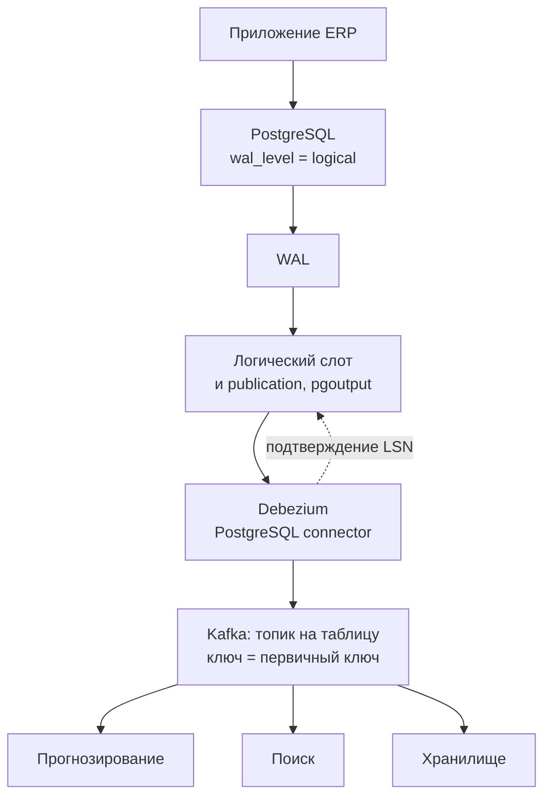

# 8.5 CDC и синхронизация данных между системами

## Зачем это аналитику

«Нам нужны те же данные в другой системе» — одна из самых частых задач. Регулярная выгрузка, двойная запись из приложения и захват изменений из журнала базы (CDC) дают разные гарантии. Ошибки здесь приводят к тихим расхождениям, которые находят через месяцы.

## Что понять

- [ ] Способы синхронизации: периодическая выгрузка по метке времени, двойная запись в приложении, триггеры, CDC из журнала (WAL, binlog).
- [ ] Почему двойная запись ненадёжна и как её заменяют Outbox и CDC (связь с модулем 3.5).
- [ ] Debezium и логическая репликация PostgreSQL: слоты, начальный снимок, формат событий, обработка DDL.
- [ ] Порядок и дубликаты: ключ партиции, идемпотентное применение, версии записей.
- [ ] Начальная загрузка и повторная синхронизация (backfill), совмещение снимка и потока.
- [ ] Удаления: мягкие и жёсткие, tombstone-события.
- [ ] Эволюция схемы источника и её влияние на потребителей.
- [ ] Сверка источника и копии.

## Урок

<!-- LESSON:START -->
### Задача синхронизации

Есть система-источник, владелец данных, и одна или несколько систем, которым нужна копия: справочник товаров из ERP нужен системе прогнозирования, данные о клиентах — поиску, заказы — аналитическому хранилищу. Копия почти всегда отстаёт, вопрос в том, какие гарантии мы даём:

- **полнота** — ни одно изменение не потеряно, включая удаления;
- **порядок** — для одной записи последнее применённое изменение действительно последнее;
- **задержка** — насколько копия отстаёт от источника;
- **цена** — нагрузка на источник, сложность эксплуатации, связность команд.

Разные способы синхронизации дают разные комбинации этих свойств. Ошибка выбора редко проявляется сразу: расхождения накапливаются тихо и обнаруживаются при сверке или по жалобе пользователя.

### Способы синхронизации

#### Периодическая выгрузка по метке времени

Самый простой вариант: раз в N минут выбрать строки, у которых `updated_at` больше последней запомненной отметки. Он выглядит надёжным, но теряет изменения по нескольким причинам.

- **Длинные транзакции.** В PostgreSQL `now()` возвращает время начала транзакции, а не момента фиксации. Транзакция началась в 10:00, записала строку с `updated_at = 10:00` и зафиксировалась в 10:06. Выгрузка в 10:05 этой строки не видит (она ещё не зафиксирована), запоминает отметку 10:05 — и следующий запуск ищет строки новее 10:05. Строка потеряна навсегда.
- **Не все пути обновляют метку.** Ручной SQL, миграция, массовое обновление из другого сервиса, триггер, который забыли. Одно пропущенное место — и изменения невидимы.
- **Удаления не видны.** Удалённой строки больше нет, выбирать нечего.
- **Промежуточные состояния теряются.** Если заказ за интервал прошёл статусы «создан — оплачен — отменён», выгрузка увидит только «отменён».
- **Граница интервала.** Строки с одинаковой меткой на границе окна либо теряются при строгом сравнении, либо дублируются при нестрогом.

Длинные транзакции частично компенсируют перекрытием окна (отступить от последней отметки на запас времени) плюс идемпотентным применением, но гарантии полноты это не даёт. Метод годится, когда допустимы задержка, потеря промежуточных состояний и есть периодическая полная сверка.

#### Двойная запись из приложения

Приложение сохраняет изменение в свою базу и тут же отправляет его во вторую систему или брокер. Проблема фундаментальная: две записи в разные системы не атомарны. Возможны все комбинации сбоев:

- база зафиксировала, отправка упала — копия никогда не узнает об изменении;
- отправка прошла, транзакция откатилась — копия содержит то, чего не было;
- два конкурентных запроса обновили одну строку в порядке A, B, а сообщения ушли в порядке B, A — копия навсегда хранит устаревшее значение.

Повторы при ошибке закрывают только первый случай и порождают дубли. Распределённые транзакции между базой и брокером на практике почти не применяются. Поэтому двойную запись заменяют двумя способами, которые опираются на одну транзакцию в источнике.

- **Transactional Outbox** (подробно — модуль 3.5): приложение в той же транзакции пишет бизнес-изменение и запись о событии в таблицу `outbox`. Отдельный процесс читает outbox и публикует. Атомарность обеспечивает база.
- **CDC** (change data capture): изменения читаются из журнала транзакций базы. Журнал — это и есть истина о том, что было зафиксировано, в каком порядке.

Outbox и CDC хорошо сочетаются: outbox-таблицу удобно читать именно через CDC, тогда публикация не требует опроса таблицы. В Debezium для этого есть готовое преобразование, которое маршрутизирует записи outbox в топики по типу агрегата.

Разница по смыслу: CDC по бизнес-таблицам публикует изменения строк — это внутренняя модель источника. Outbox публикует доменные события, которые команда-владелец сознательно спроектировала как контракт. Для интеграции между командами второе обычно правильнее, для репликации в хранилище или поиск — первое.

#### Триггеры

Триггер на таблице пишет каждое изменение в журнальную таблицу в той же транзакции. Полнота и атомарность есть, удаления видны. Минусы: дополнительная запись на каждую операцию источника, логика в базе, которую легко сломать миграцией, и всё равно нужен процесс, который вычитывает журнальную таблицу и чистит её. Уместно, когда CDC из журнала недоступен (нет прав на настройку репликации, старая версия СУБД).

#### CDC из журнала

База уже пишет каждое изменение в журнал упреждающей записи (WAL в PostgreSQL, binlog в MySQL). CDC читает этот журнал и превращает записи в события. Приложение не меняется, нагрузка на источник — только чтение журнала, видны все фиксированные изменения, включая удаления и массовые обновления, в порядке фиксации.

| Способ | Полнота | Задержка | Нагрузка на источник | Сложность |
|---|---|---|---|---|
| Выгрузка по метке | теряет удаления и изменения из длинных транзакций | минуты и больше | периодические запросы, нужен индекс | низкая |
| Двойная запись | нет атомарности, возможны потери и лишние события | секунды | низкая | низкая на старте, высокая в эксплуатации |
| Триггеры | полная | зависит от вычитывания | запись на каждую операцию | средняя |
| Outbox | полная для событий, которые приложение пишет | секунды | одна лишняя вставка в транзакции | средняя |
| CDC из журнала | полная для зафиксированных изменений | секунды | чтение WAL, удержание WAL слотом | средняя и высокая, эксплуатация |

### Логическая репликация PostgreSQL и Debezium

#### Как это устроено

PostgreSQL пишет в WAL физические изменения страниц. Чтобы получить из него изменения строк, нужно логическое декодирование (logical decoding): параметр `wal_level = logical` добавляет в WAL достаточно информации для восстановления строк, а плагин вывода (output plugin) превращает её в поток изменений. Debezium обычно использует встроенный плагин `pgoutput` — тот же, что применяет штатная логическая репликация PostgreSQL. Он работает с публикацией (publication) — перечнем таблиц, изменения которых попадают в поток.

**Слот репликации** (replication slot) хранит позицию потребителя в журнале. Сервер не удаляет WAL, который потребитель ещё не подтвердил. Это даёт гарантию «ничего не потеряем, даже если Debezium лежал сутки», но и главный эксплуатационный риск: брошенный или отставший слот удерживает WAL, и диск источника заполняется. Начиная с PostgreSQL 13 есть параметр `max_slot_wal_keep_size`, ограничивающий удерживаемый объём; при превышении слот становится недействительным, и тогда потребителю нужна повторная синхронизация. Мониторинг отставания слота — обязательная часть эксплуатации.

Ещё два факта, которые важно знать:

- Логическое декодирование отдаёт только зафиксированные транзакции и в порядке их фиксации. Изменения внутри транзакции идут вместе.
- Логические слоты привязаны к узлу. До PostgreSQL 17 при переключении на реплику слот не переносился, и после failover поток нужно было восстанавливать. В PostgreSQL 17 появилась синхронизация логических слотов на реплику, но её надо явно настроить. При проектировании стоит спросить у DBA, как это устроено в конкретной инсталляции.



#### Формат события

Debezium публикует событие на каждое изменение строки. Ключ сообщения — первичный ключ строки, значение — конверт:

```json
{
  "before": null,
  "after": { "id": 1042, "sku": "0004600123456", "name": "Молоко 3,2% 1 л", "status": "active" },
  "source": { "connector": "postgresql", "db": "erp", "schema": "public", "table": "products", "lsn": 358412776, "txId": 88121, "ts_ms": 1790000000000 },
  "op": "u",
  "ts_ms": 1790000000150
}
```

Поле `op`: `c` — вставка, `u` — обновление, `d` — удаление, `r` — чтение при снимке. В `source` — метаданные, включая позицию в журнале (LSN) и идентификатор транзакции.

Что попадает в `before`, определяет настройка таблицы `REPLICA IDENTITY`. По умолчанию (`DEFAULT`) PostgreSQL пишет в WAL старые значения только столбцов первичного ключа, поэтому для удаления `before` содержит только ключ, а для обновления старые значения передаются, только если менялся сам ключ. `REPLICA IDENTITY FULL` пишет всю старую строку — это нужно, если потребителю важно «что было до», но увеличивает объём WAL. Отдельная тонкость — большие значения, хранящиеся в TOAST: если такой столбец при обновлении не менялся, его значение в поток не попадает, и Debezium подставляет специальную заглушку. Потребитель не должен перезаписывать ею настоящее значение.

#### DDL

Логическое декодирование PostgreSQL не передаёт DDL-команды. Debezium узнаёт о новой структуре таблицы из метаданных, которые `pgoutput` отправляет перед изменениями строк, — то есть при первом изменении данных после DDL. Событий «добавлен столбец» в потоке нет, есть события строк с новой структурой. Кроме того, публикация, созданная для перечня таблиц, сама не расширяется на новые таблицы. Вывод для постановки: изменения схемы источника — это отдельный согласованный процесс, а не то, что CDC «подхватит сам».

### Порядок и дубликаты

Kafka гарантирует порядок только внутри партиции. Debezium использует первичный ключ как ключ сообщения, поэтому все изменения одной строки попадают в одну партицию и читаются по порядку. Порядка между разными строками и тем более между таблицами (у каждой свой топик) нет. Если потребителю нужен согласованный вид «заказ вместе со строками», он собирает его сам или получает доменное событие через outbox.

Доставка — как минимум один раз (at-least-once). После перезапуска коннектор продолжает с последней подтверждённой позиции, и часть событий может прийти повторно. Потребитель обязан применять изменения идемпотентно:

- применять по ключу через upsert, а не вставку;
- хранить у себя версию записи — LSN источника или версию из самой строки — и игнорировать событие, если его версия не новее сохранённой;
- удаление по ключу, которого нет, считать успешным.

```sql
INSERT INTO product_copy (id, sku, name, status, src_lsn)
VALUES ($ID, $SKU, $NAME, $STATUS, $LSN)
ON CONFLICT (id) DO UPDATE
SET sku = EXCLUDED.sku, name = EXCLUDED.name,
    status = EXCLUDED.status, src_lsn = EXCLUDED.src_lsn
WHERE product_copy.src_lsn < EXCLUDED.src_lsn;
```

Сравнение версий защищает и от повторов, и от переупорядочивания, если оно всё же возникло (например, при перебалансировке или ручной переотправке). Ключ партиционирования при этом нельзя менять произвольно: смена числа партиций или ключа ломает гарантию порядка для уже существующих ключей.

### Начальная загрузка и backfill

Поток изменений описывает, что меняется, но потребителю нужно и то, что уже есть. Отсюда задача: получить снимок и поток так, чтобы между ними не было ни дыры, ни необработанного пересечения.

**Начальный снимок Debezium.** При первом запуске коннектор создаёт слот, фиксирует его стартовую позицию и читает таблицы в транзакции, видящей данные ровно на этот момент. Строки снимка идут как события `r`. После снимка коннектор начинает читать поток с позиции слота. Поскольку слот создан до чтения снимка, всё, что изменилось во время снимка, придёт потоком — дыры нет. Минус классического снимка: для больших таблиц он долгий, поток изменений всё это время не читается, а если снимок прервался — начинать сначала.

**Инкрементальный снимок.** Debezium умеет снимать таблицы порциями по первичному ключу, чередуя их с чтением потока. Конфликт «строка из снимка против свежего изменения» решается маркерами (watermarks) в журнале: если строка изменилась, пока читалась её порция, в выдачу идёт событие из потока, а устаревшая строка снимка отбрасывается. Такой снимок можно запустить в любой момент для отдельной таблицы, приостановить и продолжить. Запускается он сигналом — например, записью в таблицу сигналов, имя которой задаётся в настройках коннектора:

```sql
INSERT INTO dbz_signal (id, type, data)
VALUES ('backfill-products-1', 'execute-snapshot',
        '{"data-collections": ["public.products"], "type": "incremental"}');
```

**Повторная синхронизация.** Она нужна, когда появился новый потребитель, слот был потерян, копия разошлась с источником или изменилась логика преобразования. Варианты: повторный инкрементальный снимок нужных таблиц; перечитывание топика с начала, если он хранит полное состояние (compacted topic); выгрузка из источника в обход CDC с последующим включением потока с сохранённой позиции. Во всех вариантах работает одно правило: применение идемпотентно и учитывает версии, тогда пересечение снимка и потока безопасно.

Процедура для большой таблицы в общем виде:

1. Включить захват изменений (слот уже удерживает позицию), убедиться, что события пишутся в топик.
2. Запустить снимок порциями; строки снимка применяются тем же идемпотентным upsert с версиями.
3. Дождаться завершения снимка, проверить отставание потока.
4. Выполнить сверку количеств и контрольных сумм по диапазонам ключей.
5. Только после этого переключать потребителей на копию.

### Удаления

**Мягкое удаление** — строка остаётся, меняется флаг `deleted_at` или статус. Для CDC это обычное обновление, копия получает его естественно. Потребитель должен знать о семантике флага, иначе будет показывать удалённые товары.

**Жёсткое удаление** — строка удаляется. Debezium публикует событие с `op = d`, в котором `before` содержит минимум ключ, а `after` пуст. Следом по умолчанию идёт **tombstone** — сообщение с тем же ключом и пустым значением. Tombstone нужен для сжатия топиков (log compaction): Kafka оставляет для каждого ключа только последнее сообщение, а tombstone разрешает со временем удалить ключ совсем. Потребитель, прочитавший топик с начала после сжатия, просто не увидит удалённую запись — это корректно для копии состояния. Обработчики потребителей должны ожидать пустое значение и не падать на нём.

Отдельно — `TRUNCATE`: это не набор удалений строк, и его обработка зависит от настроек коннектора. Для копии это опасная операция, и о ней лучше договориться заранее.

### Эволюция схемы источника

CDC по бизнес-таблицам делает внутреннюю схему источника публичным контрактом. Любая миграция в ERP становится изменением для всех потребителей.

- **Добавление nullable-столбца** обычно безопасно, если потребители игнорируют незнакомые поля.
- **Удаление столбца** ломает потребителей, которые его читают.
- **Переименование** для потока выглядит как удаление старого и появление нового поля.
- **Смена типа** (число в строку, изменение точности) может сломать десериализацию или тихо исказить данные.
- **Новая таблица** не появится в потоке, пока её не добавят в публикацию и настройки коннектора.

Защитные меры: реестр схем с правилами совместимости (при использовании Avro или Protobuf), миграции по схеме расширить–перенести–сузить (expand/contract) с периодом, когда старые и новые поля существуют одновременно, согласование изменений схем с потребителями как часть процесса выпуска, и — для межкомандной интеграции — публикация доменных событий через outbox вместо сырых строк, чтобы внутренняя схема могла меняться свободно.

### Разобранный пример: справочник товаров для прогнозирования

Система прогнозирования спроса розничной сети получает справочник товаров из ERP. Сейчас это выгрузка раз в час по `updated_at`. Симптомы: товары, выведенные из ассортимента, продолжают прогнозироваться (удаления не видны), а после ночных массовых обновлений цен и статусов часть изменений не доезжает (массовая процедура не обновляла `updated_at`).

Решение на CDC:

- в ERP включается `wal_level = logical`, создаётся публикация на таблицы товаров, групп и единиц измерения;
- Debezium публикует изменения в топики с ключом `product_id`; для таблицы товаров включается `REPLICA IDENTITY FULL`, потому что прогнозу важно видеть смену статуса «было — стало»;
- потребитель применяет события через upsert с проверкой LSN, мягкое удаление в ERP (статус «выведен») транслируется в исключение товара из расчёта, жёсткое — в удаление из копии;
- начальная загрузка — инкрементальным снимком, без остановки текущей выгрузки; переключение — после сверки;
- мониторинг: отставание слота в байтах WAL, задержка от `source.ts_ms` до применения, ошибки десериализации;
- изменения схемы товарных таблиц в ERP проходят через согласование с командой прогноза.

Ориентир для оценки: задержка сокращается с часа до секунд, но основная выгода — полнота, а не скорость.

### Сверка источника и копии

Даже при CDC копия может разойтись: баг в преобразовании, ручная правка копии, потерянный слот, неверная обработка заглушки TOAST. Поэтому нужна периодическая сверка.

- **Количества** по таблице и по сегментам (группа товаров, статус). Дёшево, ловит массовые потери.
- **Контрольные суммы по диапазонам ключей.** Для каждого диапазона `id` считается агрегированный хеш значимых полей в источнике и в копии. Совпало — диапазон в порядке; не совпало — диапазон дробится, пока не найдутся конкретные строки. Так сверка большой таблицы не требует построчной выгрузки.
- **Учёт задержки.** Сравнение идёт на согласованный момент: либо с поправкой на текущее отставание, либо только для строк, не менявшихся последние N минут.
- **Действие при расхождении.** Точечная пересинхронизация найденных ключей (тот же сигнал инкрементального снимка с фильтром или повторная публикация), разбор причины, и только потом закрытие инцидента.

### Типичные ошибки

- Считать выгрузку по `updated_at` полной: терять удаления, изменения из длинных транзакций и массовые обновления, которые метку не трогают.
- Строить интеграцию на двойной записи и лечить расхождения повторами, которые порождают дубли и не решают проблему порядка.
- Оставить брошенный слот репликации без мониторинга: WAL копится, диск источника заканчивается, и авария происходит в базе, которая к интеграции «не имеет отношения».
- Применять события вставкой без проверки версий: повторы после перезапуска коннектора дают дубли или откат к старому значению.
- Не обрабатывать удаления и tombstone: потребитель падает на пустом значении или хранит удалённые записи вечно.
- Отдавать сырые таблицы другим командам как контракт и затем удивляться, что любая миграция источника ломает потребителей.
- Не планировать повторную синхронизацию: при потере слота или новом потребителе выясняется, что снимок большой таблицы занимает часы и блокирует поток.

### Как говорить об этом на собеседовании

Сильный ответ начинается с гарантий, а не с инструмента: какие изменения нельзя потерять, важен ли порядок, какая задержка допустима, кто владеет схемой. Затем — почему выгрузка по метке теряет данные (на примере `now()` и длинной транзакции), почему двойная запись не атомарна и чем её заменяют Outbox и CDC. Уровень senior показывают эксплуатационные детали: удержание WAL слотом и мониторинг отставания, поведение слотов при failover, `REPLICA IDENTITY` и что будет в `before`, at-least-once и идемпотентное применение по версии.

Полезно различать два сценария: CDC как репликация данных в хранилище, поиск или кеш (сырые строки допустимы) и CDC как межкомандный контракт (лучше outbox с доменными событиями). Пример из ритейла — справочник товаров для прогноза, где переход с выгрузки на CDC решил проблему «невидимых» удалений и массовых обновлений, — хорошо иллюстрирует, что главная выгода CDC в полноте.

### Коротко

- Выгрузка по `updated_at` проста, но теряет удаления, изменения из длинных транзакций и обновления, не трогающие метку.
- Двойная запись не атомарна; надёжные альтернативы опираются на одну транзакцию в источнике — Outbox и CDC.
- Логическая репликация PostgreSQL: `wal_level = logical`, публикация, слот, плагин `pgoutput`; слот удерживает WAL до подтверждения, его отставание надо мониторить.
- Debezium публикует конверт `before`/`after`/`source`/`op` с ключом по первичному ключу; порядок гарантирован только для одной строки.
- Доставка at-least-once, поэтому применение — идемпотентный upsert с проверкой версии (например, LSN).
- Снимок и поток совмещаются через позицию слота или инкрементальный снимок с маркерами; пересечение безопасно при идемпотентном применении.
- Жёсткое удаление даёт событие `d` и tombstone; DDL в поток не попадает, изменения схемы источника нужно согласовывать с потребителями.
- Периодическая сверка количеств и контрольных сумм по диапазонам ключей обязательна даже при CDC.
<!-- LESSON:END -->

## Читать дальше

- Документация Debezium: архитектура и PostgreSQL connector.
- Kleppmann, DDIA — глава 11, разделы о CDC и event sourcing.

На system-design.space:

- [Надёжная доставка событий: Outbox, Inbox, CDC и порядок](https://system-design.space/chapter/reliable-event-delivery/)
- [Лаба: Outbox, захват изменений и порядок событий](https://system-design.space/labs/cdc-outbox-event-ordering/)
- [Миграции схемы без простоя: совместимость, исторический пересчёт и двойная запись](https://system-design.space/chapter/schema-migrations-backfills/)

## Практика

1. Сравнить три способа передать изменения справочника товаров из ERP в систему прогнозирования: выгрузка по метке, двойная запись, CDC. Таблица по надёжности, задержке, нагрузке на источник, сложности.
2. Пройти лабу про Outbox, CDC и порядок событий на system-design.space.
3. Описать процедуру начальной загрузки большой таблицы с последующим переключением на поток изменений без потери данных.

## Вопросы для самопроверки

1. Почему выгрузка по полю updated_at может терять изменения?
2. Чем CDC лучше двойной записи из приложения?
3. Как в CDC обрабатываются удаления?
4. Как совместить начальный снимок и поток изменений?
5. Что будет с потребителями при изменении схемы таблицы-источника?

## Заметки

<!-- Свои формулировки, ошибки, ссылки. -->
