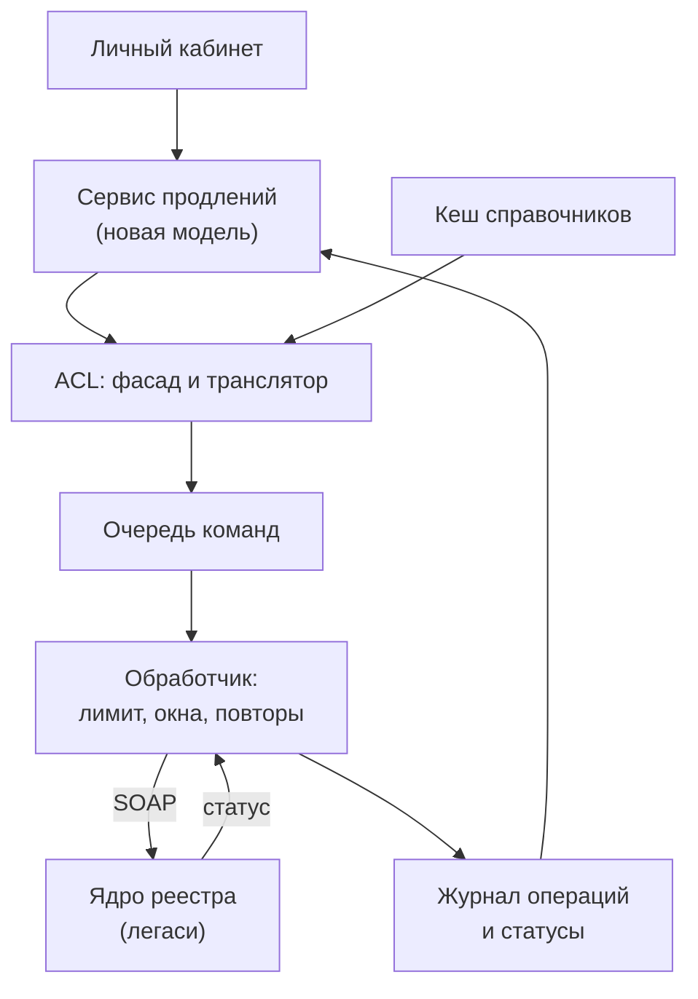
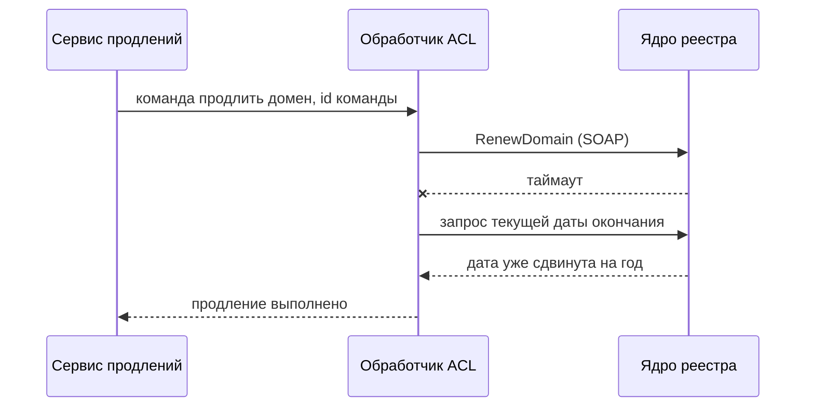

# 8.6 Легаси-интеграции: SOAP, шины, iPaaS

## Зачем это аналитику

У крупных заказчиков — банков, госструктур, ритейла — до сих пор SOAP-сервисы, корпоративные шины и интеграционные платформы. Архитектору нужно уметь с ними работать и понимать, когда шина помогает, а когда становится узким местом, которое мешает командам.

## Что понять

- [ ] SOAP и WSDL: конверт, XSD-схемы, WS-Security, почему они до сих пор живы в банках и госсекторе.
- [ ] ESB: идея централизованной шины (маршрутизация, трансформация, оркестрация), её сильные стороны и проблема «умной шины».
- [ ] «Умные конечные точки и глупые каналы» — принцип микросервисов в противовес ESB.
- [ ] iPaaS и low-code интеграционные платформы: когда уместны.
- [ ] Точка-точка против хаба: рост числа связей и управляемость.
- [ ] Anticorruption layer и фасады для легаси: как изолировать чужую модель данных.
- [ ] Работа с нестабильными легаси-системами: окна доступности, ограничения нагрузки, асинхронные буферы.

## Урок

<!-- LESSON:START -->
### Легаси как данность

Легаси-система — это не обязательно старый код. Это система, которую нельзя быстро поменять: у неё другой владелец, дорогие релизы, ограниченная экспертиза, жёсткий регламент или она просто слишком важна, чтобы её трогать. Архитектор почти никогда не начинает с чистого листа: новый сервис должен встать рядом с АБС банка, учётной системой ритейла или ядром регистратора доменов и договориться с ними на их условиях.

Отсюда три группы вопросов этого урока. Первая — протоколы и платформы, на которых живёт корпоративная интеграция: SOAP, шины, iPaaS. Вторая — топология: как не утонуть в числе связей и не создать при этом центральное узкое место. Третья — защита новой системы от чужой модели данных и от нестабильности легаси.

### SOAP и WSDL

SOAP — протокол обмена XML-сообщениями. Сообщение — это конверт (Envelope) с необязательным заголовком (Header) для служебной информации — безопасность, маршрутизация, идентификаторы — и телом (Body) с бизнес-данными. Ошибка возвращается стандартной структурой Fault с кодом и описанием.

```xml
<soap:Envelope xmlns:soap="http://schemas.xmlsoap.org/soap/envelope/"
               xmlns:reg="urn:example:registry:v2">
  <soap:Header>
    <!-- здесь WS-Security: подпись, токен, метка времени -->
  </soap:Header>
  <soap:Body>
    <reg:RenewDomainRequest>
      <reg:DomainName>example-shop.ru</reg:DomainName>
      <reg:PeriodYears>1</reg:PeriodYears>
      <reg:ClientRequestId>7f3c2a90-renew-0001</reg:ClientRequestId>
    </reg:RenewDomainRequest>
  </soap:Body>
</soap:Envelope>
```

**WSDL** описывает сервис целиком: типы данных (через XSD-схемы), сообщения, операции, привязку к транспорту и адрес. По WSDL инструменты генерируют клиентский и серверный код. Это подход «сначала контракт» (contract-first) в самой строгой форме: клиент получает типизированный интерфейс, а сообщение, не соответствующее схеме, отбрасывается ещё до бизнес-логики.

**WS-Security** — набор правил защиты на уровне сообщения, а не канала. Подпись и шифрование применяются к частям XML-документа, в заголовок кладутся токены: имя и пароль, сертификат X.509, SAML-утверждение. Принципиальное отличие от TLS: TLS защищает участок между двумя узлами и заканчивается на первом прокси или шлюзе, а подписанное сообщение остаётся подписанным, сколько бы посредников оно ни прошло. Подпись можно сохранить в архиве вместе с сообщением и предъявить позже.

Почему SOAP жив в банках и госсекторе:

- **Строгий контракт.** XSD фиксирует типы, обязательность, ограничения. Для межведомственного обмена и финансовых сообщений это ценнее гибкости.
- **Безопасность и юридическая значимость.** Подпись на уровне сообщения даёт неотказуемость — важное свойство, когда сообщение является документом.
- **Инструменты и инерция.** Зрелые стеки в Java и .NET, годы эксплуатации, регламенты и стандарты, закреплённые в нормативных документах. Замена ради моды никого не интересует, если система работает.
- **Долгий жизненный цикл.** Интеграция с госсистемой или процессинговым центром живёт десятилетие, и стабильность контракта важнее удобства разработки.

Слабые стороны тоже известны: объём и многословность, сложность стека WS-* с разными трактовками у разных вендоров, тяжёлое версионирование (новая версия схемы — новые пространства имён и регенерация кода), неудобство для браузера и мобильных клиентов. Практический вывод: с SOAP надо уметь работать, но не нужно тащить его внутрь новой системы. Его место — на границе, в адаптере.

### ESB: централизованная шина

Корпоративная сервисная шина (Enterprise Service Bus) возникла как ответ на хаос интеграций точка-точка. Идея: все системы подключаются к шине, а шина берёт на себя:

- **маршрутизацию** — куда отправить сообщение, по содержимому или правилам;
- **трансформацию** — преобразование форматов и моделей, часто к единой канонической модели данных (canonical data model);
- **посредничество по протоколам** — SOAP с одной стороны, файлы или очереди с другой;
- **оркестрацию** — многошаговые процессы: вызвать A, по результату B, при ошибке компенсировать;
- **сквозные функции** — безопасность, журналирование, мониторинг, гарантированная доставка.

Сильные стороны реальны. В ландшафте из десятков систем разных поколений шина даёт одно место, где видны все потоки, единые правила безопасности и аудита, и готовые адаптеры к легаси. Для организации, где интеграцию делает одна специализированная команда, это рабочая модель.

#### Проблема «умной шины»

Со временем в шину перетекает бизнес-логика. Сначала — простая трансформация. Потом — «если клиент VIP, маршрутизируем иначе». Потом — расчёт, обогащение из третьей системы, оркестрация процесса целиком. Через несколько лет шина знает о бизнесе больше, чем любая из систем, и становится:

- **узким местом по изменениям.** Любая новая интеграция и почти любое изменение в системах требуют работы центральной команды шины. Её очередь становится очередью всей компании.
- **точкой связности.** Изменение одной трансформации затрагивает потоки, о которых никто не помнит. Релизы шины координируются между многими командами.
- **местом, где логика теряется.** Правила размазаны между системами и конфигурацией шины, тестировать их по отдельности невозможно.
- **единой точкой отказа** — технически и организационно.

Каноническая модель данных, задуманная как общий язык, часто превращается в компромисс, который не устраивает никого: слишком общий для конкретных процессов и слишком тяжёлый для изменения. Это не значит, что каноническая модель всегда плоха — для узкого набора действительно общих понятий она работает, — но на уровне всей компании её поддержка дорога.

### «Умные конечные точки, глупые каналы»

Принцип, который Мартин Фаулер и Джеймс Льюис сформулировали в описании микросервисов (smart endpoints and dumb pipes), — прямая реакция на умную шину. Бизнес-логика, трансформации и решения живут в сервисах, которые владеют доменом. Канал — брокер сообщений или HTTP — только доставляет: не знает о содержимом, не меняет его, не принимает решений.

Что это даёт:

- команда, владеющая сервисом, меняет логику сама, без очереди к центральной команде;
- контракт между сервисами явный и версионируемый, а не спрятан в конфигурации посредника;
- инфраструктура канала проста и заменяема.

Принцип легко понять неправильно. «Глупый канал» не значит «никакой инфраструктуры»: брокер с гарантиями доставки, реестр схем, API-шлюз с аутентификацией и лимитами — всё это нормально. Граница проходит по бизнес-логике: канал может обеспечивать доставку, безопасность и наблюдаемость, но не должен знать, что такое «VIP-клиент». И второе: отказ от шины переносит работу по трансформации в сервисы. Если у команд нет дисциплины контрактов, децентрализация даёт хаос точка-точка с новыми технологиями.

### Точка-точка против хаба

| Критерий | Точка-точка | Хаб или шина | Брокер плюс соглашения |
|---|---|---|---|
| Число связей для n систем | до n(n-1)/2 | n | n подключений к брокеру, контракты между владельцами |
| Где логика трансформации | в каждой паре систем | в центре | в сервисах-владельцах |
| Кто меняет интеграцию | две команды пары | центральная команда | команда-владелец контракта |
| Видимость потоков | низкая | высокая | средняя, нужен каталог и трассировка |
| Главный риск | неуправляемая сеть связей | узкое место и умная шина | расползание форматов без дисциплины |

При пяти системах точка-точка — до десяти связей, и это нормально. При тридцати — до четырёхсот тридцати пяти, и каждая со своим форматом, расписанием и владельцем. Хаб сокращает число подключений, но концентрирует зависимость. Современный компромисс — брокер или шлюз как общая инфраструктура, плюс обязательные соглашения: реестр схем, каталог событий и API, правила версионирования, владелец у каждого контракта. Решение «нужна ли шина» на практике зависит не столько от числа систем, сколько от того, сколько в ландшафте систем, которые не умеют говорить на общем протоколе, и есть ли у команд зрелость, чтобы владеть контрактами самостоятельно.

### iPaaS и low-code платформы

Интеграционная платформа как услуга (iPaaS) — облачный наследник шины: готовые коннекторы к популярным SaaS и протоколам, визуальный редактор потоков, расписания, мониторинг, иногда управление API. Рядом — low-code инструменты, где простые интеграции собирают аналитики или бизнес-пользователи.

Уместны, когда:

- интеграция между стандартными SaaS: CRM, почта, таблицы, маркетинговые сервисы, помощь пользователям;
- поток простой — перенести, преобразовать поля, отправить уведомление — и объём умеренный;
- нужно быстро, а команды разработки нет или она занята ядром;
- задача временная или экспериментальная.

Неуместны, когда в потоке критичная доменная логика, высокие объёмы или жёсткие требования к задержке, сложная обработка ошибок и компенсаций, требования к хранению данных в определённом контуре. Скрытые издержки: привязка к вендору, тарификация по потокам или операциям, которая растёт с успехом, слабое версионирование и тестирование визуальных потоков, риск повторить историю умной шины — только теперь логика живёт в чужом облаке. Разумная политика — явно определить класс задач для iPaaS и не пускать туда ядро бизнеса.

### Anticorruption layer и фасады

Модель данных легаси — результат двадцати лет решений, часть которых уже никто не помнит. Коды статусов из двух символов, поля с перегруженным смыслом, сущность «клиент», которая одновременно и договор, и адрес. Если новая система начнёт использовать эту модель напрямую, она унаследует все её искажения и станет зависеть от каждого изменения легаси.

**Anticorruption layer** (ACL, термин Эрика Эванса из DDD) — слой перевода между моделью новой системы и моделью легаси. Новая система говорит на своём языке: «продление домена на год». ACL переводит это в вызов легаси с её кодами, форматами и последовательностью операций и переводит ответ обратно. Модель легаси не проникает дальше ACL.

Составные части:

- **фасад** (facade) — упрощённый интерфейс к сложной системе: одна операция вместо пяти вызовов в правильном порядке;
- **адаптер** (adapter) — техника протокола: SOAP-клиент, сгенерированный по WSDL, файловый обмен, прямой доступ к базе;
- **транслятор** — преобразование моделей и кодов: статус `A1` становится `Active`, пара полей становится объектом периода;
- **защитные механизмы** — таймауты, ограничения, повторы, обработка специфических ошибок легаси.

ACL принадлежит новой системе и развивается вместе с ней. Его цена — дополнительный код и ещё одно место для ошибок перевода. Но он же становится опорой для постепенной замены легаси (strangler fig): когда функция переносится в новый сервис, меняется реализация за ACL, а потребители этого не замечают.

### Работа с нестабильной легаси-системой

Типичные ограничения легаси: окна недоступности (ночное закрытие дня, регламентные работы), жёсткий лимит одновременных соединений или запросов, долгие и непредсказуемые ответы, неидемпотентные операции, отсутствие нормального способа узнать статус. Главный принцип — новая система не должна наследовать доступность легаси.

Инструменты:

- **Асинхронный буфер.** Запросы на изменение кладутся в очередь, отдельный обработчик передаёт их в легаси с нужной скоростью. Пользователь получает ответ «принято», а не ждёт легаси. Очередь переживает окна недоступности.
- **Ограничение нагрузки.** Лимит параллельных вызовов и скорости на стороне адаптера — не больше, чем легаси выдерживает. Лучше очередь у себя, чем падение чужой системы.
- **Таймауты и предохранитель** (circuit breaker). Короткий таймаут, при серии ошибок — прекратить вызовы на время и не добивать систему, которая и так не справляется.
- **Повторы с идемпотентностью.** Повторять можно только то, что безопасно повторять. Если легаси не поддерживает ключ идемпотентности, адаптер перед повтором проверяет, выполнена ли операция (запросом статуса по бизнес-ключу), или хранит собственный журнал отправленных операций.
- **Кеш и реплика для чтения.** Справочники и редко меняющиеся данные читаются из локальной копии, обновляемой по расписанию или через CDC, а не из легаси на каждый запрос.
- **Учёт окон.** Обработчик знает расписание доступности: не тратит повторы в окне регламентных работ, а ждёт его окончания.
- **Изоляция ресурсов** (bulkhead). Отдельные пулы соединений для разных потоков, чтобы массовая фоновая операция не выбрала лимит, нужный для интерактивных запросов.



### Разобранный пример: продление доменов через легаси-ядро

Регистратор доменов строит новый сервис продлений с автоплатежом. Регистрационные данные и операции с доменами живут в легаси-ядре, доступном через SOAP. Ограничения: не больше нескольких одновременных вызовов, ежедневное окно регламентных работ ночью, операция продления неидемпотентна — повторный вызов продлевает ещё на год.

Решение:

1. **Модель.** Новый сервис оперирует понятиями «подписка на домен», «попытка продления», «результат». Коды и структуры ядра существуют только внутри ACL.
2. **Буфер.** После успешного платежа сервис записывает команду продления в свою базу и в очередь (через outbox), пользователь видит статус «продление в обработке».
3. **Обработчик.** Берёт команды с ограничением параллельности, не работает в окне регламентных работ, при таймауте не повторяет вслепую.
4. **Идемпотентность.** Перед повтором обработчик запрашивает в ядре текущую дату окончания регистрации. Если она уже сдвинулась на ожидаемый период — операция считается выполненной. Дополнительно в запрос передаётся собственный идентификатор команды, если ядро позволяет его сохранить, — это упрощает разбор.
5. **Ошибки.** Бизнес-отказ ядра (домен заблокирован, истёк период восстановления) переводится в понятный статус и запускает возврат платежа. Технические ошибки — повтор с увеличивающейся паузой, после исчерпания — ручной разбор.
6. **Чтение.** Список доменов пользователя показывается из локальной копии, а не запросом к ядру на каждое открытие страницы.



Результат: доступность и скорость сервиса продлений определяются его собственной инфраструктурой, а не ядром; ядро получает нагрузку не выше своих возможностей; повторные продления исключены проверкой состояния.

### Типичные ошибки

- Протаскивать модель легаси (коды, структуры, названия полей) в новую систему без ACL — и навсегда привязать её к чужим изменениям.
- Класть бизнес-логику в шину или iPaaS-поток, потому что так быстрее: через пару лет логика размазана и не тестируется.
- Считать отказ от ESB решением само по себе: без реестра контрактов и владельцев получается сеть точка-точка на новых технологиях.
- Вызывать легаси синхронно из пользовательского сценария: окно регламентных работ ядра становится недоступностью нового продукта.
- Повторять неидемпотентные вызовы по таймауту без проверки результата: двойные продления, двойные списания.
- Не ограничивать нагрузку на легаси: массовая фоновая операция новой системы кладёт ядро, которым пользуются все.
- Считать SOAP заведомо плохим и предлагать заменить стабильный внешний контракт, который принадлежит другой организации.

### Как говорить об этом на собеседовании

Senior-уровень виден в том, что вы не спорите о технологиях в отрыве от организации. Шина — это не ошибка, а модель, которая работает при централизованной интеграционной команде и плохо работает при многих автономных продуктовых командах. SOAP — не архаизм, а строгий контракт с безопасностью на уровне сообщения, которую TLS не заменяет. Полезно называть конкретные механизмы: ACL как граница модели, фасад, асинхронный буфер, лимит параллельности, предохранитель, проверка состояния перед повтором неидемпотентной операции.

Хорошо работает история из модернизации: как новый сервис встал рядом с легаси-ядром, не унаследовав ни его модель, ни его окна недоступности, и как ACL потом позволил постепенно переносить функции (strangler fig). На вопрос «нужна ли нам шина» сильный ответ — встречные вопросы: сколько систем не говорят на общих протоколах, кто владеет контрактами, есть ли каталог и реестр схем, где сейчас живёт логика трансформаций.

### Коротко

- SOAP держится в банках и госсекторе благодаря строгому контракту XSD/WSDL и безопасности на уровне сообщения через WS-Security; его место — на границе, в адаптере.
- ESB централизует маршрутизацию, трансформацию и оркестрацию; её проблема — бизнес-логика в шине, центральная очередь изменений и скрытая связность.
- «Умные конечные точки, глупые каналы»: логика у владельцев домена, канал только доставляет; без дисциплины контрактов это превращается в хаос точка-точка.
- Точка-точка даёт до n(n-1)/2 связей, хаб — n подключений ценой центральной зависимости; компромисс — брокер плюс реестр контрактов и владельцы.
- iPaaS хорош для стандартных SaaS-потоков и простых задач, но не для ядра бизнеса.
- Anticorruption layer изолирует модель легаси и становится опорой постепенной замены.
- Нестабильное легаси обслуживается через асинхронный буфер, лимиты, предохранитель, учёт окон, кеш и повторы только с проверкой результата.
<!-- LESSON:END -->

## Читать дальше

- Sam Newman, Building Microservices — раздел о «умных каналах».
- James Lewis, Martin Fowler, «Microservices» (2014), раздел Smart endpoints and dumb pipes.

На system-design.space:

- [Оркестрация бизнес-процессов: Temporal, Cadence и Step Functions](https://system-design.space/chapter/workflow-orchestration-patterns/)
- [Зачем нужны микросервисы и интеграция](https://system-design.space/chapter/microservices-integration-overview/)
- [Learning Domain-Driven Design (short summary)](https://system-design.space/chapter/learning-ddd-book/)

## Практика

1. Спроектировать интеграцию новой системы с обезличенным легаси через SOAP: фасад, ACL, преобразование модели, ограничение нагрузки, обработка недоступности.
2. Оценить для обезличенного ландшафта: нужна ли шина, или достаточно брокера и соглашений. Аргументы за и против.

## Вопросы для самопроверки

1. Почему SOAP до сих пор используется и какие у него сильные стороны?
2. Что такое ESB и в чём проблема «умной шины»?
3. Что означает принцип «умные конечные точки, глупые каналы»?
4. Как интегрироваться с нестабильной легаси-системой, не завися от её доступности?
5. Зачем нужен anticorruption layer при работе с легаси?

## Заметки

<!-- Свои формулировки, ошибки, ссылки. -->
