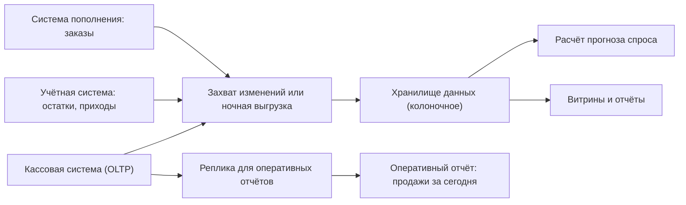

# 9.1 OLTP и OLAP: почему отчёты не строят на проде

## Зачем это аналитику

Классическая ошибка — строить тяжёлые отчёты и выгрузки на рабочей базе. Они мешают транзакциям, а сами работают медленно. Понимание разницы между транзакционной и аналитической нагрузкой и способов их разделить — база для любого разговора о данных.

## Что понять

- [ ] Профили нагрузки: короткие транзакции по ключу против сканирования миллионов строк с агрегацией.
- [ ] Строчное и колоночное хранение: почему аналитика в колоночных базах быстрее в десятки раз (чтение только нужных столбцов, сжатие, векторное выполнение).
- [ ] Способы разделения нагрузки: реплика для отчётов, выгрузка в хранилище, HTAP, материализованные представления.
- [ ] Задержка данных в аналитике: пакетная (раз в сутки), микропакеты, поток — и что из этого реально нужно бизнесу.
- [ ] Типы аналитических систем: хранилище данных (DWH), озеро данных, lakehouse, встроенная аналитика.
- [ ] Требования к аналитике в постановке: свежесть, глубина истории, детализация, кто пользователи.

## Урок

<!-- LESSON:START -->
### Две разные нагрузки на одни и те же данные

У любой учётной системы есть две группы потребителей. Первая — сами бизнес-процессы: касса пробивает чек, система пополнения создаёт заказ поставщику, оператор меняет цену. Вторая — те, кто хочет понять, что происходит: категорийный менеджер смотрит продажи по группам товаров за квартал, аналитик прогноза выгружает историю продаж за два года, финансист сверяет выручку по магазинам.

Первую нагрузку называют транзакционной (OLTP, online transaction processing), вторую — аналитической (OLAP, online analytical processing). Данные у них часто одни и те же, но характер обращения к ним противоположный.

| Характеристика | OLTP | OLAP |
|---|---|---|
| Типичный запрос | Найти, вставить или изменить одну или несколько строк по ключу | Просканировать миллионы строк и посчитать агрегаты |
| Число строк на запрос | Единицы, десятки | Миллионы, миллиарды |
| Число столбцов на запрос | Часто все столбцы строки | Несколько столбцов из десятков |
| Частота запросов | Тысячи в секунду, много параллельных пользователей | Десятки или сотни в час, немного пользователей |
| Требования к задержке | Миллисекунды | Секунды, минуты допустимы |
| Запись | Постоянная, мелкими порциями | Пакетами, реже, крупными блоками |
| Модель данных | Нормализованная, под целостность | Денормализованная, под чтение |
| Главная метрика | Время ответа и пропускная способность транзакций | Время сканирования и агрегации |

Проблема отчётов «на проде» не в том, что отчёт медленный сам по себе. Долгий запрос со сканированием большой таблицы вытесняет из буферного кеша горячие страницы, которые нужны транзакциям, загружает диск и процессор, а в некоторых СУБД удерживает ресурсы, мешающие обслуживанию. В PostgreSQL, например, долгая транзакция на чтение не даёт процессу очистки (VACUUM) убрать старые версии строк, и таблицы начинают раздуваться. В системах с блокировками на чтение тяжёлый отчёт может просто заблокировать запись. Итог знаком: в конце месяца финансисты запускают выгрузку, и у магазинов начинает тормозить приёмка товара.

При этом сам отчёт на транзакционной базе тоже работает плохо: индексы построены под поиск по ключу, а не под сканирование, модель нормализована, и каждый отчёт собирает данные из десятка соединений.

### Строчное и колоночное хранение

Чтобы понять, почему аналитические СУБД так быстры на своих задачах, нужно посмотреть на физическое хранение.

В строчной (row-oriented) СУБД, такой как PostgreSQL или MySQL, строка таблицы хранится целиком, все её поля подряд в одной странице. Это идеально для OLTP: чтобы прочитать или обновить чек, достаточно найти по индексу одну страницу и работать с ней.

В колоночной (column-oriented) СУБД — ClickHouse, Vertica, Greenplum с колоночными таблицами, облачные хранилища, DuckDB — значения каждого столбца хранятся отдельно, подряд. Столбец «дата» лежит в одном файле или блоке, столбец «магазин» — в другом, «сумма» — в третьем. Строка восстанавливается по позиции: десятая запись во всех столбцах — это одна строка.

Возьмём таблицу строк чеков с 40 столбцами и запрос «выручка по магазинам за месяц». Ему нужны три столбца: дата, магазин, сумма. Строчная СУБД прочитает все 40 столбцов каждой подходящей строки, потому что они лежат в одних страницах. Колоночная прочитает три. Уже одно это даёт выигрыш на порядок по объёму ввода-вывода.

Дальше работают ещё три механизма.

**Сжатие.** В одном столбце лежат однотипные и часто повторяющиеся значения: код магазина повторяется миллионы раз, дата меняется редко, если данные отсортированы по ней. Такие данные хорошо сжимаются — кодированием длин серий (run-length encoding), словарным кодированием, дельта-кодированием для монотонных чисел, поверх этого общими алгоритмами сжатия. Меньше байт на диске — меньше чтения и лучше используется кеш.

**Векторное выполнение (vectorized execution).** Движок обрабатывает не по одной строке, а блоками значений одного столбца — тысячи чисел за раз. Такие циклы хорошо ложатся на кеши процессора и SIMD-инструкции, накладные расходы интерпретации запроса делятся на весь блок.

**Пропуск блоков.** Для каждого блока хранится минимум и максимум значений (или разреженный индекс). Если запрос просит данные за сентябрь, а блок содержит только май, его можно не читать вовсе. Если таблица отсортирована по дате и магазину, отсекается большая часть данных.

В сумме это даёт ускорение агрегирующих запросов в десятки раз, а иногда больше, в зависимости от ширины таблицы, степени сжатия и селективности. Конкретный множитель на ваших данных нужно мерить, а не обещать.

Обратная сторона — точечные операции. Чтобы вставить одну строку, колоночной СУБД нужно дописать значение в каждый из 40 столбцов, а сжатые блоки неудобно менять на месте. Поэтому колоночные системы предпочитают крупные пакетные вставки, а обновление и удаление реализуют дорого: переписыванием блоков, отметками об удалении с последующим слиянием, фоновыми процессами. Прочитать одну строку целиком тоже дороже — надо собрать её из многих мест. Именно поэтому колоночную СУБД не ставят под кассу, а строчную — под отчёт по всем продажам за три года.

### Способы разделить нагрузку

Разделение — это всегда компромисс между свежестью данных, стоимостью и сложностью. Основные варианты от простого к сложному.

**Реплика для отчётов.** Поднимается реплика основной базы (физическая или логическая), и отчёты направляются на неё. Транзакции больше не страдают, но проблемы самого отчёта остаются: та же строчная модель, та же нормализованная схема. Есть и тонкости: на физической реплике PostgreSQL долгий запрос может конфликтовать с применением изменений от мастера — либо запрос отменяется, либо реплика отстаёт, в зависимости от настроек; а с включённым `hot_standby_feedback` долгий запрос на реплике задерживает очистку старых версий строк уже на мастере. Реплика хороша как быстрое временное решение и для оперативных отчётов «на сейчас».

**Материализованные представления и агрегатные таблицы.** Результат тяжёлого запроса заранее считается и сохраняется, а отчёт читает готовое. В PostgreSQL материализованное представление обновляется командой REFRESH целиком, по расписанию. Это снижает нагрузку от повторяющихся отчётов, но само обновление всё равно нагружает базу, и данные устаревают между обновлениями. В колоночных СУБД есть более развитые механизмы инкрементальной агрегации при вставке.

**Выгрузка в хранилище данных.** Данные регулярно извлекаются из рабочих систем и загружаются в отдельную аналитическую систему с подходящей моделью и движком. Это основной промышленный вариант. Выгрузка бывает полной, инкрементальной по отметке времени изменения или через захват изменений (CDC, change data capture) из журнала транзакций. Хранилище становится единым местом, где продажи из кассовой системы соединяются с остатками из учётной системы и заказами из системы пополнения — то, чего не может ни одна отдельная рабочая база.

**HTAP (hybrid transactional/analytical processing).** Одна система обслуживает обе нагрузки: внутри у неё строчное хранилище для транзакций и колоночная копия для аналитики, синхронизируемая автоматически. Идея привлекательна — свежие данные без конвейера, — но такие системы требуют отдельного выбора платформы, и они решают только задачу одной базы. Соединить данные нескольких систем HTAP не помогает.

### Свежесть данных: что действительно нужно

Заказчики отчётов почти всегда говорят «нужны данные в реальном времени». Задача аналитика — выяснить, какое решение будет принято по этим данным и с какой частотой.

- **Пакетная загрузка раз в сутки.** Данные за вчера доступны утром. Этого хватает для большинства управленческих отчётов, для прогноза спроса и расчёта заказов поставщикам: заказ формируется раз в день или реже, и более свежие продажи почти не меняют результат.
- **Микропакеты (micro-batch).** Загрузка каждые 5–60 минут. Подходит для внутридневного мониторинга: как идут продажи в день акции, не закончился ли товар на полке, сколько заказов интернет-магазина ждут сборки.
- **Поток (streaming).** Задержка секунды. Нужен там, где решение принимается автоматически и быстро: антифрод при платежах, динамическое ценообразование, оповещение о сбое кассы.

Стоимость растёт нелинейно. Суточная загрузка — это одна задача в оркестраторе. Поток — это брокер сообщений, потоковый движок, обработка опоздавших событий, дежурства. Хороший вопрос заказчику: «Что вы сделаете иначе, если увидите цифру через 5 минут, а не завтра утром?» Если ответа нет, реального времени не нужно.

#### Пример: отчёт о продажах в системе пополнения

В розничной сети отчёт «продажи по товарам и магазинам за 8 недель» строится прямо на базе системы автопополнения. Его запускают категорийные менеджеры в течение дня. Запрос соединяет строки чеков, справочник товаров, иерархию категорий и справочник магазинов и сканирует десятки миллионов строк. В часы запуска растёт время расчёта заказов, а в конце месяца отчёт иногда падает по таймауту.

Разбор:
1. Кто пользователи и какие решения они принимают? Менеджеры оценивают динамику категорий и эффект акций. Решения недельные.
2. Какая свежесть нужна? Данных «по вчера» достаточно. Внутридневная динамика нужна только в дни крупных акций.
3. Какая глубина и детализация? 8 недель в отчёте, но для сравнения с прошлым годом — 60 недель. Детализация — товар, магазин, день.

Решение: ночная выгрузка продаж в хранилище, агрегат «товар — магазин — день» как витрина, отчёт строится на ней. Для дней акций — отдельный лёгкий отчёт на реплике по ограниченному набору товаров. Свежесть основного отчёта — до 7 утра за вчерашний день, это фиксируется в требованиях. Нагрузка на систему пополнения от отчётов уходит полностью.

### Типы аналитических систем

**Хранилище данных (data warehouse, DWH).** Структурированные, очищенные, интегрированные данные из многих источников в заранее спроектированной модели. Схема задаётся при записи (schema-on-write): прежде чем загрузить, нужно определить таблицы и правила. Сильные стороны — согласованность, одна версия правды, быстрые SQL-запросы. Слабые — стоимость изменения модели и то, что неструктурированные данные сюда не ложатся.

**Озеро данных (data lake).** Дешёвое объектное или распределённое файловое хранилище, куда данные кладутся в исходном или слабо обработанном виде: файлы Parquet, JSON, CSV, логи, изображения. Схема определяется при чтении (schema-on-read). Сильные стороны — дешевизна хранения, гибкость, возможность сохранить всё сырое для будущих задач, удобство для машинного обучения. Слабая — без дисциплины озеро превращается в «болото»: никто не знает, какой файл актуален, нет транзакций, нет гарантий качества.

**Lakehouse.** Попытка взять лучшее от обоих: данные лежат в открытых форматах в объектном хранилище, но поверх них работает слой табличного формата (Apache Iceberg, Delta Lake, Apache Hudi), который даёт транзакции, версии, эволюцию схемы. SQL-движки читают эти таблицы как обычные. Хранение и вычисления разделены: можно подключать разные движки к одним данным.

**Встроенная аналитика (embedded analytics).** Два смысла, которые стоит различать. Первый — встроенные в приложение отчёты и дашборды для конечного пользователя, например аналитика продаж в личном кабинете поставщика. Второй — встраиваемые аналитические движки, такие как DuckDB: колоночная СУБД, работающая внутри процесса приложения или ноутбука аналитика, без сервера. Она отлично подходит для локального анализа файлов Parquet и CSV, для прототипов и для небольших витрин.

| Критерий | DWH | Озеро | Lakehouse |
|---|---|---|---|
| Схема | При записи | При чтении | При записи, с эволюцией |
| Типы данных | Структурированные | Любые | Преимущественно структурированные, плюс сырые файлы рядом |
| Транзакции | Да | Нет | Да, через табличный формат |
| Основные пользователи | BI, отчётность | Инженеры данных, ML | Все перечисленные |
| Риск | Жёсткость и стоимость | Хаос без каталога | Сложность платформы |

Выбор типа — не религиозный вопрос. Для сети из сотен магазинов с отчётностью и прогнозом часто достаточно одного колоночного хранилища. Озеро и lakehouse оправданы, когда много разнородных источников, большие объёмы сырых данных и серьёзная работа с машинным обучением.

### Требования к аналитике в постановке

Постановка на отчёт или витрину без явных требований к данным почти гарантированно приводит к переделкам. Минимальный набор вопросов, которые нужно закрыть:

- **Пользователи и решения.** Кто смотрит, какие решения принимает, как часто. Сколько одновременных пользователей и нужна ли выгрузка в Excel.
- **Свежесть.** К какому времени данные должны быть готовы и за какой период: «к 8:00 по местному времени за вчерашний день включительно». Что показывать, если загрузка опоздала.
- **Глубина истории.** Сколько лет нужно хранить и показывать. Нужно ли сравнение с прошлым годом — это сразу удваивает объём.
- **Детализация (гранулярность).** До какого уровня нужно проваливаться: чек, строка чека, товар-магазин-день, категория-регион-неделя. Нельзя получить детализацию, которой нет в данных.
- **Определения показателей.** Что такое «выручка»: с НДС или без, до скидок или после, с учётом возвратов. Что такое «продажи штук» для весового товара. Это главный источник расхождений между отчётами.
- **Источники и приоритет.** Откуда берётся показатель, если он есть в двух системах, и какая из них главная.
- **Историчность справочников.** Если товар перевели в другую категорию, продажи прошлого года показывать в старой категории или в новой. Это прямо определяет модель (об этом в следующем уроке).
- **Доступ и безопасность.** Кто какие магазины и данные видит.
- **Нефункциональные требования.** Время открытия отчёта, допустимый объём выгрузки.

Эти вопросы стоит задать до выбора технологии: ответы на них и определяют, нужна реплика, витрина или поток.

### Типичные ошибки

- Строить тяжёлые отчёты и выгрузки на рабочей базе «временно», без плана выноса. Временное становится постоянным, а нагрузка растёт вместе с историей.
- Принимать запрос «нужно в реальном времени» без вопроса о решениях. Получается дорогой поток там, где хватило бы ночной загрузки.
- Считать, что реплика решает проблему аналитики. Она убирает нагрузку с мастера, но не делает модель удобной и не объединяет источники.
- Ставить колоночную СУБД под транзакционную нагрузку с частыми точечными обновлениями, потому что «она быстрая».
- Не фиксировать определения показателей: два отчёта считают выручку по-разному, и бизнес перестаёт доверять обоим.
- Сваливать всё в озеро без каталога, владельцев и форматов, откладывая «разберёмся потом».
- Не указывать в постановке время готовности данных, из-за чего невозможно понять, работает ли конвейер нормально.

### Как говорить об этом на собеседовании

Уровень senior виден, когда вы начинаете не с технологии, а с профиля нагрузки и требований: кто пользователи, какая свежесть, глубина, детализация. Хорошо звучит объяснение механизма, а не лозунга: «колоночная СУБД читает только нужные столбцы, сжимает однотипные значения и обрабатывает их блоками, поэтому агрегаты по большим таблицам быстрее; за это она платит дорогими точечными изменениями».

Используйте конкретный пример из опыта: отчёт, который мешал расчёту заказов, и как его вынесли, с какой свежестью и что это изменило. Покажите, что понимаете цену свежести: «реальное время стоит дорого, поэтому я выясняю, какое решение принимается по этим данным». Упомяните компромиссы вариантов разделения — реплика, витрина, хранилище, HTAP — и скажите, когда какой выбирать.

### Коротко

- OLTP — много коротких операций по ключу, OLAP — мало тяжёлых запросов со сканированием и агрегацией. Их не стоит смешивать в одной базе.
- Колоночное хранение ускоряет аналитику за счёт чтения только нужных столбцов, сжатия, векторного выполнения и пропуска блоков, но делает точечные изменения дорогими.
- Нагрузку разделяют репликой, материализованными представлениями, выгрузкой в хранилище или HTAP; промышленный стандарт — отдельное хранилище.
- Свежесть определяется решениями бизнеса: суточная загрузка закрывает большинство задач, поток нужен для автоматических быстрых решений.
- DWH даёт согласованность и схему при записи, озеро — дешёвое хранение любых данных, lakehouse добавляет транзакции поверх файлов.
- В постановке на аналитику обязательно фиксируются пользователи, свежесть, глубина истории, детализация и определения показателей.
<!-- LESSON:END -->

## Читать дальше

- Kleppmann, DDIA — глава 3, раздел о колоночном хранении и аналитике.
- Reis, Housley, Fundamentals of Data Engineering — главы о жизненном цикле данных.

На system-design.space:

- [Введение в хранение данных](https://system-design.space/chapter/data-storage-intro/)
- [ClickHouse: аналитическая СУБД и архитектура](https://system-design.space/chapter/clickhouse-overview/)
- [DuckDB: встроенная аналитическая СУБД и архитектура](https://system-design.space/chapter/duckdb-overview/)
- [Внутреннее устройство хранилищ: B-tree, LSM-tree, WAL и MVCC](https://system-design.space/chapter/storage-internals/)

## Практика

1. Найти в своей практике пример отчёта, который строился на рабочей базе, и предложить, как вынести его, с оценкой свежести данных.
2. Установить DuckDB локально и сравнить время агрегации по таблице `orders` из стенда блока 2 (выгрузить в Parquet или CSV) с тем же запросом в PostgreSQL.

## Вопросы для самопроверки

1. Чем OLTP-нагрузка отличается от OLAP?
2. Почему колоночные базы быстрее на аналитических запросах и медленнее на точечных обновлениях?
3. Какие есть способы разделить отчётную и транзакционную нагрузку?
4. Чем хранилище данных отличается от озера данных?
5. Какие вопросы о данных нужно задать заказчику отчёта?

## Заметки

<!-- Свои формулировки, ошибки, ссылки. -->
