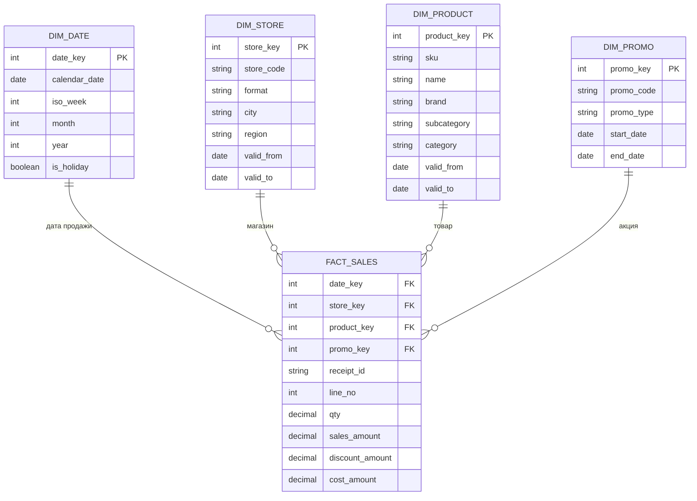
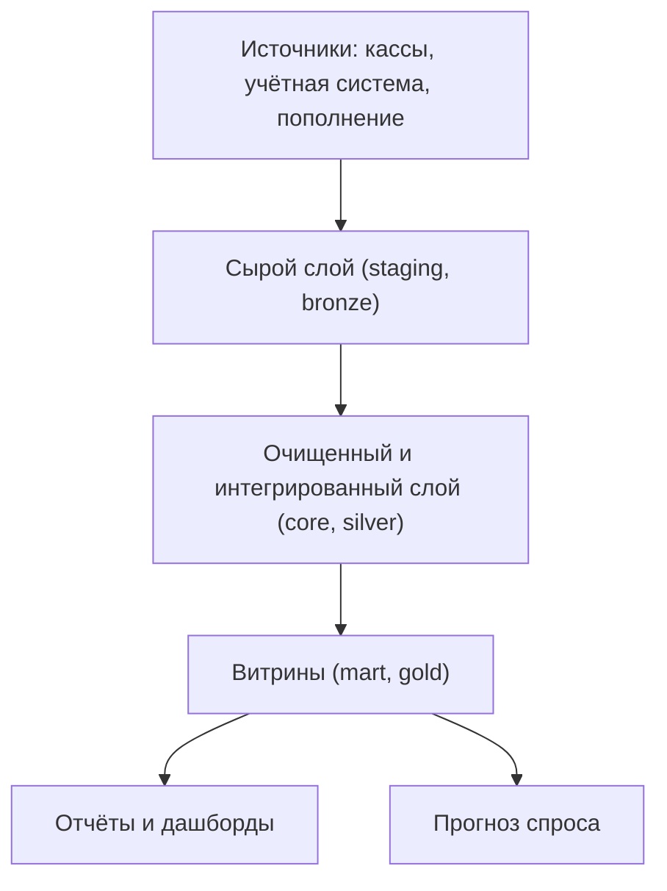

# 9.2 Моделирование хранилища данных: Кимбалл, Data Vault, слои

## Зачем это аналитику

Модель данных для анализа устроена иначе, чем для транзакций: денормализация, факты и измерения, история изменений. Ошибка в модели — это неверные цифры в отчётах, которым верят руководители. Аналитик, который умеет спроектировать звёздную схему, закрывает целый класс задач.

## Что понять

- [ ] Факты и измерения; зерно (grain) факта — самое важное решение в модели.
- [ ] Звезда и снежинка; почему в аналитике денормализация — норма.
- [ ] Виды фактов: транзакционные, периодические снимки (остатки на конец дня), накопительные снимки (жизненный цикл заказа).
- [ ] Аддитивные, полуаддитивные (остатки нельзя суммировать по времени) и неаддитивные меры.
- [ ] Медленно меняющиеся измерения: типы 1, 2 и 3; когда нужна история изменений атрибута.
- [ ] Согласованные измерения и шина хранилища (bus matrix).
- [ ] Data Vault: хабы, ссылки, спутники — когда уместен (много источников, аудит, частые изменения).
- [ ] Слои хранилища: сырые данные, очищенные, витрины (bronze/silver/gold, staging/core/mart).

## Урок

<!-- LESSON:START -->
### Зачем отдельная модель для анализа

Транзакционная модель проектируется так, чтобы каждое изменение записывалось в одно место и не нарушало целостность: третья нормальная форма, внешние ключи, отдельные таблицы для каждой сущности. Для аналитики это неудобно. Запрос «продажи по категориям и форматам магазинов за год» в нормализованной схеме соединяет строки чеков, чеки, товары, группы, подкатегории, категории, магазины, форматы, регионы. Каждый аналитик пишет эти соединения по-своему, и цифры расходятся.

Аналитическая модель решает другую задачу: сделать так, чтобы типовые вопросы задавались просто, считались быстро и давали одинаковый ответ у всех. Самый распространённый подход здесь — размерное моделирование (dimensional modeling), которое систематизировал Ральф Кимбалл.

### Факты и измерения

Модель делит данные на два вида таблиц.

**Факт (fact)** — измерение бизнес-процесса: событие или состояние, которое можно посчитать. Продажа товара в чеке, остаток на складе на конец дня, строка заказа поставщику. В таблице фактов лежат числовые меры (количество, сумма, себестоимость) и ключи измерений.

**Измерение (dimension)** — контекст, по которому факты фильтруют и группируют: дата, магазин, товар, акция, поставщик. Таблица измерения широкая, с описательными атрибутами: у товара — название, бренд, категория на всех уровнях, единица измерения, признак собственной торговой марки. У магазина — город, регион, формат, площадь, дата открытия.

Вопрос «кто, что, где, когда» отвечают измерения, вопрос «сколько» — факты.

#### Зерно факта

Зерно (grain) — точное описание того, что представляет одна строка таблицы фактов. «Одна строка — это одна позиция товара в одном чеке». Или «одна строка — это суммарные продажи товара в магазине за день». Или «одна строка — остаток товара в магазине на конец дня».

Зерно выбирают первым, до выбора мер и измерений, по трём причинам.

1. Зерно определяет, какие измерения вообще возможны. Если зерно — «товар — магазин — день», то измерение «кассир» или «время чека» добавить нельзя: этих деталей в строке нет.
2. Зерно определяет, какие меры корректны. Каждая мера обязана относиться именно к этому зерну. Если смешать в одной таблице строки чеков и дневные итоги, суммирование даст двойной счёт.
3. Зерно невозможно уточнить потом без перезагрузки. Агрегировать детальные данные можно всегда, восстановить детали из агрегатов — никогда.

Отсюда практическое правило: выбирать самое атомарное зерно, которое доступно в источнике и оправдано по объёму, а агрегаты строить поверх него как витрины.

### Звезда и снежинка

**Звёздная схема (star schema)** — таблица фактов в центре и денормализованные измерения вокруг, каждое соединяется с фактом одним ключом. Иерархия товара (группа, подкатегория, категория, департамент) лежит прямо в таблице измерения товара, а не в отдельных таблицах.

**Снежинка (snowflake)** — те же измерения, но нормализованные: товар ссылается на подкатегорию, та на категорию. Экономится немного места, зато растёт число соединений и сложность запросов.

Денормализация в аналитике — норма по нескольким причинам. Измерения на порядки меньше фактов: справочник в сотню тысяч товаров против миллиардов строк продаж, и повторение названия категории в каждой строке товара ничего не стоит. Данные в хранилище меняются контролируемо, загрузкой, а не пользователями, поэтому аномалии обновления, от которых защищает нормализация, здесь не так опасны. Колоночные движки хорошо сжимают повторяющиеся значения. И главное — пользователю и BI-инструменту проще работать с одной таблицей «товар», где есть всё.

#### Пример: звёздная схема продаж розничной сети

Зерно: одна строка — одна позиция товара в одном чеке. Меры: количество, сумма продажи со скидкой, сумма скидки, себестоимость.

Несколько решений в этой схеме стоит проговорить.

- Ключи измерений — суррогатные (surrogate key), целые числа, генерируемые хранилищем, а не коды из учётной системы. Это нужно для истории изменений (ниже) и для независимости от источников.
- Номер чека `receipt_id` лежит в факте без отдельного измерения. Такое поле называют вырожденным измерением (degenerate dimension): оно нужно для подсчёта числа чеков и среднего чека, но описательных атрибутов у него нет.
- Продажи без акции ссылаются на специальную строку «Без акции» в измерении акций, а не на NULL. Так соединения не теряют строки, а отчёт показывает понятную подпись.
- Измерение даты — отдельная таблица, а не просто поле даты: в ней заранее посчитаны неделя, месяц, признак праздника, фискальный период. Это то, что нужно для прогноза спроса и сравнения с прошлым годом.

### Виды фактов

**Транзакционный факт (transaction fact).** Одна строка — одно событие: позиция в чеке, строка приходной накладной. Строки только добавляются. Хорош для детального анализа, но чтобы узнать состояние на дату, нужно просуммировать всю историю событий.

**Периодический снимок (periodic snapshot).** Одна строка — состояние объекта на конец периода: остаток товара в магазине на конец дня, баланс счёта на конец месяца. Строки создаются регулярно для каждого объекта, даже если ничего не произошло. Такой факт отвечает на вопрос «сколько было» без пересчёта истории. Для автопополнения это основной источник: остатки на конец дня вместе с продажами дают оценку дней, когда товара не было на полке, и позволяют очистить историю продаж от эффекта дефицита перед прогнозом.

**Накопительный снимок (accumulating snapshot).** Одна строка — экземпляр процесса с понятным началом и концом, и она обновляется по мере прохождения этапов. Пример — заказ поставщику: даты создания, подтверждения, отгрузки, приёмки, количества заказанное, подтверждённое, принятое. Такой факт удобен для анализа длительности этапов: сколько дней в среднем от заказа до приёмки, какой процент недопоставки. Это один из немногих видов фактов, где строки обновляются.

### Аддитивность мер

Мера аддитивна (additive), если её можно суммировать по любому измерению. Количество и сумма продаж аддитивны: продажи по всем магазинам, всем товарам и всем дням складываются корректно.

Мера полуаддитивна (semi-additive), если её можно суммировать по некоторым измерениям, но не по всем. Классический пример — остатки.

#### Почему остатки нельзя суммировать по времени

Остаток — это состояние на момент времени, а не поток. Посмотрим на факт остатков с зерном «товар — магазин — конец дня».

| Дата | Магазин 1 | Магазин 2 | Сумма по магазинам |
|---|---|---|---|
| Понедельник | 10 | 4 | 14 |
| Вторник | 8 | 6 | 14 |
| Среда | 12 | 3 | 15 |
| Сумма по дням | 30 | 13 | 43 |

Сумма по магазинам на конец среды — 15 штук — это реальное количество товара в сети. Суммировать по магазинам можно. А вот 30 штук «за неделю» в первом магазине никогда не существовали: это одни и те же единицы товара, посчитанные трижды. Сумма по времени бессмысленна.

По времени для остатков используют другие агрегаты:
- остаток на конец периода (последнее значение) — «сколько было на конец недели»;
- средний остаток за период — сумма ежедневных остатков, делённая на число дней; нужен для оборачиваемости;
- минимум или число дней с нулевым остатком — для оценки дефицита.

Средний остаток использует сумму по дням, но только как промежуточный шаг, делённый на число дней. Ошибка возникает, когда BI-инструмент по умолчанию применяет SUM ко всем числовым полям, и в отчёте за месяц «остаток» оказывается в 30 раз больше реального. Поэтому в описании меры нужно явно фиксировать правило агрегации по времени, а в семантическом слое BI — настраивать его.

Неаддитивные (non-additive) меры нельзя суммировать ни по какому измерению: проценты, доли, цены, маржинальность в процентах. Их хранят в виде слагаемых (сумма маржи и сумма выручки) и вычисляют отношение после агрегации. Средний чек считают как сумму продаж, делённую на число чеков, а не как среднее из средних по магазинам.

### Медленно меняющиеся измерения

Атрибуты измерений меняются: товар переводят в другую категорию, магазин меняет формат с «у дома» на «супермаркет», регион переподчиняют другому дивизиону. Вопрос в том, как это отражается на исторических отчётах. Подходы называют медленно меняющимися измерениями (SCD, slowly changing dimensions).

**Тип 1 — перезапись.** Старое значение заменяется новым. История теряется: все прошлые продажи товара теперь выглядят как продажи в новой категории. Подходит для исправления ошибок (опечатка в названии) и атрибутов, история которых не важна.

**Тип 2 — новая версия строки.** При изменении создаётся новая строка измерения с новым суррогатным ключом и интервалом действия (`valid_from`, `valid_to`), часто с признаком текущей версии. Новые факты ссылаются на новую версию, старые — на старую. Отчёт по прошлому году показывает продажи в той категории, в которой товар был тогда.

**Тип 3 — отдельный столбец для предыдущего значения.** В строке хранятся «текущая категория» и «предыдущая категория». Даёт ограниченную историю на один шаг и позволяет сравнивать «как было» и «как стало» по всем фактам. Используется редко, при разовых реорганизациях.

Как выбирать. SCD 2 нужен, когда атрибут участвует в группировке исторических отчётов и бизнесу важно видеть картину «как было на момент события». В рознице это обычно формат магазина (продажи до и после реформатирования нельзя смешивать при оценке эффекта), кластер магазина, категория товара при анализе категорийных стратегий. При этом часто нужна и противоположная картина — «вся история в текущей структуре», например для сравнения категорий год к году после реорганизации ассортиментной матрицы. Для этого делают гибрид: версии типа 2 плюс столбец текущего значения, одинаковый во всех версиях. Этот выбор — вопрос к заказчику, а не технический.

Нужно помнить и о следствиях SCD 2: число строк товара больше не равно числу SKU, подсчёт уникальных товаров делают по натуральному ключу, а загрузка фактов должна искать версию измерения, действовавшую на дату события.

### Согласованные измерения и шина хранилища

Хранилище строится не одной таблицей фактов, а по бизнес-процессам: продажи, остатки, заказы поставщикам, приёмка, списания. Чтобы результаты разных процессов можно было сопоставлять — продажи против остатков, заказы против приёмки, — они должны использовать одни и те же измерения. Такие измерения называют согласованными (conformed dimensions): одна таблица «товар», одна «магазин», одна «дата» с одинаковыми ключами и атрибутами для всех фактов.

Инструмент планирования — шина хранилища (bus matrix): таблица, где строки — бизнес-процессы, столбцы — измерения, а отметки показывают, какое измерение используется каким процессом.

| Процесс | Дата | Магазин | Товар | Акция | Поставщик |
|---|---|---|---|---|---|
| Продажи | да | да | да | да | нет |
| Остатки на конец дня | да | да | да | нет | нет |
| Заказы поставщикам | да | да | да | нет | да |
| Приёмка | да | да | да | нет | да |
| Прогноз спроса | да | да | да | да | нет |

Матрица сразу показывает, какие измерения критичны (товар, магазин, дата используются везде и их нужно согласовать первыми) и в каком порядке развивать хранилище. Она же служит общим языком с бизнесом.

### Data Vault

Data Vault — другой подход к ядру хранилища, ориентированный на интеграцию и аудит, а не на удобство запросов. Модель состоит из трёх видов таблиц.

- **Хаб (hub)** — список бизнес-ключей сущности: коды товаров, коды магазинов. Плюс технические поля: хеш ключа, время загрузки, источник.
- **Ссылка (link)** — связь между хабами: «товар продан в магазине в чеке», «товар поставляется поставщиком». Связи всегда моделируются как «многие ко многим».
- **Спутник (satellite)** — описательные атрибуты хаба или ссылки с историей: каждое изменение — новая строка с временем загрузки. Спутники обычно делят по источнику и частоте изменения.

Достоинства подхода: новые источники добавляются новыми хабами, ссылками и спутниками без переделки существующих таблиц; вся история и происхождение каждой записи сохраняются, что удобно для аудита; загрузка хорошо распараллеливается и шаблонизируется. Недостатки: таблиц много, запросы к ядру сложны, и для пользователей поверх него всё равно строят звёздные витрины.

Data Vault уместен, когда источников много и они часто меняются, когда нужны аудит и полная прослеживаемость, когда команда большая и загрузки генерируются автоматически. Для хранилища с несколькими стабильными источниками и понятной отчётностью это обычно избыточно: звёздной схемы поверх слоя очищенных данных достаточно.

### Слои хранилища

Почти любое современное хранилище делится на слои. Названия разные, смысл общий.

- **Сырой слой (staging, raw, bronze).** Данные в том виде, в каком пришли из источника, с метаданными загрузки. Никакой бизнес-логики. Нужен, чтобы можно было пересчитать всё заново без повторного обращения к источнику и разобраться, что именно прислал источник, когда цифры не сходятся.
- **Очищенный слой (core, silver, ODS или ядро DWH).** Типы приведены, дубли удалены, коды разных систем сопоставлены, применены правила качества. Здесь живёт интегрированная модель: нормализованная, Data Vault или согласованные измерения.
- **Витрины (mart, gold).** Модели под конкретные задачи: звёздная схема продаж, агрегат для отчёта категорийных менеджеров, обучающая выборка для прогноза. Здесь применяются бизнес-определения показателей.

Слои разделяют ответственность. Ошибка в бизнес-правиле исправляется пересчётом витрины, а не перезагрузкой из источников. Изменение источника затрагивает только загрузку в сырой слой и преобразование в очищенный. Разные потребители получают свои витрины из одного согласованного ядра, поэтому цифры сходятся.

### Типичные ошибки

- Не зафиксировать зерно явно и смешать в одной таблице фактов строки разной детализации — отсюда двойной счёт.
- Суммировать остатки по времени, оставив в BI агрегацию SUM по умолчанию для полуаддитивных мер.
- Хранить в факте проценты и средние вместо слагаемых, а потом усреднять средние.
- Использовать бизнес-ключ источника как ключ измерения и не иметь возможности вести SCD 2 или объединить два источника с пересекающимися кодами.
- Выбирать тип SCD без заказчика: технически включить тип 1 для категории товара и тихо переписать историю отчётов за прошлые годы.
- Строить отдельный справочник товаров для каждой витрины вместо согласованного измерения — отчёты о продажах и остатках перестают сопоставляться.
- Внедрять Data Vault «потому что так правильно» в проекте с двумя источниками, получая сложность без выигрыша.

### Как говорить об этом на собеседовании

На вопрос о проектировании хранилища начинайте с бизнес-процесса и зерна: «прежде всего фиксирую, что означает одна строка факта». Затем измерения, меры и их аддитивность, затем историчность атрибутов. Это показывает методичность и понимание, откуда берутся неверные цифры.

Сильный ответ опирается на пример из опыта: факт остатков как периодический снимок для автопополнения, почему его нельзя суммировать по дням, как это настроено в отчётах; решение по SCD для формата магазина и чем оно обосновано. Про Data Vault говорите через критерии выбора, а не через оценку «лучше или хуже»: много источников, аудит, частые изменения — да; стабильная отчётность — звезда поверх очищенного слоя.

### Коротко

- Размерная модель делит данные на факты (что измеряем) и измерения (контекст анализа).
- Зерно факта выбирают первым; атомарное зерно даёт гибкость, агрегаты строятся поверх.
- Звёздная схема с денормализованными измерениями — норма для аналитики, снежинка редко оправдана.
- Факты бывают транзакционными, периодическими снимками и накопительными снимками; остатки — периодический снимок.
- Остатки полуаддитивны: суммируются по магазинам и товарам, но не по времени; по времени берут значение на конец периода или среднее.
- SCD 2 сохраняет историю атрибутов через версии с интервалами действия; выбор типа — решение бизнеса.
- Согласованные измерения и шина хранилища обеспечивают сопоставимость процессов.
- Data Vault — для многих меняющихся источников и аудита; слои сырой, очищенный, витрины разделяют ответственность.
<!-- LESSON:END -->

## Читать дальше

- Kimball, Ross, *The Data Warehouse Toolkit* — главы 1–4 (основы, розница, склад).
- Dan Linstedt, Michael Olschimke, *Building a Scalable Data Warehouse with Data Vault 2.0* — обзорно.

На system-design.space:

- [Архитектура конвейеров данных: ETL и ELT](https://system-design.space/chapter/data-pipeline-etl-elt-architecture/)
- [Краткий обзор платформы данных Т-Банка](https://system-design.space/chapter/tbank-data-platform-overview/)

## Практика

1. Спроектировать звёздную схему для продаж обезличенной ритейл-сети: зерно, факт продаж, измерения (дата, магазин, товар, акция), меры.
2. Добавить факт остатков как периодический снимок и объяснить, почему остатки нельзя суммировать по дням.
3. Решить, какие атрибуты товара и магазина требуют SCD типа 2 (например, смена категории товара или формата магазина) и как это повлияет на отчёты.

## Вопросы для самопроверки

1. Что такое зерно факта и почему его выбирают первым?
2. Чем транзакционный факт отличается от периодического снимка?
3. Почему остатки нельзя суммировать по времени?
4. Что такое SCD тип 2 и когда он нужен?
5. Когда выбрать Data Vault вместо звёздной схемы?
6. Зачем нужны слои в хранилище данных?

## Заметки

<!-- Свои формулировки, ошибки, ссылки. -->
