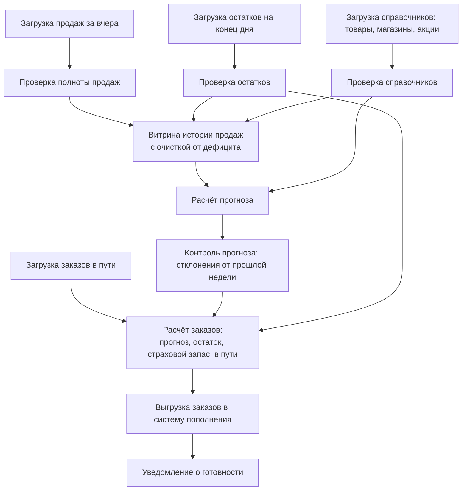

# 9.3 Конвейеры данных: ETL, ELT, оркестрация, потоковая обработка

## Зачем это аналитику

Данные в хранилище попадают через конвейеры, и именно конвейеры ломаются чаще всего: опоздавшие источники, частичные загрузки, пересчёты истории. Нужно понимать, как они устроены, чем пакетная обработка отличается от потоковой и что требовать от конвейера.

## Что понять

- [ ] ETL против ELT: почему с появлением мощных хранилищ преобразование переехало внутрь.
- [ ] Оркестрация: DAG задач, зависимости, расписание, повторные запуски (Airflow, Dagster, Prefect); dbt для преобразований в SQL.
- [ ] Идемпотентность и пересчёт: загрузка по партициям, перезапуск за период, backfill.
- [ ] Потоковая обработка: события, окна (фиксированные, скользящие, сессионные), время события против времени обработки, водяные знаки, опоздавшие события.
- [ ] Lambda и Kappa-архитектуры: зачем была Lambda и почему от неё уходят.
- [ ] Табличные форматы озера данных (Iceberg, Delta): транзакции и эволюция схемы поверх файлов.
- [ ] SLA конвейера: к какому времени данные должны быть готовы и что делать при опоздании.

## Урок

<!-- LESSON:START -->
### Что такое конвейер данных

Конвейер данных (data pipeline) — это цепочка шагов, которая забирает данные из источников, преобразует их и кладёт туда, где ими пользуются: в хранилище, витрину, модель прогноза, обратно в операционную систему. В простом случае это ночной скрипт. В реальном — десятки и сотни задач с зависимостями, разными источниками, расписаниями и требованиями к времени готовности.

Конвейеры ломаются чаще, чем приложения, потому что зависят от чужих систем: источник выгрузил файл позже обычного, прислал половину данных, поменял формат поля, повторно отправил вчерашний день. Поэтому главные свойства хорошего конвейера — не скорость, а предсказуемость: понятно, когда данные будут готовы, что делать при сбое и как пересчитать период без побочных эффектов.

### ETL и ELT

**ETL (extract, transform, load)** — данные извлекаются из источника, преобразуются на отдельном сервере интеграции и загружаются в хранилище уже в готовом виде. Так строились хранилища, когда вычислительные ресурсы хранилища были дорогими и ограниченными: тратить их на преобразования было нельзя, и логику выносили в специализированные ETL-инструменты.

**ELT (extract, load, transform)** — данные извлекаются и загружаются в хранилище почти как есть, в сырой слой, а преобразуются уже внутри хранилища, обычно на SQL.

Переход к ELT объясняется несколькими причинами.

- Колоночные и облачные хранилища стали достаточно мощными, а вычисления в облаке масштабируются отдельно от хранения. Преобразовывать данные там, где они лежат, быстрее, чем гонять их через внешний сервер.
- Сырые данные сохраняются в хранилище. Если бизнес-правило изменилось или в преобразовании нашли ошибку, историю можно пересчитать, не обращаясь снова к источнику.
- Преобразования на SQL понятны аналитикам. Логику можно версионировать в git, ревьюить и тестировать как код.
- Загрузка отделена от преобразования: коннекторы извлечения становятся типовыми, а бизнес-логика концентрируется в одном месте.

ETL при этом не исчез. Преобразование до загрузки остаётся оправданным, когда данные нужно очистить от персональной информации до попадания в хранилище, когда исходные объёмы огромны и перед загрузкой их нужно агрегировать, или когда целевая система не умеет выполнять преобразования.

#### dbt

dbt (data build tool) — популярный инструмент для слоя «T» в ELT. Каждая модель — это файл с SELECT-запросом, а dbt превращает его в таблицу или представление в хранилище. Модели ссылаются друг на друга через специальную функцию ref, и dbt по этим ссылкам сам строит граф зависимостей и порядок выполнения. Кроме того, он даёт тесты данных (уникальность, отсутствие NULL, ссылочная целостность, допустимые значения), документацию и инкрементальные модели, которые обрабатывают только новые данные. dbt сам не планирует запуски по времени — это делает оркестратор или облачный сервис dbt.

### Оркестрация

Оркестратор управляет тем, какие задачи, в каком порядке и когда запускать. Основная абстракция — DAG (directed acyclic graph, ориентированный ациклический граф): задачи — узлы, зависимости — рёбра. Задача запускается, когда завершились все задачи, от которых она зависит.

Что даёт оркестратор:
- расписание (по времени или по событию, например появлению файла);
- зависимости между задачами и между разными DAG;
- повторные попытки с задержкой при временных сбоях;
- журнал запусков, статусы, логи;
- перезапуск упавшей задачи и всех зависящих от неё без повторения успешных;
- запуск за прошлые даты (backfill);
- оповещения и контроль времени выполнения.

Наиболее известные инструменты — Apache Airflow, Dagster и Prefect. Airflow — самый распространённый, DAG описываются на Python, в центре — задачи и расписание. Dagster делает акцент на данных как активах (assets): описываются не столько задачи, сколько таблицы и зависимости между ними. Prefect ориентирован на простоту описания потоков в обычном Python-коде. Для аналитика важнее не синтаксис, а умение описать DAG: задачи, зависимости, расписание, правила перезапуска.

#### Пример: DAG ежедневного расчёта прогноза и заказов

Розничная сеть каждую ночь пересчитывает прогноз спроса и формирует рекомендуемые заказы поставщикам. Заказы должны быть в системе пополнения к 7:00, чтобы менеджеры успели их проверить до отправки поставщикам.



Разберём точки отказа и поведение в каждой.

- **Загрузки источников.** Главный риск — источник не готов. Задача загрузки ждёт признак готовности (файл-маркер, запись в контрольной таблице) до определённого срока, затем падает с оповещением. Повторы с задержкой закрывают временные сетевые сбои.
- **Проверки качества.** Проверка полноты продаж сравнивает число магазинов с данными и сумму продаж с обычным уровнем для этого дня недели. Если данных нет по 30 магазинам, прогноз по ним будет занижен, а заказы — недостаточны. Правило нужно сформулировать заранее: остановить расчёт, считать без этих магазинов с пометкой или использовать данные прошлого дня.
- **Расчёт прогноза.** Самая долгая задача. Её делают идемпотентной: результат пишется в партицию с датой расчёта и полностью её заменяет. Перезапуск не создаёт дублей.
- **Контроль прогноза.** Автоматическая проверка на аномалии: прогноз по категории отличается от прошлой недели в разы — сигнал об ошибке в данных, а не о внезапном спросе.
- **Выгрузка.** Точка, где конвейер влияет на бизнес. Выгрузка должна быть атомарной: система пополнения видит либо полный набор заказов, либо ни одного. Повторная выгрузка не должна создавать повторные заказы — для этого у каждого расчёта есть идентификатор, и принимающая сторона обрабатывает его идемпотентно.

Рёбра от проверок к расчётам показывают важную идею: проверки качества — это полноценные задачи DAG, которые блокируют дальнейшие шаги, а не отчёт, который кто-то посмотрит потом.

### Идемпотентность и пересчёт

Идемпотентная загрузка при повторном запуске с теми же параметрами даёт тот же результат, что и одиночный запуск. Без этого любой перезапуск — риск дублей или потерь.

Основные приёмы:

- **Загрузка по партициям с заменой.** Данные делятся на партиции по дате. Загрузка за день удаляет или перезаписывает партицию этого дня целиком и пишет её заново. Перезапуск за тот же день даёт ту же партицию.
- **Слияние по ключу (MERGE, upsert).** Для данных без естественного деления по датам: строка с тем же бизнес-ключом обновляется, новая — вставляется.
- **Параметр даты вместо «сейчас».** Задача получает логическую дату запуска параметром и обрабатывает именно её, а не «вчерашний день относительно текущего времени». Иначе перезапуск через два дня загрузит не тот период.
- **Детерминированные преобразования.** Результат зависит только от входных данных за период, а не от времени запуска и не от состояния, изменённого прошлыми запусками.
- **Атомарная публикация.** Результат пишется во временную таблицу и затем подменяет рабочую одной операцией, или используется транзакционная запись табличного формата.

Пример задачи загрузки продаж за день, где `$RUN_DATE` подставляется оркестратором:

```sql
BEGIN;
DELETE FROM core.sales_line
 WHERE sale_date = DATE '$RUN_DATE';
INSERT INTO core.sales_line (sale_date, store_id, sku, receipt_id, line_no, qty, amount)
SELECT sale_date, store_id, sku, receipt_id, line_no, qty, amount
  FROM staging.pos_sales
 WHERE sale_date = DATE '$RUN_DATE';
COMMIT;
```

**Backfill** — запуск конвейера за прошлые периоды: при первом наполнении хранилища, после исправления ошибки в логике, при добавлении нового поля, которое нужно посчитать за историю. Если задачи идемпотентны и параметризованы датой, backfill — это просто запуск DAG для диапазона дат. Нужно заранее решить, можно ли запускать дни параллельно (для прогноза, который зависит от предыдущих результатов, часто нельзя) и как не перегрузить источники.

Отдельный случай — поздние исправления в источнике: кассы досылают чеки за позавчера, учётная система проводит корректировку остатков задним числом. Типовое решение — каждый запуск перезагружает не один день, а скользящее окно за последние несколько дней, либо источник отдаёт изменения по отметке времени изменения, и пересчитываются затронутые партиции.

### Потоковая обработка

Пакетная обработка работает с ограниченным набором данных: «продажи за вчера». Потоковая — с неограниченным потоком событий, который никогда не заканчивается. Событие — неизменяемый факт: «в 14:03:12 в магазине 17 пробит чек на 1 250 рублей». События обычно передаются через брокер (Apache Kafka и аналоги), обрабатываются движком (Apache Flink, Spark Structured Streaming, Kafka Streams).

#### Время события и время обработки

У каждого события есть два времени.
- **Время события (event time)** — когда оно произошло в реальном мире: момент пробития чека.
- **Время обработки (processing time)** — когда событие дошло до системы обработки.

Их различают, потому что разница между ними непостоянна и иногда велика. Касса потеряла связь на 20 минут и потом отправила накопленные чеки пачкой. Если считать продажи по времени обработки, в одном 5-минутном интервале окажется всплеск, а в предыдущих — провал, хотя покупатели шли равномерно. Для бизнес-показателей почти всегда нужно время события. Время обработки проще и даёт предсказуемую задержку результата (но сам результат зависит от того, когда события дошли), его используют для технических метрик самой системы.

#### Окна

Бесконечный поток нельзя агрегировать целиком, поэтому его режут на окна.

- **Фиксированные окна (tumbling).** Непересекающиеся интервалы одинаковой длины: 14:00–14:05, 14:05–14:10. Каждое событие попадает ровно в одно окно. Подходит для «продажи по магазинам за каждые 5 минут».
- **Скользящие окна (sliding, hopping).** Окна фиксированной длины, которые начинаются с шагом меньше длины: окно 15 минут с шагом 5 минут. Окна пересекаются, событие попадает в несколько окон. Подходит для сглаженных показателей: «выручка за последние 15 минут, обновляемая каждые 5».
- **Сессионные окна (session).** Окно определяется активностью: оно длится, пока события идут с паузами не больше заданной, и закрывается после паузы. Длина разная. Подходит для сессий покупателя в интернет-магазине.

#### Водяные знаки и опоздавшие события

Когда можно считать окно 14:00–14:05 по времени события закрытым и выдать результат? Ведь чек за 14:04 может прийти и в 14:07, и в 14:30.

Водяной знак (watermark) — это оценка движка: «события с временем раньше T, скорее всего, уже все пришли». Когда водяной знак проходит конец окна, окно можно закрыть и выдать результат. Водяной знак обычно вычисляют как максимальное увиденное время события минус допустимую задержку. Это компромисс: маленькая допустимая задержка даёт быстрые, но неполные результаты, большая — полные, но поздние.

События, пришедшие после водяного знака, называются опоздавшими (late events). Варианты обработки:
- отбросить и посчитать в метрике опоздавших;
- принять в течение дополнительного допуска (allowed lateness) и выдать обновлённый результат окна — потребитель должен уметь заменять ранее полученное значение;
- направить в отдельный поток для последующей сверки пакетным расчётом.

Для задачи «продажи по магазинам с окнами 5 минут» разумная постановка звучит так: окна по времени события, водяной знак с задержкой в несколько минут, опоздавшие чеки до определённого допуска обновляют окно, более поздние попадают в ночной пакетный пересчёт, который остаётся источником истины для отчётности. Точные значения задержки выбираются по реальному распределению опозданий касс.

### Lambda и Kappa

**Lambda-архитектура** появилась, когда потоковые движки были ненадёжными и не гарантировали точность. Идея: два параллельных контура. Пакетный (batch layer) периодически пересчитывает точные результаты по всем данным. Потоковый (speed layer) быстро выдаёт приближённые результаты за последние часы. Слой обслуживания объединяет оба. Проблема — одна и та же логика реализуется дважды, на разных технологиях, и две реализации неизбежно расходятся. Сопровождать это дорого.

**Kappa-архитектура**, предложенная Джеем Крепсом, убирает пакетный контур. Всё — поток. Журнал событий хранится достаточно долго, и если нужно пересчитать историю или поменять логику, запускается новая версия потоковой обработки с начала журнала, а после догонки на неё переключаются потребители. Это стало возможно, когда потоковые движки научились работать со временем события, хранить состояние и обеспечивать обработку ровно один раз (exactly-once) в пределах своей системы.

От Lambda уходят потому, что двойная реализация логики слишком дорога, а потоковые движки стали достаточно точными. На практике многие системы — ни чистая Lambda, ни Kappa: поток для оперативных показателей и пакетный ELT для отчётности, но без попытки склеить их в один результат.

### Табличные форматы озера данных

Озеро данных — это файлы в объектном хранилище. Сами по себе файлы не дают транзакций: если задача записи упала посередине, читатели увидят часть файлов; нельзя атомарно заменить партицию; изменение схемы ломает старые файлы.

Табличные форматы — Apache Iceberg, Delta Lake, Apache Hudi — добавляют над файлами слой метаданных. Таблица — это набор файлов данных (обычно Parquet) плюс метаданные, описывающие, какие файлы входят в текущую версию таблицы. Запись создаёт новые файлы и затем атомарно публикует новую версию метаданных. Отсюда:
- **транзакции**: читатель видит либо старую версию, либо новую целиком;
- **снимки и путешествие во времени (time travel)**: можно прочитать таблицу на прошлую версию, что полезно для отладки и воспроизведения расчёта прогноза;
- **эволюция схемы**: добавление, переименование столбцов без переписывания данных;
- **эффективные MERGE, UPDATE, DELETE** поверх неизменяемых файлов;
- **независимость от движка**: одну таблицу читают разные SQL-движки и Spark.

Для конвейера это означает, что идемпотентная замена партиции и атомарная публикация результата доступны и в озере, а не только в классической СУБД.

### SLA конвейера

SLA конвейера — договорённость о том, к какому времени и в каком качестве данные будут готовы. В требованиях его стоит описывать конкретно:

- **Время готовности.** «Витрина продаж за вчерашний день готова к 6:00 по московскому времени в 99% рабочих дней за квартал».
- **Зависимости от источников.** Крайний срок готовности каждого источника, при котором SLA достижимо. Если кассы выгружаются до 3:00, а расчёт идёт 2 часа, запас минимален.
- **Критерии полноты и качества.** Что считается «готово»: все магазины, расхождение с кассовой системой не более заданного порога, пройдены тесты.
- **Поведение при опоздании источника.** Ждать до какого времени; после этого — считать на неполных данных с пометкой, использовать вчерашние данные или не публиковать. Решение принимает бизнес: для заказов поставщикам лучше вчерашний прогноз, чем никакого.
- **Уведомления и эскалация.** Кому и когда сообщать: дежурному инженеру при сбое задачи, владельцу данных при риске срыва срока, пользователям — если данные опаздывают или неполные.
- **Пересчёт истории.** За какой период допустимы исправления, кто инициирует backfill, как пользователи узнают об изменении прошлых цифр.
- **Мониторинг.** Метрики времени завершения, свежести данных, объёма загрузки по дням, доли опоздавших событий для потоков.

### Типичные ошибки

- Писать загрузку через INSERT без очистки периода: каждый перезапуск добавляет дубли.
- Брать дату из текущего времени, а не из параметра запуска, из-за чего перезапуск и backfill обрабатывают не тот период.
- Считать проверки качества необязательным отчётом, а не блокирующими задачами DAG, и отправлять заказы, рассчитанные по неполным продажам.
- Агрегировать потоковые данные по времени обработки и получать ложные всплески после восстановления связи с кассами.
- Строить Lambda-архитектуру с двумя реализациями одной логики, не имея ресурсов поддерживать их согласованность.
- Формулировать SLA как «данные должны быть свежими», без времени, критериев полноты и правил поведения при опоздании.
- Не предусмотреть поздние исправления в источнике, из-за чего хранилище навсегда расходится с учётной системой.

### Как говорить об этом на собеседовании

Сильный ответ описывает конвейер через требования и отказы, а не через список инструментов. Рассказывая о DAG расчёта прогноза, называйте точки отказа и решения: ожидание источника до срока, блокирующие проверки полноты, идемпотентная запись по партициям, атомарная выгрузка, правило «лучше вчерашний прогноз, чем никакой». Это показывает, что вы думаете о последствиях для бизнеса.

В разговоре о потоках покажите понимание времени события, водяных знаков и цены полноты: «окно закрывается по водяному знаку, опоздавшие чеки в пределах допуска обновляют результат, остальное сверяет ночной пакет». На вопрос о Lambda и Kappa объясните причину появления и отказа, а не только определения.

### Коротко

- ELT вытеснил ETL, потому что хранилища стали мощными, а хранение сырых данных позволяет пересчитывать историю; dbt — стандартный инструмент преобразований на SQL.
- Оркестратор управляет DAG задач: расписание, зависимости, повторы, перезапуски, backfill.
- Идемпотентность достигается заменой партиций или MERGE, параметром логической даты и атомарной публикацией.
- Проверки качества — блокирующие шаги конвейера, а не отчёт постфактум.
- В потоках бизнес-показатели считают по времени события; водяной знак решает, когда закрыть окно, опоздавшие события обрабатываются по явному правилу.
- Lambda дублирует логику в двух контурах, Kappa пересчитывает историю повторным проигрыванием журнала.
- Iceberg и Delta дают транзакции, снимки и эволюцию схемы поверх файлов в озере.
- SLA конвейера — это время готовности, критерии полноты, поведение при опоздании, уведомления и правила пересчёта.
<!-- LESSON:END -->

## Читать дальше

- Reis, Housley, Fundamentals of Data Engineering — главы о загрузке, преобразовании и оркестрации.
- Tyler Akidau et al., *Streaming Systems* — главы 1–3 о времени и окнах.
- Документация dbt (docs.getdbt.com) — Introduction.

На system-design.space:

- [Архитектура конвейеров данных: ETL и ELT](https://system-design.space/chapter/data-pipeline-etl-elt-architecture/)
- [Движки потоковой обработки: окна, водяные знаки, состояние и ровно один раз](https://system-design.space/chapter/stream-processing-engines/)
- [Kappa Architecture: потоковая альтернатива Lambda](https://system-design.space/chapter/kappa-architecture/)
- [Apache Iceberg: архитектура таблиц в озере данных](https://system-design.space/chapter/apache-iceberg-architecture/)
- [Визуализация: Архитектура data pipeline](https://system-design.space/visuals/data-pipeline-architecture/)

## Практика

1. Нарисовать DAG ежедневного расчёта прогноза спроса для обезличенной сети: загрузки источников, проверки, преобразования, расчёт, выгрузка результата. Отметить точки отказа и способы перезапуска.
2. Сформулировать требования к конвейеру: время готовности, поведение при опоздании источника, пересчёт истории, уведомления.
3. Спроектировать потоковый подсчёт продаж по магазинам в реальном времени с окнами в 5 минут и обработкой опоздавших чеков.

## Вопросы для самопроверки

1. Чем ETL отличается от ELT и почему ELT стал популярнее?
2. Как сделать загрузку данных идемпотентной?
3. Что такое время события и время обработки, и почему их различают?
4. Что такое водяной знак в потоковой обработке?
5. Чем Kappa-архитектура отличается от Lambda?
6. Как описать SLA конвейера данных в требованиях?

## Заметки

<!-- Свои формулировки, ошибки, ссылки. -->
