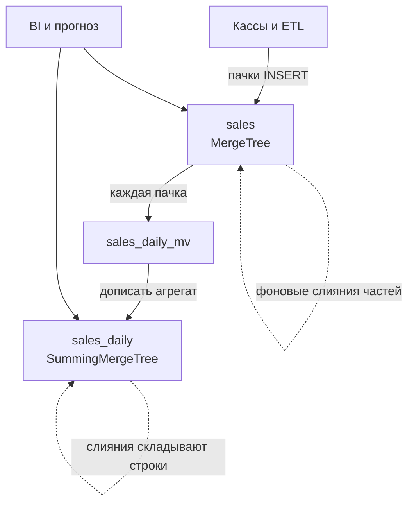
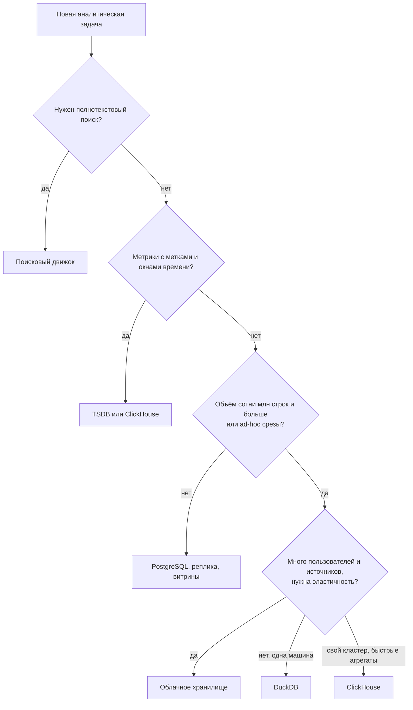

# 9.4 Аналитические СУБД и выбор хранилища для данных

## Зачем это аналитику

ClickHouse, облачные хранилища, DuckDB, Elasticsearch, базы временных рядов — у каждой своя ниша. Архитектору нужно понимать, почему одна и та же задача на одной базе решается за секунды, а на другой за часы, и уметь выбрать хранилище по профилю нагрузки.

## Что понять

- [ ] ClickHouse: MergeTree, первичный ключ как порядок сортировки, партиции, материализованные представления, почему точечные обновления дороги.
- [ ] Облачные хранилища (BigQuery, Snowflake, Redshift обзорно): разделение хранения и вычислений, оплата за объём запроса.
- [ ] DuckDB и встроенная аналитика: аналитика на ноутбуке и в приложении.
- [ ] Базы временных рядов: метрики, IoT, сжатие и даунсэмплинг.
- [ ] Поисковые движки как аналитика по логам и текстам.
- [ ] Фреймворк выбора хранилища: профиль запросов, объём, свежесть, конкурентность, стоимость, компетенции команды.

## Урок

<!-- LESSON:START -->
### Почему одна и та же задача занимает секунды или часы

Возьмём запрос «выручка по магазинам и категориям за три года помесячно» к таблице с несколькими миллиардами строк чеков. В PostgreSQL он читает каждую строку целиком: все двадцать колонок, хотя нужны четыре. Данные хранятся построчно (row-oriented), страница на диске содержит строки подряд, и прочитать «только сумму» нельзя. Даже при параллельном сканировании это десятки или сотни гигабайт ввода-вывода.

Колоночная СУБД (columnar) хранит каждую колонку отдельно. Запрос читает четыре колонки из двадцати, и каждая сжата: значения одного типа, часто повторяющиеся и отсортированные, сжимаются в разы лучше, чем смешанные строки. Затем обработка идёт векторно — блоками по тысячам значений, что хорошо ложится на кэши процессора и SIMD-инструкции. Итог — разница на порядки при одинаковом железе.

Цена колоночного формата — всё, что работает со строкой целиком: вставка одной записи, обновление одного поля, чтение одной строки по ключу. Именно поэтому OLTP-нагрузку (платёжные поручения, заказы) держат в строковой базе, а аналитику выносят в колоночную. Дальше разберём основные классы аналитических хранилищ и то, как между ними выбирать.

### ClickHouse и семейство MergeTree

ClickHouse — колоночная СУБД с открытым кодом, рассчитанная на большие объёмы и интерактивные агрегаты. Её основной движок таблиц — MergeTree и его варианты.

#### Как устроен MergeTree

Каждая вставка (INSERT) создаёт на диске новую неизменяемую часть (part): отсортированный набор колонок с собственным индексом. В фоне сервер сливает мелкие части в крупные — отсюда название «дерево слияний». Модель близка к LSM-деревьям: запись дешёвая и последовательная, порядок наводится потом.

Отсюда первое практическое правило: вставлять пачками. Тысячи вставок по одной строке в секунду порождают тысячи частей, слияния не успевают, и сервер начинает отказывать во вставке. Типовое решение — буферизация на стороне приложения или брокера (например, пачки по десяткам тысяч строк или раз в секунду), либо асинхронная вставка, которую поддерживает сам сервер.

#### Первичный ключ — это порядок сортировки

В MergeTree ключ `ORDER BY` задаёт, как строки упорядочены внутри каждой части. Первичный ключ по умолчанию совпадает с ним и не гарантирует уникальность — две строки с одинаковым ключом спокойно сосуществуют. Это главное отличие от первичного ключа в PostgreSQL.

Индекс разреженный (sparse): он хранит не каждую строку, а значение ключа для каждой гранулы — блока строк (по умолчанию около 8192). Индекс маленький и целиком помещается в память. При запросе с условием на префикс ключа сервер бинарным поиском находит нужные гранулы и читает только их.

Как выбирать ключ сортировки:

- Первыми ставить колонки, по которым чаще всего фильтруют запросы. Работает префикс: фильтр по второй колонке без первой использует индекс намного хуже.
- При прочих равных — от низкой кардинальности к высокой: сначала магазин (сотни значений), потом товар (сотни тысяч). Длинные серии одинаковых значений лучше сжимаются и точнее отсекают гранулы.
- Не включать колонки «на всякий случай»: длинный ключ не ускоряет запросы, но усложняет слияния.
- Помнить, что ключ определяет и сжатие: соседние строки похожи, значит, колонки жмутся лучше.

Если основных профилей запросов два (например, «по магазину» и «по товару во всей сети»), одного ключа не хватит. Варианты — проекции (projections) с другим порядком сортировки внутри той же таблицы или отдельная агрегированная таблица.

#### Партиции

`PARTITION BY` делит данные на независимые группы частей, обычно по месяцу. Партиция — прежде всего инструмент управления данными, а не ускорения: её можно целиком удалить, отсоединить, перезаписать. Удаление данных старше пяти лет становится операцией над метаданными, а не переписыванием таблицы. Отсечение партиций по дате помогает запросам, но основную работу делает ключ сортировки.

Частая ошибка — слишком мелкое партиционирование (по дню при малом объёме или по магазину). Части из разных партиций никогда не сливаются, поэтому тысячи партиций означают тысячи мелких частей и деградацию. Месяц — разумное значение по умолчанию для большинства таблиц фактов.

#### Пример: таблица продаж розничной сети

```sql
CREATE TABLE sales
(
    sale_date   Date,
    sold_at     DateTime,
    store_id    UInt32,
    sku_id      UInt64,
    receipt_id  UInt64,
    channel     LowCardinality(String),
    qty         Decimal(12, 3),
    amount      Decimal(14, 2)
)
ENGINE = MergeTree
PARTITION BY toYYYYMM(sale_date)
ORDER BY (store_id, sku_id, sale_date);
```

Логика решений:

- Прогноз спроса и отчёты по магазину фильтруют по `store_id` и затем по товару — они в начале ключа.
- Дата в конце ключа даёт упорядоченные временные ряды по паре «магазин — товар», что удобно для выборок истории.
- Месячные партиции позволяют удалять старую историю и перезагружать месяц при исправлении данных.
- `LowCardinality(String)` для канала продаж — словарное кодирование для колонок с малым числом различных значений.
- Денежные суммы — `Decimal`, а не `Float`: ошибки округления в финансовых отчётах недопустимы.

#### Материализованные представления

Материализованное представление в ClickHouse — это не периодически пересчитываемый снимок, как в PostgreSQL, а триггер на вставку. Каждая пачка, попадающая в исходную таблицу, прогоняется через запрос представления, а результат дописывается в целевую таблицу. Представление видит только новую пачку, а не всю таблицу.

Дневные агрегаты для примера выше:

```sql
CREATE TABLE sales_daily
(
    sale_date  Date,
    store_id   UInt32,
    sku_id     UInt64,
    qty        Decimal(38, 3),
    amount     Decimal(38, 2)
)
ENGINE = SummingMergeTree
PARTITION BY toYYYYMM(sale_date)
ORDER BY (store_id, sku_id, sale_date);

CREATE MATERIALIZED VIEW sales_daily_mv TO sales_daily AS
SELECT
    sale_date,
    store_id,
    sku_id,
    sum(qty)    AS qty,
    sum(amount) AS amount
FROM sales
GROUP BY sale_date, store_id, sku_id;
```

`SummingMergeTree` при слияниях складывает строки с одинаковым ключом сортировки. Важная тонкость: слияние происходит когда-нибудь, а не сразу, поэтому в таблице может временно быть несколько строк на один день. Запросы к агрегату всё равно пишут с `sum()` и `GROUP BY` — тогда результат корректен независимо от состояния слияний. Для средних, уникальных и перцентилей используют `AggregatingMergeTree` с промежуточными состояниями агрегатных функций.

Ещё два следствия модели «триггер на вставку». Первое: исторические данные, загруженные до создания представления, в агрегат не попадут — их нужно догрузить отдельно. Второе: исправление или удаление строки в исходной таблице не отражается в агрегате автоматически.



#### Почему точечные обновления дороги

Части неизменяемы. Чтобы поменять одно поле в одной строке, нужно переписать все части, где могут лежать затронутые строки, — как минимум переписать затронутые колонки этих частей. В ClickHouse это называется мутацией (`ALTER TABLE ... UPDATE` или `DELETE`): она выполняется асинхронно, в фоне, и может занимать минуты на больших таблицах. Лёгкие удаления (lightweight delete) помечают строки как удалённые без немедленной перезаписи, но физическая очистка всё равно происходит при слияниях, и частые мелкие удаления остаются антипаттерном.

Поэтому в ClickHouse изменения моделируют иначе:

- Версионные строки: `ReplacingMergeTree` оставляет при слиянии последнюю версию строки по ключу. До слияния дубли видны, поэтому в запросах нужен `FINAL` или дедупликация через `argMax`, что дороже обычного чтения.
- Строки-отмены: `CollapsingMergeTree` и его варианты — вставить строку с признаком «−1», которая погасит предыдущую при слиянии.
- Перезапись партиции: исправленный месяц загружают заново и заменяют партицию целиком.

Для аналитика это значит: если в требованиях есть «чек может быть скорректирован в течение 30 дней» или «статус заказа меняется семь раз», это нужно явно заложить в модель данных, а не надеяться на `UPDATE`.

### Облачные хранилища: разделение хранения и вычислений

BigQuery, Snowflake и Redshift в современных конфигурациях объединяет одна идея: данные лежат в дешёвом распределённом объектном хранилище, а вычисления выполняются отдельными, независимо масштабируемыми кластерами.

В классической MPP-системе (массово-параллельной обработки) каждый узел хранит свою долю данных и сам её обрабатывает. Хранение и вычисления привязаны друг к другу: чтобы получить больше диска, покупаешь больше узлов с процессорами, и наоборот. Добавление узла требует перераспределения данных. Нагрузки мешают друг другу: тяжёлый ночной ETL тормозит утренние отчёты.

При разделении:

- Хранилище растёт независимо и стоит как объектное хранилище.
- Под разные нагрузки поднимаются разные вычислительные кластеры над одними данными: отдельно для ETL, для BI, для команды data science. Они не конкурируют за процессоры.
- Вычисления можно останавливать, когда запросов нет, и не платить за них.
- Платой становится задержка: данные приходится тянуть по сети из объектного хранилища, поэтому в системы встроены многоуровневые кэши на локальных дисках вычислительных узлов.

Модели оплаты различаются. У BigQuery в режиме по запросу платят за объём просканированных данных; есть и режим с зарезервированными мощностями. У Snowflake платят за время работы виртуальных складов (warehouses) определённого размера. Redshift исторически был классическим MPP-кластером, затем получил узлы с отделённым управляемым хранилищем и бессерверный режим. Конкретные цены и названия тарифов меняются, их нужно проверять на момент решения.

Для аналитика из оплаты за объём следуют требования к модели. Запрос `SELECT *` к широкой таблице за пять лет может стоить заметных денег. Партиционирование по дате и кластеризация (аналог ключа сортировки) напрямую снижают счёт, а не только время. Ограничения на стоимость одного запроса и квоты для пользователей — нормальная часть постановки.

### DuckDB и встроенная аналитика

DuckDB — встраиваемая (in-process) колоночная СУБД: библиотека, которая работает внутри процесса приложения, без отдельного сервера, по аналогии с SQLite, но для аналитики. Она умеет напрямую читать файлы Parquet, CSV и JSON, в том числе из объектного хранилища, и выполнять над ними полноценный SQL с векторным исполнением.

Где это полезно:

- Аналитика на ноутбуке: выгрузка истории продаж в Parquet на несколько десятков гигабайт обрабатывается локально за секунды — без кластера и без очереди к общему хранилищу.
- Шаг конвейера: трансформация файлов между этапами ETL без поднятия Spark.
- Встроенная аналитика в приложении: отчёты внутри сервиса или прямо в браузере через WebAssembly.
- Прототипирование модели данных перед переносом в «большое» хранилище.

Ограничения: это не многопользовательский сервер. Одновременно писать в файл базы может один процесс, нет разграничения доступа и репликации. Объём ограничен ресурсами одной машины, хотя DuckDB умеет обрабатывать данные больше оперативной памяти, сбрасывая промежуточные результаты на диск. Если отчёт должны видеть сто пользователей одновременно, DuckDB — не ответ.

### Базы временных рядов

Временной ряд — последовательность измерений с меткой времени: загрузка процессора сервера, температура в холодильной витрине магазина, число запросов в секунду к API регистрации доменов. Профиль нагрузки специфичен: почти только вставки в конец, запросы по диапазонам времени, агрегаты по окнам, свежие данные запрашивают часто, старые — редко.

Специализированные базы (Prometheus для метрик, InfluxDB, TimescaleDB как расширение PostgreSQL, VictoriaMetrics и другие) используют это:

- Модель «метрика + набор меток + значение + время». Каждая уникальная комбинация меток — отдельный ряд.
- Сильное сжатие: соседние метки времени отличаются на одинаковый шаг, соседние значения близки. Кодирование разностей (delta, delta-of-delta) и XOR-кодирование чисел с плавающей точкой сжимают данные во много раз.
- Даунсэмплинг (downsampling): сырые точки хранятся недолго, затем заменяются агрегатами — минутными, часовыми. Метрика раз в 10 секунд за год не нужна, нужен часовой максимум и среднее.
- Политики хранения (retention): данные старше заданного срока удаляются автоматически.

Главный риск — кардинальность меток. Если положить в метку идентификатор пользователя или номер чека, число рядов взрывается, индекс перестаёт помещаться в память, и система деградирует. Метки — для измерений с ограниченным набором значений (сервис, регион, магазин), а не для идентификаторов событий.

ClickHouse тоже хорошо справляется с метриками и часто используется для этого. Выбор между ним и специализированной TSDB зависит от того, нужна ли экосистема мониторинга (язык запросов, алерты, интеграции с Grafana) или гибкий SQL и объединение с бизнес-данными.

### Поисковые движки как аналитика

Elasticsearch и OpenSearch строятся вокруг инвертированного индекса: для каждого слова хранится список документов, где оно встречается. Это оптимально для полнотекстового поиска с ранжированием, морфологией, опечатками и фасетами — поиск по каталогу интернет-магазина, поиск по логам по произвольной строке.

Аналитика в них — агрегации поверх результатов поиска: гистограммы ошибок по времени, топ значений поля, фасетные счётчики. Для логов приложений это удобно: инженер ищет по тексту исключения и сразу видит распределение по сервисам.

Слабые места как аналитической системы:

- Хранение дороже колоночных СУБД: индекс по всем полям занимает много места.
- Сложные соединения таблиц практически не поддерживаются, данные приходится денормализовать при индексации.
- Точность некоторых агрегаций (например, уникальные значения, топы на распределённых данных) приблизительна.
- Индексирование требует ресурсов при высокой скорости записи.

Поэтому для логов всё чаще встречается гибрид: полнотекстовый поиск по свежим данным в поисковом движке, долгосрочная история и тяжёлая аналитика — в колоночной СУБД или объектном хранилище.

### Когда хватит PostgreSQL

PostgreSQL — не колоночная база, но для многих аналитических задач его достаточно. Признаки того, что отдельная система не нужна:

- Объём таблиц фактов — десятки миллионов строк, возможно, сотни, и рост умеренный.
- Отчёты строятся по заранее известным срезам, их можно ускорить индексами, партиционированием и материализованными представлениями.
- Пользователей отчётов немного, и нагрузка от них не мешает основной системе — лучше, если аналитика читает с реплики.
- Нужна строгая согласованность и транзакционная связь с операционными данными.

Сигналы, что пора выносить аналитику:

- Ad-hoc запросы по произвольным срезам на сотнях миллионов и миллиардах строк работают минутами.
- Аналитические запросы мешают транзакционной нагрузке даже на реплике: реплика отстаёт, долгие запросы конфликтуют с репликацией.
- Нужно объединять данные из многих источников — это уже хранилище данных, а не отчётная реплика.
- Требуется хранить историю за годы, а в операционной базе её держать дорого или неудобно.

Промежуточные варианты тоже существуют: колоночные расширения для PostgreSQL, TimescaleDB для временных рядов. Их стоит рассматривать, когда команда хорошо знает PostgreSQL, а объём ещё не требует полноценной MPP-системы.

### Фреймворк выбора хранилища

Выбор начинается не с продукта, а с профиля нагрузки. Полезно пройти по шести вопросам.

1. Профиль запросов. Агрегаты по широким срезам, точечные чтения по ключу, полнотекстовый поиск, окна по времени? Известны ли запросы заранее или они произвольные?
2. Объём и рост. Сколько данных сейчас, сколько через три года, сколько лет истории храним?
3. Свежесть. Насколько отстают данные от источника: секунды, минуты, сутки? Как часто данные исправляются задним числом?
4. Конкурентность. Сколько одновременных пользователей и запросов? Внутренние аналитики или тысячи клиентов в личном кабинете?
5. Стоимость. Оплата за железо, за объём сканирования или за время вычислений; стоимость хранения истории; стоимость ошибки в неудачном запросе.
6. Компетенции команды и эксплуатация. Кто будет поддерживать систему, есть ли опыт, готова ли компания к управляемому облачному сервису или требуется размещение на своих мощностях.

Сводная таблица ориентиров:

| Класс | Сильные стороны | Слабые стороны | Типичная задача |
|---|---|---|---|
| PostgreSQL | Транзакции, гибкость, знакомый стек | Медленные сканы миллиардов строк | Отчёты умеренного объёма, бухгалтерия |
| ClickHouse | Быстрые агрегаты, сжатие, высокая скорость вставки | Дорогие обновления, слабые соединения больших таблиц | История продаж, события, метрики |
| Облачное хранилище | Эластичность, изоляция нагрузок, минимум эксплуатации | Стоимость при неаккуратных запросах, задержка | Корпоративное DWH из многих источников |
| DuckDB | Нулевая инфраструктура, работа с файлами | Один процесс, один узел | Локальный анализ, шаг конвейера |
| TSDB | Сжатие рядов, даунсэмплинг, экосистема мониторинга | Кардинальность меток, узкий профиль | Метрики серверов, IoT |
| Поисковый движок | Полнотекст, фасеты, поиск по логам | Дорогое хранение, нет соединений | Поиск по товарам, свежие логи |



Дерево — отправная точка, а не алгоритм. В реальности решение часто комбинированное: операционные данные в PostgreSQL, события и история продаж в ClickHouse, логи — в поисковом движке с короткой retention и архивом в объектном хранилище.

#### Разбор: отчёт для бухгалтерии и прогноз спроса

Розничная сеть просит две вещи. Бухгалтерии нужен ежемесячный отчёт по выручке с НДС по юрлицам сети, данные должны сходиться с учётной системой копейка в копейку, чеки корректируются до закрытия периода. Отделу прогнозирования нужна история продаж по паре «магазин — товар» за пять лет для обучения моделей, запросы тяжёлые и произвольные.

Для бухгалтерии объём небольшой (агрегат по месяцу и юрлицу), важны точность и возможность исправлений — достаточно витрины в PostgreSQL или в корпоративном хранилище с ежедневной пересборкой. Для прогноза объём — миллиарды строк, исправления редки и укладываются в перезагрузку месячной партиции, запросы сканирующие — это профиль ClickHouse или облачного хранилища. Ошибка — пытаться обслужить обе задачи одной системой только потому, что «данные одни и те же».

### Типичные ошибки

- Выбирать хранилище по популярности, а не по профилю запросов, объёму, свежести и конкурентности.
- Считать `ORDER BY` в MergeTree уникальным ключом и ждать, что дубли исчезнут сами; забывать про `FINAL` или дедупликацию в запросах к `ReplacingMergeTree`.
- Проектировать в ClickHouse частые точечные обновления статусов вместо версионных строк или перезаписи партиций.
- Партиционировать слишком мелко и вставлять по одной строке — получать тысячи частей и отказ во вставке.
- Строить агрегаты на материализованном представлении и забыть, что оно не видит исторические данные и исправления в исходной таблице.
- В облачном хранилище с оплатой за объём не закладывать партиционирование, кластеризацию и лимиты на запросы.
- Класть идентификаторы событий в метки TSDB и получать взрыв кардинальности.

### Как говорить об этом на собеседовании

Уровень senior проявляется в том, что вы начинаете с профиля нагрузки и компромиссов, а не с названия продукта. Хорошая структура ответа: «Сначала уточню профиль запросов, объём, требуемую свежесть, число пользователей и бюджет. Для истории продаж с тяжёлыми агрегатами выберу колоночную СУБД, потому что...». Объясняйте механизм: колоночное хранение и сжатие, разреженный индекс по ключу сортировки, неизменяемые части и фоновые слияния — и из механизма выводите ограничения, например дорогие обновления.

Полезно привести пример из практики: как в задаче прогноза спроса история продаж и остатков требовала отдельного аналитического контура, а отчёт для финансов остался в реляционной базе. Упомяните, какие требования вы бы зафиксировали в постановке: допустимое отставание данных, правила корректировок задним числом, срок хранения истории, ограничения стоимости запросов.

### Коротко

- Колоночное хранение, сжатие и векторное исполнение дают выигрыш на порядки для агрегатов, но делают дорогими операции над отдельной строкой.
- В MergeTree `ORDER BY` — это порядок сортировки и разреженный индекс, а не уникальность; ключ выбирают по частым фильтрам, от низкой кардинальности к высокой.
- Партиции в ClickHouse — инструмент управления жизненным циклом данных; обычно по месяцу.
- Материализованное представление в ClickHouse — триггер на вставку; агрегаты читают с `sum()` и `GROUP BY`.
- Изменения в ClickHouse моделируют версиями строк, строками-отменами или перезаписью партиций.
- Облачные хранилища разделяют хранение и вычисления, изолируют нагрузки и меняют модель оплаты — стоимость становится требованием к модели данных.
- DuckDB — аналитика без сервера для одной машины; TSDB — метрики со сжатием и даунсэмплингом; поисковые движки — полнотекст и свежие логи.
- PostgreSQL достаточно для умеренных объёмов и известных срезов; отдельная система нужна при миллиардах строк, ad-hoc аналитике и конфликте с OLTP.
<!-- LESSON:END -->

## Читать дальше

- Документация ClickHouse: «Why is ClickHouse so fast?», MergeTree.
- Документация DuckDB (duckdb.org/docs).

На system-design.space:

- [ClickHouse: аналитическая СУБД и архитектура](https://system-design.space/chapter/clickhouse-overview/)
- [DuckDB: встроенная аналитическая СУБД и архитектура](https://system-design.space/chapter/duckdb-overview/)
- [Базы данных временных рядов (TSDB): типы, компромиссы и выбор](https://system-design.space/chapter/time-series-databases/)
- [Фреймворк выбора СУБД](https://system-design.space/chapter/database-selection-framework/)
- [Elasticsearch: поисковый движок и архитектура](https://system-design.space/chapter/elasticsearch-overview/)

## Практика

1. Для пяти обезличенных задач (история продаж за 5 лет, метрики серверов, логи приложений, поиск по товарам, отчёт для бухгалтерии) выбрать хранилище и обосновать.
2. Спроектировать таблицу продаж в ClickHouse: ключ сортировки, партиционирование, материализованное представление для дневных агрегатов.

## Вопросы для самопроверки

1. Почему ClickHouse быстро агрегирует, но плохо обновляет отдельные строки?
2. Как выбрать ключ сортировки в таблице MergeTree?
3. Чем облачное хранилище с разделением хранения и вычислений отличается от классического?
4. Когда достаточно PostgreSQL для аналитики, а когда нужна отдельная система?
5. По каким критериям вы выбираете хранилище для новой аналитической задачи?

## Заметки

<!-- Свои формулировки, ошибки, ссылки. -->
