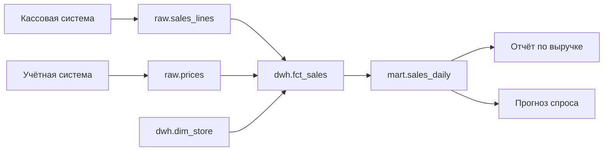

# 9.5 Качество данных, контракты данных, data mesh

## Зачем это аналитику

Неверные данные хуже отсутствующих: по ним принимают решения. Качество данных — это не разовая чистка, а процесс с владельцами, проверками и контрактами между производителями и потребителями. Data mesh переносит эти идеи в организационную модель и часто обсуждается на собеседованиях в крупных компаниях.

## Что понять

- [ ] Измерения качества: полнота, точность, согласованность, своевременность, уникальность, валидность.
- [ ] Проверки в конвейере: схемы, ограничения, объёмы, распределения, сверки с источником; инструменты (Great Expectations, dbt tests, Soda).
- [ ] Контракты данных: схема, семантика, SLA по свежести, владелец, правила изменения — между командой-источником и потребителями.
- [ ] Владение данными и каталог данных: кто отвечает за набор данных, где найти описание и происхождение (lineage).
- [ ] Data mesh: доменное владение, данные как продукт, платформа самообслуживания, федеративное управление — и когда это оверинжиниринг.
- [ ] Управление данными и регуляторика: персональные данные, сроки хранения, маскирование, доступы.

## Урок

<!-- LESSON:START -->
### Качество данных как свойство системы

Прогноз спроса в розничной сети внезапно удвоил заказ молока в сорок магазинов. Модель не сломалась: в выгрузке продаж за вчера дважды пришли чеки из одного кассового сервера после его перезапуска. Никто не проверял уникальность, дубли прошли через три слоя хранилища и дошли до автозаказа. Ущерб — списание просроченного товара. Такие истории типичны: данные почти всегда ломаются тихо, а обнаруживает поломку потребитель, иногда через недели.

Отсюда главный тезис урока: качество данных — не разовая чистка перед миграцией, а постоянный процесс. У него есть измеримые характеристики, автоматические проверки в конвейере, договорённости между производителями и потребителями, владельцы и правила реагирования. Data mesh и практики управления данными (data governance) — это способы организовать этот процесс в масштабе компании.

### Измерения качества

Общепринятого единственного списка нет, но шесть измерений встречаются почти во всех моделях. Удобно держать их в голове как чек-лист при постановке требований к любому набору данных.

| Измерение | Вопрос | Пример нарушения |
|---|---|---|
| Полнота (completeness) | Все ли записи и поля на месте? | Из 1200 магазинов за вчера пришли продажи только 1150 |
| Точность (accuracy) | Соответствуют ли данные реальности? | Цена товара в справочнике 1990 вместо 199,0 из-за сдвига запятой |
| Согласованность (consistency) | Не противоречат ли данные друг другу и другим системам? | Сумма строк чека не равна итогу чека; выручка в хранилище не сходится с учётной системой |
| Своевременность (timeliness) | Готовы ли данные к моменту, когда нужны? | Остатки на утро загрузились в 11:00, а расчёт автозаказа стартует в 7:00 |
| Уникальность (uniqueness) | Нет ли дублей сущностей и событий? | Одно платёжное поручение пришло в выписке дважды |
| Валидность (validity) | Соответствуют ли значения формату и допустимым значениям? | Отрицательное количество в продаже без признака возврата; ИНН из девяти цифр |

Два замечания. Первое: точность проверить автоматически труднее всего — нужен эталон (источник, ручная выборка, физическая инвентаризация). Большинство автоматических проверок на деле проверяют валидность, полноту и согласованность как косвенные признаки точности. Второе: требования к качеству зависят от назначения. Для маркетингового дашборда задержка в полдня и потеря 0,1% событий допустимы, для сверки платежей — нет. Поэтому уровни качества задаются на конкретный набор данных и конкретного потребителя.

### Проверки в конвейере

Проверки встраивают в конвейер так же, как тесты — в сборку кода. Их удобно разложить по уровням.

- Схема. Набор колонок, типы, обязательность. Самая дешёвая проверка и самый частый источник поломок: источник переименовал поле или сменил тип.
- Ограничения на значения. Не пусто, уникально, из допустимого списка, в диапазоне, соответствует шаблону, ссылочная целостность (каждый `sku_id` есть в справочнике товаров).
- Объёмы. Число строк за период в ожидаемом коридоре: сегодня пришло 40 тысяч чеков при обычных 2 миллионах — вероятно, выгрузка неполная.
- Распределения. Доля пустых значений, среднее, доля категорий, число уникальных значений. Помогают поймать то, что проходит формальные ограничения: все цены внезапно стали круглыми, доля возвратов выросла впятеро.
- Свежесть. Максимальная метка времени в данных не старше заданного порога.
- Сверки с источником. Контрольные суммы и количество записей в источнике и приёмнике за период: сумма продаж за день по кассам равна сумме в хранилище.

Проверки различаются реакцией. Блокирующие останавливают конвейер и не пускают данные дальше — для нарушений, после которых данные нельзя использовать (дубли чеков перед автозаказом). Предупреждающие пропускают данные, но создают инцидент — для аномалий, которые могут быть реальными (всплеск продаж перед праздником). Реакцию определяют заранее, вместе с потребителем, иначе при первом срабатывании начинается спор.

Инструменты:

- dbt tests — проверки, описанные рядом с моделями трансформаций. Есть встроенные общие тесты (уникальность, не пусто, допустимые значения, ссылочная целостность) и пользовательские тесты в виде SQL-запроса, который должен вернуть ноль строк.
- Great Expectations — библиотека на Python, где проверки называются ожиданиями (expectations) и собираются в наборы; умеет генерировать отчёты о результатах валидации.
- Soda — проверки в декларативном формате на своём языке описания, запускаемые по расписанию или в конвейере.

Пример описания тестов в dbt для модели продаж:

```yaml
version: 2
models:
  - name: fct_sales
    columns:
      - name: receipt_line_id
        tests:
          - unique
          - not_null
      - name: store_id
        tests:
          - not_null
          - relationships:
              to: ref('dim_store')
              field: store_id
      - name: channel
        tests:
          - accepted_values:
              values: ['offline', 'online']
```

Начиная с dbt 1.8 ключ `tests` можно писать как `data_tests` (это рекомендуемое имя, `tests` по-прежнему поддерживается); с версии 1.10.5 параметры общих тестов (`to`, `field`, `values`) рекомендуется вкладывать в блок `arguments:`, а запись без него выдаёт предупреждение об устаревании. Смысл проверок тот же. Выбор инструмента вторичен. Важнее, что проверки версионируются вместе с кодом, запускаются автоматически и у каждого сработавшего правила есть адресат.

Отдельный класс решений — наблюдаемость данных (data observability): системы, которые сами строят базовые профили объёмов, свежести и распределений и сигналят об отклонениях. Они полезны как страховка, но не заменяют явных правил, согласованных с потребителем.

### Контракты данных

Схема отвечает на вопрос «какой формат». Контракт данных отвечает на вопрос «что мы друг другу обещаем». Это явное, версионируемое соглашение между командой-производителем данных и потребителями.

Типичный состав контракта:

- Схема: поля, типы, обязательность, ключи.
- Семантика: что означает каждое поле и событие. «`amount` — сумма строки чека после скидок, с НДС, в рублях, для возвратов отрицательная». Без этого одна и та же колонка трактуется тремя командами тремя способами.
- Гарантии качества: уникальность ключа, допустимые значения, правила полноты.
- SLA по свежести и доступности: «данные за день доступны до 05:00 следующего дня», «задержка потока не более 15 минут в 99% времени».
- Владелец: команда и контакт, куда идти при проблеме.
- Правила изменения: что считается совместимым изменением (добавить необязательное поле), что — несовместимым (удалить, переименовать, сменить смысл); срок уведомления, период параллельной поставки старой и новой версии.
- Реакция на нарушение: кто и как узнаёт, что делает производитель, что делает потребитель.

Фрагмент контракта для потока продаж из кассовой системы может выглядеть так (формат произвольный, важна полнота содержания):

```yaml
contract: pos_sales_lines
version: 2.1.0
owner: team-store-operations
consumers: [demand-forecast, finance-reporting]
schema:
  receipt_line_id: {type: string, required: true, unique: true}
  store_id: {type: integer, required: true}
  sold_at: {type: timestamp, timezone: store_local, required: true}
  amount: {type: decimal(14,2), meaning: "после скидок, с НДС, возврат со знаком минус"}
freshness: "закрытый день доступен до 05:00 следующего дня"
changes: "несовместимые изменения - новая мажорная версия, уведомление за 30 дней"
on_violation: "поставка блокируется, инцидент владельцу, потребители уведомляются"
```

Главное отличие контракта от схемы — в ответственности. Схему можно извлечь из базы; контракт кто-то подписал и обязуется соблюдать. Его стоит проверять автоматически на стороне производителя: изменение, ломающее контракт, не должно пройти сборку. Это сдвигает обнаружение проблемы влево, от отчёта к коммиту в систему-источник.

### Кто отвечает за качество

Короткий ответ: за соответствие данных контракту отвечает источник, за пригодность данных для своей задачи — потребитель.

Производитель лучше всех знает смысл данных и может исправить причину, а не симптом. Если отвечает только потребитель, возникает классическая картина: каждая команда аналитики пишет свои исправления одних и тех же ошибок, по-разному, и исправления ломаются при каждом изменении источника. Но и потребитель не может полностью переложить ответственность: у него своя задача и свои требования, которые источник может не знать. Прогнозу спроса нужны продажи без акционных всплесков — это его логика очистки, а не ошибка источника.

На практике договорённость выглядит так: производитель гарантирует контракт и проверяет его на выходе; потребитель проверяет данные на входе своими правилами пригодности; нарушения контракта — инцидент производителя, нарушения правил пригодности — работа потребителя.

### Владение и каталог данных

Набор данных без владельца со временем деградирует: никто не обновляет описание, никто не отвечает на вопросы, никто не решает, можно ли удалить старую колонку. Поэтому в зрелой организации у каждого значимого набора есть владелец данных (data owner) — роль на стороне бизнеса или продукта, решающая, что данные значат и кому доступны, — и технический ответственный, поддерживающий поставку.

Каталог данных (data catalog) — место, где эту информацию можно найти: описание набора, владелец, схема, контракт, классификация по чувствительности, свежесть, результаты проверок качества и происхождение. Без каталога знание живёт в головах и в переписке.

Происхождение данных (lineage) — граф зависимостей: из каких источников, какими преобразованиями получено каждое поле отчёта. Оно бывает на уровне таблиц и на уровне колонок; строится автоматически из кода трансформаций, логов запросов или метаданных оркестратора.



Как lineage помогает при разборе ошибки. Финансовый директор видит, что выручка за вчера в отчёте на 3% ниже, чем в учётной системе. Без происхождения аналитик вручную выясняет, откуда берётся цифра. С ним — идёт вверх по графу: витрина, факт, источники; на каждом узле смотрит результаты проверок и время загрузки. Находится, что `raw.sales_lines` загружен без данных двух магазинов, у которых не сработала выгрузка. Обратное направление тоже важно: перед изменением поля в источнике lineage показывает, какие отчёты и модели сломаются, — это анализ влияния (impact analysis).

### Data mesh

Data mesh — организационно-архитектурный подход, предложенный Жамак Дегани. Он отвечает на проблему централизованной команды данных: одна команда хранилища становится узким местом между десятками доменов-источников и десятками потребителей, не понимает семантику чужих данных и тонет в очереди задач.

Четыре принципа:

1. Доменное владение. Ответственность за аналитические данные переходит к доменным командам, которые их производят: команда касс отвечает за данные продаж, команда закупок — за данные заказов поставщикам.
2. Данные как продукт. Доменные данные публикуются как продукт для внутренних потребителей: с описанием, контрактом, SLA, проверками качества, поддержкой и измеримой удовлетворённостью пользователей. Это не «выгрузка, которую кто-то когда-то сделал».
3. Платформа самообслуживания. Центральная платформенная команда даёт инфраструктуру, чтобы доменные команды могли публиковать продукты данных без глубокой экспертизы: хранилище, конвейеры, каталог, проверки, управление доступом.
4. Федеративное вычислительное управление (federated computational governance). Общие правила — идентификаторы, форматы, классификация персональных данных, стандарты качества — вырабатываются совместно представителями доменов и платформы и, по возможности, проверяются автоматически платформой, а не ручными согласованиями.

Когда data mesh — оверинжиниринг:

- Доменов мало или они не разделены организационно; вся аналитика умещается в одну команду из нескольких человек.
- Центральная команда данных не является узким местом.
- Доменные команды не имеют компетенций и мотивации владеть данными, а бюджет на их развитие не выделен.
- Нет платформы, и строить её некому: без неё каждый домен изобретает свой стек, и получается хаос вместо сети.

Для компании масштаба нескольких сотен ИТ-специалистов ответ обычно не «да» или «нет», а «частично»: ввести владельцев и контракты для ключевых наборов, каталог и lineage, стандарты качества, оставив центральную платформу и центральное хранилище. Полноценная передача аналитических данных в домены оправдана, когда доменов много, они крупные и централизованная модель уже явно тормозит.

### Управление данными и регуляторика

Управление данными (data governance) — набор правил, ролей и процессов, определяющих, как данные классифицируются, хранятся, используются и удаляются. Для аналитика здесь четыре практические темы.

Персональные данные. Нужно знать, где они лежат, на каком основании обрабатываются и кто к ним имеет доступ. Первый шаг — классификация полей в каталоге: публичные, внутренние, конфиденциальные, персональные, особо чувствительные. В аналитическом контуре чаще всего персональные данные не нужны в открытом виде: для анализа покупательского поведения достаточно стабильного псевдонимизированного идентификатора клиента.

Сроки хранения. Для каждого набора определяется, сколько данные хранятся и что с ними происходит потом: удаление, агрегирование, обезличивание. Требования идут из двух сторон — регуляторика и договоры могут требовать хранить (платёжные документы банка), а законодательство о персональных данных — не хранить дольше необходимого. Эти требования нужно явно фиксировать и реализовывать технически: политики retention, удаление партиций, а не надежду на ручную чистку.

Маскирование. Статическое — при копировании данных в тестовые и аналитические среды значения заменяются или обезличиваются. Динамическое — данные хранятся в исходном виде, но при чтении пользователь без нужной роли видит маску. Токенизация и хеширование с солью позволяют соединять данные по идентификатору, не раскрывая его. Важно помнить, что обезличивание может быть обратимым через сочетание полей: дата рождения, почтовый индекс и пол вместе часто однозначно указывают на человека.

Доступы. Принцип минимальных привилегий, доступ по ролям и атрибутам (например, региональный менеджер видит только свои магазины — построчная безопасность), журнал доступа к чувствительным данным, периодический пересмотр выданных прав.

Конкретные требования зависят от юрисдикции и отрасли, поэтому в проекте их формулирует юрист или специалист по комплаенсу, а аналитик переводит их в требования к системе: классификацию полей, политики хранения, правила маскирования, матрицу доступа.

### Типичные ошибки

- Считать качество данных задачей команды хранилища и чинить ошибки источника в трансформациях потребителя без обратной связи источнику.
- Писать проверки без определённой реакции: алерт приходит всем и никому, через месяц его перестают читать.
- Путать контракт со схемой: описать типы полей, но не семантику, свежесть, владельца и правила изменения.
- Проверять только схему и не-пустоту, пропуская аномалии объёмов и распределений, которые и ломают модели.
- Объявлять data mesh без платформы самообслуживания и без готовности доменных команд владеть данными.
- Копировать продуктовые персональные данные в аналитические и тестовые среды без маскирования и без срока хранения.
- Не вести lineage и при каждой ошибке в отчёте заново раскапывать происхождение цифры.

### Как говорить об этом на собеседовании

Сильный ответ связывает технику и организацию. На вопрос о качестве данных не перечисляйте инструменты, а опишите цикл: измерения качества под конкретного потребителя, проверки на входе и выходе конвейера с разделением на блокирующие и предупреждающие, контракт между источником и потребителем, владелец и маршрут инцидента, lineage для разбора. Хороший пример — история из прогноза спроса: какие проверки остатков и продаж вы бы поставили перед расчётом автозаказа и почему дубли опаснее пропусков.

На вопросе о data mesh уровень senior показывает умение сказать «здесь не нужно» и объяснить почему. Назовите четыре принципа, затем признаки, при которых подход окупается, и промежуточный вариант: владельцы, контракты и каталог без полной децентрализации. Формулировка вроде «data mesh решает проблему узкого места централизованной команды; если такого узкого места нет, мы получим накладные расходы без выгоды» звучит зрело.

### Коротко

- Качество данных — процесс с измерениями, проверками, владельцами и реакцией, а не разовая чистка.
- Шесть измерений: полнота, точность, согласованность, своевременность, уникальность, валидность; уровень требований задаётся под потребителя.
- Проверки строятся по уровням: схема, ограничения, объёмы, распределения, свежесть, сверки с источником; у каждой определена реакция.
- Контракт данных добавляет к схеме семантику, гарантии, SLA, владельца и правила изменения — и ответственность за их соблюдение.
- Источник отвечает за соответствие контракту, потребитель — за пригодность данных для своей задачи.
- Каталог и lineage делают данные находимыми и сокращают время разбора ошибок и анализа влияния изменений.
- Data mesh — доменное владение, данные как продукт, платформа самообслуживания, федеративное управление; без масштаба и платформы это оверинжиниринг.
- Регуляторика превращается в требования: классификация полей, сроки хранения, маскирование, модель доступа.
<!-- LESSON:END -->

## Читать дальше

- Zhamak Dehghani, *Data Mesh* (O'Reilly, 2022) — главы 1–4.
- Chad Sanderson, статьи о data contracts.
- Документация dbt tests и Great Expectations.

На system-design.space:

- [Data Mesh in Action (Data Mesh в действии)](https://system-design.space/chapter/data-mesh-in-action-book/)
- [Управление данными и соответствие требованиям](https://system-design.space/chapter/data-governance-compliance/)
- [Человек в контуре, качество данных и операционный цикл AI](https://system-design.space/chapter/human-in-the-loop-data-quality-ops/)

## Практика

1. Составить контракт данных для потока «продажи из кассовой системы в хранилище»: схема, семантика полей, свежесть, владелец, правила изменения, что делать при нарушении.
2. Сформулировать 10 проверок качества для данных, на которых строится прогноз спроса, и указать реакцию на каждую.
3. Оценить, нужна ли data mesh обезличенной компании из 300 ИТ-специалистов, и обосновать ответ.

## Вопросы для самопроверки

1. Какие измерения качества данных вы знаете? Приведите по примеру нарушения.
2. Что такое контракт данных и чем он отличается от просто схемы?
3. Кто должен отвечать за качество данных: источник или потребитель?
4. Какие четыре принципа data mesh и когда он не нужен?
5. Что такое lineage и зачем он нужен при разборе ошибки в отчёте?

## Заметки

<!-- Свои формулировки, ошибки, ссылки. -->
