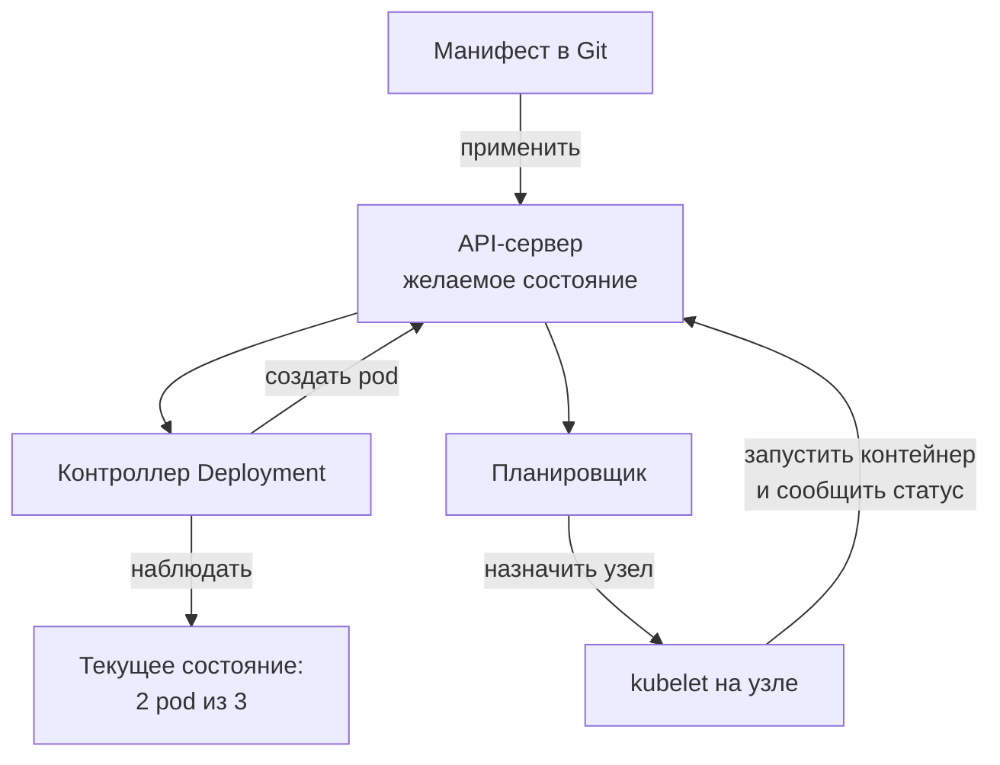
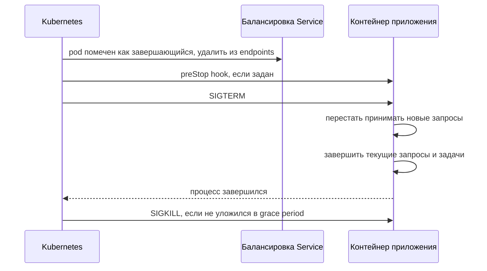

# 10.1 Контейнеры и Kubernetes для архитектора

## Зачем это аналитику

Kubernetes стал стандартной платформой исполнения. Архитектору нужно понимать его модель: что такое pod и сервис, как работают ресурсы и автомасштабирование, почему приложение должно быть готово к внезапной остановке. Эти свойства напрямую превращаются в требования к сервисам.

## Что понять

- [ ] Контейнер против виртуальной машины: изоляция, образ, слои, неизменяемость.
- [ ] Двенадцать факторов: конфигурация в окружении, stateless-процессы, логи в stdout, быстрый старт и корректная остановка.
- [ ] Объекты Kubernetes: Pod, Deployment, ReplicaSet, Service, Ingress/Gateway, ConfigMap, Secret, StatefulSet, Job/CronJob.
- [ ] Декларативная модель и контроллеры: желаемое состояние против текущего.
- [ ] Ресурсы: requests и limits, классы QoS, что происходит при нехватке памяти (OOMKill) и CPU (троттлинг).
- [ ] Пробы: liveness, readiness, startup; корректное завершение (SIGTERM, grace period).
- [ ] Автомасштабирование: HPA по метрикам, масштабирование кластера; почему автомасштабирование не спасает от медленной базы.
- [ ] Состояние в Kubernetes: базы данных внутри кластера или управляемые сервисы.

## Урок

<!-- LESSON:START -->
### Зачем архитектору модель Kubernetes

Сервис, который годами жил на двух виртуальных машинах, переносят в Kubernetes. Через неделю приходят жалобы: при каждом релизе часть запросов на регистрацию доменов падает с ошибкой, ночью сервис несколько раз перезапускался без видимой причины, а при росте трафика добавление реплик не помогло — время ответа только выросло. Ни одна из проблем не связана с ошибкой в коде. Все три — следствие того, что приложение не учитывает модель платформы: как она останавливает процессы, как ограничивает память и что именно масштабирует.

Для архитектора Kubernetes — не набор команд, а контракт между приложением и платформой. Платформа обещает поддерживать заданное число экземпляров, перезапускать упавшие и распределять трафик. Взамен приложение должно быстро стартовать, корректно останавливаться, честно сообщать о готовности и не хранить важное состояние в локальном процессе. Этот контракт и превращается в нефункциональные требования.

### Контейнер и виртуальная машина

Виртуальная машина эмулирует аппаратуру: у каждой своё ядро операционной системы, гипервизор изолирует машины друг от друга на уровне железа. Это сильная изоляция ценой веса: гигабайты на образ, десятки секунд или минуты на старт, накладные расходы на каждую копию ОС.

Контейнер — это обычный процесс хост-системы, которому ядро Linux ограничило обзор и ресурсы. Пространства имён (namespaces) дают процессу собственное видение файловой системы, сети, списка процессов и пользователей. Контрольные группы (cgroups) ограничивают процессор, память и ввод-вывод. Ядро у всех контейнеров на узле общее. Отсюда плюсы — старт за доли секунды или секунды, плотная упаковка — и главный минус: изоляция слабее, чем у ВМ, уязвимость ядра затрагивает все контейнеры узла. Для недоверенного кода используют дополнительные механизмы (песочницы, лёгкие ВМ для контейнеров), а в облаке узлы Kubernetes сами являются виртуальными машинами.

Образ контейнера (image) — упакованная файловая система приложения со всеми зависимостями плюс метаданные запуска. Он состоит из слоёв: базовая система, среда выполнения, зависимости, код приложения. Слои кешируются и переиспользуются, поэтому порядок инструкций при сборке важен: редко меняющееся — внизу, код — наверху, тогда пересборка после изменения кода затрагивает только верхний слой.

Ключевое свойство — неизменяемость. Образ собирают один раз и продвигают по средам (тест, предпрод, прод) без изменений; отличается только конфигурация. Изменения в работающем контейнере не сохраняются при его пересоздании. Чинить «зайдя внутрь» бессмысленно: исправление — это новый образ и новый релиз. Тег образа в продакшене должен однозначно указывать на сборку (версия или хеш), а не на плавающий `latest`.

### Двенадцать факторов в применении к Kubernetes

Методика двенадцати факторов сформулирована до Kubernetes, но хорошо описывает приложение, удобное для него. Самые важные для платформы пункты:

- Конфигурация в окружении. Адреса, флаги, параметры — через переменные окружения или смонтированные файлы, а не внутри образа. Один образ работает во всех средах.
- Процессы без состояния (stateless). Экземпляр может быть убит в любой момент, поэтому сессии, корзины, загруженные файлы хранятся во внешних сервисах: базе, кеше, объектном хранилище. Любая реплика обслуживает любой запрос.
- Логи в stdout. Приложение пишет журнал в стандартный вывод как поток событий; сбор, хранение и поиск — задача платформы. Файлы логов внутри контейнера исчезнут вместе с ним.
- Быстрый старт и корректная остановка (disposability). Чем быстрее старт, тем быстрее масштабирование и восстановление. Остановка должна завершать текущую работу и не терять данные.
- Зависимости явно объявлены, внешние сервисы — подключаемые ресурсы, адрес которых приходит из конфигурации.
- Разделение сборки, релиза и запуска: сборка создаёт образ, релиз связывает образ с конфигурацией, запуск ничего не меняет.

При проверке реального сервиса по этому списку типичные нарушения — сессии в памяти процесса, запись файлов на локальный диск, логи в файл с ротацией, конфигурация, зашитая в сборку для каждой среды, и фоновые задачи внутри веб-процесса, которые будут выполняться на каждой реплике одновременно.

### Объекты Kubernetes

#### Pod

Pod — минимальная единица развёртывания: один или несколько контейнеров, которые всегда размещаются на одном узле, делят сетевое пространство (общий IP, контейнеры общаются через localhost) и могут делить тома. Pod смертен: у него нет стабильного адреса, после удаления он не воскресает, вместо него создаётся новый с другим именем и IP.

Несколько контейнеров в pod нужны, когда вспомогательный процесс должен жить рядом с основным и разделять его жизненный цикл. Примеры: sidecar-прокси сервисной сетки, агент, отправляющий логи или метрики, контейнер, обновляющий сертификаты или конфигурацию в общем томе. Отдельный вид — init-контейнеры, которые выполняются до старта основных (миграция схемы, ожидание зависимости). Правило: в один pod кладут то, что масштабируется и живёт вместе; два независимых сервиса в одном pod — ошибка, их нельзя масштабировать по отдельности.

#### Контроллеры рабочих нагрузок

- ReplicaSet поддерживает заданное число одинаковых pod. Напрямую его почти не создают.
- Deployment управляет ReplicaSet и реализует обновления: при смене образа создаёт новый ReplicaSet и постепенно переносит на него реплики (rolling update), умеет откатываться. Это основной объект для stateless-сервисов.
- StatefulSet — для приложений с состоянием: pod получают стабильные имена и порядковые номера, у каждого свой постоянный том (PersistentVolumeClaim), запуск и обновление идут по порядку. Используется для баз, брокеров, кластеров с выбором лидера.
- DaemonSet — по одному pod на каждый узел: агенты логов и мониторинга.
- Job — задача, которая должна завершиться успешно (пересчёт, миграция, выгрузка); CronJob запускает Job по расписанию, например ночной расчёт автозаказа.

#### Сеть и конфигурация

- Service — стабильное имя и виртуальный адрес перед группой pod, выбранных по меткам. Трафик балансируется только между pod, которые готовы (прошли readiness-пробу). Типы: внутренний адрес кластера, порт на каждом узле, внешний балансировщик.
- Ingress — правила маршрутизации HTTP-трафика извне к сервисам по хосту и пути; работает через контроллер Ingress. Gateway API — более новая и выразительная модель того же уровня с разделением ролей (инфраструктура, кластер, команда приложения); API Ingress заморожен, и проект Kubernetes рекомендует для новых решений Gateway API.
- ConfigMap — несекретная конфигурация в виде ключей, передаётся в pod как переменные окружения или файлы.
- Secret — пароли, токены, ключи. Важно понимать: по умолчанию это закодированные, а не зашифрованные данные; реальная защита — шифрование хранилища кластера, ограничение доступа и часто внешнее хранилище секретов.

### Декларативная модель и контроллеры

В Kubernetes вы не командуете «запусти три экземпляра», а описываете желаемое состояние: «должно быть три реплики такого образа с такими ресурсами». Описание сохраняется в API-сервере. Контроллеры в бесконечном цикле сравнивают желаемое состояние с наблюдаемым и выполняют действия, чтобы их сблизить. Этот цикл называют циклом согласования (reconciliation loop).



Следствия для архитектора. Система самовосстанавливается: удалённый или упавший pod будет пересоздан, потому что расхождение заметит контроллер. Операции идемпотентны: применение того же манифеста ничего не меняет. Ручные изменения в кластере будут перезаписаны при следующем применении манифеста из репозитория — на этом строится подход GitOps. Тот же паттерн используют операторы (operators): контроллеры, которые знают, как управлять конкретным сложным приложением, например кластером базы данных.

### Ресурсы: requests и limits

Для каждого контейнера задаются два числа по процессору и памяти.

- Requests — гарантированный минимум. Планировщик размещает pod только на узле, где сумма requests помещается в свободную ёмкость. От requests считается процент загрузки для автомасштабирования.
- Limits — верхняя граница, которую контейнер не может превысить.

Процессор измеряется в ядрах или миллиядрах (`250m` — четверть ядра), память — в байтах с суффиксами (`512Mi`).

Поведение при превышении принципиально разное:

- Процессор — сжимаемый ресурс. При упоре в limit контейнер не убивают, а притормаживают: ядро выделяет ему процессорное время квотами, и после исчерпания квоты в периоде процесс ждёт следующего периода. Это троттлинг (throttling): приложение живо, но задержки растут, иногда скачками по десятку-сотне миллисекунд. Особенно заметно на многопоточных средах выполнения.
- Память — несжимаемый ресурс. Превысить limit нельзя: ядро убивает процесс (OOMKill), Kubernetes перезапускает контейнер, в статусе видна причина `OOMKilled`. Повторяющиеся падения переходят в состояние `CrashLoopBackOff` с растущими паузами между перезапусками.

Отдельный сценарий — нехватка памяти на всём узле. Тогда kubelet вытесняет (evicts) pod. Формально он ранжирует их по трём признакам: превышает ли потребление requests, приоритет pod (PriorityClass), насколько потребление превышает requests. Класс качества обслуживания (QoS) напрямую в этом не участвует, но позволяет оценить вероятный порядок вытеснения; кроме того, по классу QoS kubelet настраивает приоритет для OOM killer ядра:

| Класс QoS | Условие | Поведение при нехватке памяти на узле |
|---|---|---|
| Guaranteed | Для всех контейнеров requests равны limits по CPU и памяти | Вытесняются последними |
| Burstable | Хотя бы у одного контейнера заданы requests или limits, но не выполнено условие Guaranteed | Превысившие requests вытесняются в одной группе с BestEffort (порядок — по приоритету, затем по величине превышения); уложившиеся в requests — в последнюю очередь |
| BestEffort | Не заданы ни requests, ни limits | Вытесняются первыми |

Практические правила: requests задают по реальному наблюдаемому потреблению, а не «с потолка»; limit по памяти ставят обязательно и с запасом над пиком; для среды выполнения с управляемой памятью (JVM, .NET, Node.js) размер кучи согласуют с limit, иначе процесс будет убит раньше, чем сработает сборщик мусора. О limit по процессору мнения расходятся: он даёт предсказуемость и защиту соседей, но вызывает троттлинг; часть команд задаёт только requests по CPU и полагается на них как на пропорциональные доли процессора.

Пример минимального Deployment с ресурсами и пробами:

```yaml
apiVersion: apps/v1
kind: Deployment
metadata:
  name: domain-renewal-api
  labels:
    app: domain-renewal-api
spec:
  replicas: 2
  selector:
    matchLabels:
      app: domain-renewal-api
  template:
    metadata:
      labels:
        app: domain-renewal-api
    spec:
      terminationGracePeriodSeconds: 30
      containers:
        - name: app
          image: registry.example.com/domain-renewal-api:1.8.3
          ports:
            - containerPort: 8080
          envFrom:
            - configMapRef:
                name: domain-renewal-config
          resources:
            requests:
              cpu: 250m
              memory: 384Mi
            limits:
              cpu: "1"
              memory: 512Mi
          startupProbe:
            httpGet:
              path: /health/started
              port: 8080
            periodSeconds: 5
            failureThreshold: 24
          readinessProbe:
            httpGet:
              path: /health/ready
              port: 8080
            periodSeconds: 5
            failureThreshold: 3
          livenessProbe:
            httpGet:
              path: /health/live
              port: 8080
            periodSeconds: 10
            failureThreshold: 3
```

Здесь requests меньше limits, поэтому pod относится к классу Burstable. Стартовая проба даёт приложению до двух минут (24 попытки по 5 секунд) на запуск, прежде чем включатся остальные пробы.

### Пробы и корректное завершение

#### Три пробы

- Liveness отвечает на вопрос «процесс жив или безнадёжно завис?». При провале kubelet перезапускает контейнер. Проверка должна быть локальной и дешёвой: процесс отвечает, внутренний цикл не заблокирован.
- Readiness отвечает на вопрос «можно ли сейчас слать трафик?». При провале pod исключается из балансировки Service, но не перезапускается. Сюда относятся прогрев кеша, временная перегрузка, потеря связи с обязательной зависимостью.
- Startup защищает медленно стартующие приложения: пока она не прошла, liveness и readiness не выполняются, и контейнер не убьют за «зависание» во время законной загрузки.

Самая опасная ошибка — проверять в liveness внешние зависимости. Если база недоступна и liveness проверяет базу, Kubernetes начнёт перезапускать все реплики одновременно; когда база вернётся, сервис будет в цикле перезапусков и холодных стартов. Недоступность зависимости — повод для readiness (или деградации), а не для перезапуска. Но и readiness, завязанная на общую зависимость, может вывести из балансировки все реплики сразу — это нужно осознанно решить: вернуть 503 быстро или честно пропасть из балансировщика.

#### Остановка pod

Pod останавливают постоянно: релиз, масштабирование вниз, обслуживание узла, вытеснение. Последовательность упрощённо такая:



Тонкость: исключение из балансировки и отправка SIGTERM идут параллельно, а обновление правил маршрутизации на узлах занимает время. Если приложение по SIGTERM мгновенно закрывает порт, в эти секунды часть запросов ещё приходит и получает ошибку соединения — именно так и возникают ошибки при каждом релизе из вступления. Решения: короткая пауза в preStop или в обработчике SIGTERM перед закрытием входящих соединений, затем дообработка текущих запросов. Всё должно уложиться в `terminationGracePeriodSeconds` (по умолчанию 30 секунд), после которого придёт SIGKILL.

Требования к приложению отсюда: обрабатывать SIGTERM (в том числе убедиться, что сигнал доходит до процесса, а не теряется в shell-обёртке), не брать новые сообщения из очереди после сигнала, делать операции идемпотентными — обработка, прерванная SIGKILL, будет повторена.

### Автомасштабирование

Горизонтальный автомасштабировщик pod (HorizontalPodAutoscaler, HPA) периодически сравнивает метрику с целевым значением и меняет число реплик в Deployment. Базовая метрика — загрузка CPU относительно requests: цель 70% при requests в 250m означает, что HPA добавит реплики, когда средняя загрузка превысит примерно 175m на pod. Можно масштабировать по памяти, по пользовательским метрикам (запросы в секунду) и по внешним (длина очереди) — через адаптеры метрик или надстройки вроде KEDA. Масштабирование вниз по умолчанию происходит с задержкой стабилизации, чтобы число реплик не скакало.

Если новым pod не хватает места, они остаются в состоянии ожидания (Pending). Тогда в игру вступает масштабирование кластера: автомасштабировщик узлов (Cluster Autoscaler или аналоги в облаках) видит неразмещённые pod и добавляет узлы, а при низкой загрузке — удаляет. Узел поднимается минутами, поэтому для резких пиков нужен запас мощности или заранее прогретые узлы.

Почему автомасштабирование не спасает от медленной базы. HPA масштабирует только stateless-слой. Если узкое место — PostgreSQL, то новые реплики сервиса открывают новые соединения и шлют больше запросов в ту же базу: растут очередь на блокировки, число соединений, нагрузка на диск, и время ответа ухудшается для всех. Хуже того, рост задержки повышает загрузку CPU реплик (ожидание, повторы) — HPA добавляет ещё реплики, усиливая положительную обратную связь. Средства против — пулы соединений с жёстким лимитом, реплики для чтения, кеш, очереди с ограничением параллелизма, оптимизация запросов и явный максимум реплик в HPA, рассчитанный от ёмкости базы.

### Состояние в Kubernetes

Kubernetes умеет запускать приложения с состоянием: StatefulSet, постоянные тома, операторы баз данных, которые автоматизируют репликацию, переключение, резервное копирование. Вопрос не в том, можно ли, а в том, кто будет эксплуатировать.

Аргументы за управляемый сервис (managed database) облака или отдельную инфраструктуру:

- Резервное копирование, восстановление на момент времени, обновления и переключение при отказе — ответственность провайдера.
- База не делит узлы и сетевые ресурсы с приложениями, нет риска вытеснения из-за соседей.
- Команде не нужна глубокая экспертиза одновременно в PostgreSQL и в хранилищах Kubernetes.

Аргументы за базу внутри кластера:

- Единая модель развёртывания и автоматизации, одинаковые окружения от разработки до продакшена.
- Работа на своих мощностях, где управляемого сервиса нет.
- Много мелких баз (по базе на тестовый стенд или на арендатора), где оператор экономит ручной труд.
- Зрелый оператор и команда, которая понимает, как ведут себя тома, узлы и сеть при сбоях.

Разумная позиция по умолчанию: для критичной продакшен-базы — управляемый сервис или выделенная инфраструктура, если нет сильной причины и опыта. Для тестовых сред, кешей, вспомогательных хранилищ — внутри кластера. Решение фиксируют в ADR с явными требованиями к RPO, RTO и эксплуатации.

### Типичные ошибки

- Проверять в liveness-пробе базу или другие внешние зависимости и получать массовые перезапуски при их сбое.
- Не обрабатывать SIGTERM и закрывать входящие соединения мгновенно — отсюда ошибки при каждом релизе и потерянные задачи.
- Не задавать requests и limits или задавать их без измерений: pod класса BestEffort, неожиданные OOMKill или скрытый троттлинг.
- Хранить сессии и файлы в контейнере и удивляться потере данных после перезапуска.
- Выполнять фоновые задания в каждой реплике веб-сервиса вместо Job, CronJob или распределённой блокировки.
- Ожидать, что HPA решит проблему производительности, узкое место которой в базе или внешнем API.
- Класть в один pod независимые сервисы или разворачивать критичную базу в кластере без оператора и опыта эксплуатации.

### Как говорить об этом на собеседовании

На уровне senior от вас ждут не перечисления объектов, а перевода модели платформы в требования к сервису. Хороший ответ на вопрос «что нужно приложению для Kubernetes»: конфигурация через окружение, отсутствие локального состояния, логи в stdout, старт за секунды, эндпоинты для трёх проб с разной семантикой, обработка SIGTERM с дообработкой запросов в пределах grace period, идемпотентность операций, requests и limits по результатам нагрузочного теста, верхняя граница реплик, согласованная с ёмкостью базы.

Показывайте механизмы: почему превышение памяти убивает, а превышение CPU замедляет; почему liveness не должна зависеть от базы; как цикл согласования восстанавливает удалённый pod. Пример из практики с понятной причинно-следственной цепочкой — «после переноса сервиса регистрации в кластер релизы сопровождались ошибками; причина была в мгновенном закрытии порта по SIGTERM, решили паузой перед остановкой и требованием в постановке» — ценится больше, чем знание флагов.

### Коротко

- Контейнер — изолированный процесс на общем ядре; образ неизменяем, слоист и продвигается по средам без пересборки.
- Двенадцать факторов описывают приложение, удобное платформе: конфигурация в окружении, нет локального состояния, логи в stdout, быстрый старт и корректная остановка.
- Pod — смертная единица размещения; Deployment для stateless, StatefulSet для состояния, Job и CronJob для задач, Service и Ingress или Gateway для трафика.
- Kubernetes декларативен: контроллеры непрерывно приводят текущее состояние к желаемому.
- Requests влияют на размещение и автомасштабирование, limits ограничивают: память сверх лимита — OOMKill, CPU сверх лимита — троттлинг; класс QoS определяет порядок вытеснения.
- Liveness перезапускает, readiness убирает из балансировки, startup защищает медленный старт; остановка — SIGTERM, дообработка, SIGKILL после grace period.
- HPA и масштабирование узлов добавляют мощность stateless-слою, но не ускоряют базу и могут её добить.
- Критичную базу по умолчанию выносят в управляемый сервис; в кластере — при зрелом операторе и опыте эксплуатации.
<!-- LESSON:END -->

## Читать дальше

- Документация Kubernetes: Concepts (kubernetes.io/docs/concepts).
- 12factor.net — методика двенадцати факторов.
- Bilgin Ibryam, Roland Huß, *Kubernetes Patterns* (2nd ed.).

На system-design.space:

- [Контейнеризация](https://system-design.space/chapter/containerization-overview/)
- [Методика двенадцати факторов (The Twelve-Factor App)](https://system-design.space/chapter/12-factor-app/)
- [Kubernetes Fundamentals (v1.36): архитектура, объекты и базовые практики](https://system-design.space/chapter/kubernetes-fundamentals/)
- [Kubernetes Patterns (short summary)](https://system-design.space/chapter/kubernetes-patterns-book/)
- [Лаба: Шумный сосед и изоляция арендаторов](https://system-design.space/labs/noisy-neighbor-tenant-isolation/)

## Практика

1. Пройти по двенадцати факторам для обезличенного сервиса из своей практики и отметить нарушения.
2. Поднять локально kind или minikube, развернуть простой сервис с двумя репликами, readiness-пробой и HPA; удалить pod и посмотреть, что произойдёт.
3. Сформулировать требования к сервису для работы в Kubernetes: старт, остановка, пробы, логи, конфигурация, ресурсы.

## Вопросы для самопроверки

1. Чем контейнер отличается от виртуальной машины?
2. Что такое pod и почему в нём может быть больше одного контейнера?
3. Чем readiness-проба отличается от liveness?
4. Что происходит с сервисом при превышении лимита памяти и лимита CPU?
5. Какие требования к приложению предъявляет работа в Kubernetes?
6. Стоит ли размещать PostgreSQL внутри Kubernetes?

## Заметки

<!-- Свои формулировки, ошибки, ссылки. -->
