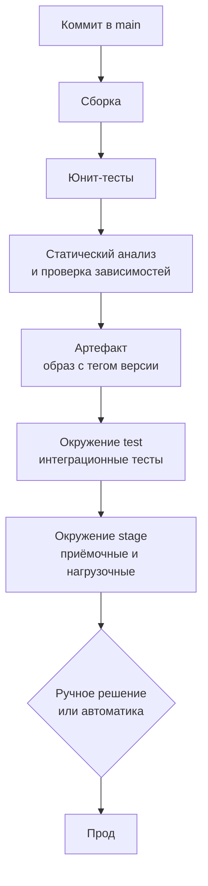

# 10.2 CI/CD, стратегии релизов, feature flags

## Зачем это аналитику

Скорость и безопасность изменений — архитектурное свойство. От того, как устроена поставка, зависит, можно ли выпускать изменения ежедневно, откатывать их за минуты и включать функции для части пользователей. Стратегия релиза и совместимость миграций должны быть в постановке, а не придумываться в день релиза.

## Что понять

- [ ] Непрерывная интеграция, доставка и развёртывание: чем отличаются.
- [ ] Конвейер: сборка, тесты, анализ, артефакт, развёртывание по окружениям; неизменяемые артефакты.
- [ ] Стратегии развёртывания: rolling, blue-green, canary, теневой трафик; как выбирается стратегия.
- [ ] Feature flags: отделение развёртывания от выпуска функции, постепенное включение, «выключатель», долг от старых флагов.
- [ ] Совместимость при релизе: expand/contract для схемы БД и API, порядок выкладки сервисов.
- [ ] GitOps: желаемое состояние в Git, синхронизация (Argo CD, Flux), аудит изменений.
- [ ] Инфраструктура как код: Terraform и аналоги, план и применение, дрейф.
- [ ] Метрики DORA: частота развёртываний, время поставки, доля неудачных изменений, время восстановления.

## Урок

<!-- LESSON:START -->
### Поставка как свойство архитектуры

Обычно о CI/CD вспоминают как о задаче DevOps-инженера: настроить сборку, прикрутить деплой. Для архитектора это ошибка ракурса. От того, как устроена поставка, зависит, насколько мелкими могут быть изменения, сколько стоит ошибка и сколько времени проходит между идеей и её проверкой на реальных пользователях. Система, которую можно выпускать только раз в месяц окном на ночь с субботы на воскресенье, и система, которая выпускается десять раз в день с откатом за минуту, — это разные системы, даже если код у них одинаковый.

Аналитика это касается напрямую. Если функция требует изменить схему таблицы, контракт API и поведение двух сервисов, то порядок выкладки, условия отката и способ включения для пользователей — часть требований. Их нужно описать в постановке, иначе в день релиза команда будет решать их в спешке.

### CI, continuous delivery и continuous deployment

Три термина часто смешивают, хотя они описывают разные уровни зрелости.

**Непрерывная интеграция (continuous integration, CI)** — практика, при которой разработчики часто, минимум раз в день, вливают изменения в общую ветку, а каждое вливание автоматически собирается и проверяется тестами. Суть не в инструменте, а в дисциплине: короткоживущие ветки, быстрый конвейер, сломанная сборка чинится немедленно. Команда, у которой ветки живут по три недели, а сборка на Jenkins зелёная, CI не практикует.

**Непрерывная доставка (continuous delivery)** — каждое изменение, прошедшее конвейер, находится в состоянии «готово к выпуску в прод». Сам выпуск запускается решением человека: нажатием кнопки, согласованием, по расписанию. Ключевое — выпуск технически тривиален и может произойти в любой момент.

**Непрерывное развёртывание (continuous deployment)** — следующий шаг: каждое изменение, прошедшее все автоматические проверки, уходит в прод без ручного шага. Человек участвует только на этапе ревью кода.

Разница между доставкой и развёртыванием — в наличии ручного решения перед продом. Для банка с регламентами изменений часто разумна именно доставка: всё автоматизировано, но выпуск в прод привязан к согласованию. Для интернет-магазина с сильной культурой тестирования и флагами может подойти непрерывное развёртывание.

### Конвейер и неизменяемые артефакты

Типовой конвейер (pipeline) выглядит так.

Несколько принципов, которые отличают зрелый конвейер.

**Собрать один раз, развернуть много раз.** Артефакт (контейнерный образ, jar, пакет) собирается один раз и дальше без изменений продвигается по окружениям. Между test и prod меняется только конфигурация. Если для прода собирают «свою» сборку, то протестирован был не тот артефакт, который выпущен.

**Неизменяемость.** Артефакт с версией `1.4.7` никогда не перезаписывается. Тег `latest` в проде — плохая идея: невозможно ответить, что именно сейчас работает, и невозможно гарантированно откатиться. Откат — это развёртывание предыдущего неизменного артефакта, а не пересборка старой ветки.

**Быстрые проверки раньше медленных.** Юнит-тесты и линтеры за минуты, интеграционные тесты — позже, нагрузочные — реже. Задача конвейера — дать разработчику сигнал как можно раньше.

**Конфигурация отдельно от кода.** Адреса баз, секреты, лимиты приходят из окружения или хранилища секретов, а не зашиты в артефакт.

**Статический анализ и безопасность** — проверка зависимостей на известные уязвимости, поиск секретов в коде, анализ образов. Это тоже шаги конвейера, а не разовая активность перед аудитом.

### Стратегии развёртывания

Развёртывание — замена работающей версии новой. Стратегия определяет, как это происходит, кто видит новую версию и как быстро можно вернуться.

| Стратегия | Как работает | Ресурсы | Скорость отката | Когда выбирать |
|---|---|---|---|---|
| Пересоздание (recreate) | Остановить старую, запустить новую | x1 | Медленно, с простоем | Внутренние системы, где простой допустим |
| Поэтапная замена (rolling) | Экземпляры заменяются партиями | x1 плюс небольшой запас | Средне: обратный rolling | Стандарт для stateless-сервисов |
| Сине-зелёное (blue-green) | Полная копия окружения, переключение трафика целиком | x2 на время релиза | Мгновенно: вернуть трафик | Нужен быстрый откат и проверка перед переключением |
| Канареечное (canary) | Новая версия получает малую долю трафика, доля растёт | x1 плюс немного | Быстро: снять долю | Высокий трафик, есть метрики для оценки |
| Теневой трафик (shadow, mirroring) | Копия запросов идёт в новую версию, ответы не отдаются клиенту | Дополнительные | Не нужен: пользователи не затронуты | Проверка на реальной нагрузке без риска |

**Rolling** — поведение по умолчанию в Kubernetes: экземпляры заменяются по несколько, пока все не станут новыми. Во время выкладки одновременно работают обе версии, поэтому они обязаны быть совместимы по API и данным. Откат — такая же поэтапная замена в обратную сторону.

**Blue-green** держит два полных окружения. «Синее» обслуживает трафик, на «зелёное» выкладывают новую версию, прогоняют проверки и переключают балансировщик. Откат — переключение обратно. Цена — двойные ресурсы на время релиза и сложность с базой данных: база обычно одна на оба цвета, поэтому миграции схемы должны быть совместимы с обеими версиями. Blue-green не решает проблему данных, он решает проблему кода.

**Canary** направляет на новую версию сначала небольшую долю запросов, например 1–5%, затем больше. На каждом шаге сравниваются метрики новой версии с контрольной: доля ошибок, задержки по перцентилям, бизнес-метрики. Если отклонение выходит за порог, доля снимается автоматически. Canary хорошо ловит проблемы, которые проявляются только на реальных пользователях и реальных данных, но требует достаточного трафика: на сервисе с десятью запросами в минуту за разумное время статистики не набрать.

**Теневой трафик** дублирует входящие запросы в новую версию, а её ответы сравнивает или просто отбрасывает. Удобно для переписывания легаси: новая реализация расчёта получает те же запросы, что и старая, и можно сравнить результаты. Ограничение — побочные эффекты. Если новая версия при обработке пишет в базу, отправляет платёж или письмо, тень должна быть изолирована от них, иначе вы проведёте операцию дважды.

Как выбрать. Если есть надёжные метрики и заметный трафик — canary. Если критичен мгновенный откат и ресурсы позволяют — blue-green. Если нужно проверить новую реализацию на реальных данных без влияния на пользователей — тень. Для большинства внутренних stateless-сервисов достаточно rolling с хорошими проверками готовности (readiness probes).

### Feature flags: развёртывание отдельно от выпуска

Развёртывание (deploy) — технический факт: новый код работает в проде. Выпуск (release) — бизнес-факт: пользователи получили функцию. Флаги функций (feature flags, feature toggles) разрывают эту связь. Код новой функции уходит в прод выключенным, а включается позже и по отдельному решению.

Что это даёт:

- **Слияние незаконченной работы.** Код можно вливать в main маленькими порциями под выключенным флагом, не держа длинную ветку.
- **Постепенное включение.** Функция включается для сотрудников, затем для 5% клиентов, затем для отдельного региона или сегмента. Это canary на уровне бизнес-логики.
- **Выключатель (kill switch).** Если новая логика расчёта скидки даёт странные цифры, её выключают за секунды без релиза.
- **Эксперименты.** A/B-тесты — частный случай флага с распределением по группам.

Типы флагов стоит различать: релизные (живут недели и удаляются), операционные выключатели (могут жить долго, например отключение тяжёлой рекомендательной выдачи при перегрузке), экспериментальные, флаги доступа (функция для тарифа). Требования к ним разные: релизный флаг должен иметь срок жизни, операционный — владельца и документированное поведение в выключенном состоянии.

Издержки флагов реальны.

- **Комбинаторика.** Десять флагов — это теоретически 1024 варианта поведения. Все они не тестируются, и неожиданное сочетание ломает систему.
- **Долг.** Флаг, включённый на 100% полгода назад, — мёртвый код с веткой `else`, которую никто не помнит. Нужна процедура удаления: у флага есть владелец и дата, после полного включения заводится задача на удаление.
- **Зависимость от сервиса флагов.** Если флаги читаются из внешнего сервиса, нужно определить поведение при его недоступности: значение по умолчанию и кэш.
- **Непрозрачность.** Поддержка видит у клиента поведение, которого «не должно быть», потому что клиент попал в процент включения. Состояние флагов должно быть видно в логах и трассировке.

### Совместимость: expand/contract

Самая сложная часть релиза — не код, а данные и контракты. Во время rolling или blue-green одновременно работают старая и новая версии, а откат возвращает старый код к базе, которую уже изменил новый. Поэтому любая несовместимая правка делится на несколько совместимых шагов. Этот подход называют расширение и сужение (expand/contract, также parallel change).

Принцип: сначала расширяем схему или контракт так, чтобы подходили обе версии, затем переводим потребителей, затем убираем старое.

#### Разобранный пример: разделение поля адреса

Интернет-магазин хранит адрес доставки одной строкой `orders.address`. Нужно разделить его на `city`, `street`, `building`, чтобы считать стоимость доставки по городу. API заказов тоже должен начать отдавать структурированный адрес. Требование — без простоя и с возможностью отката на каждом шаге.

1. **Expand, схема.** Миграция добавляет колонки `city`, `street`, `building`, допускающие NULL. Старый код их не видит и продолжает работать. Откат: колонки просто не используются.
2. **Двойная запись.** Релиз сервиса, который пишет и старое поле, и новые. Чтение всё ещё из старого. Флаг `address_dual_write` позволяет выключить запись в новые поля при проблеме.
3. **Перенос данных (backfill).** Фоновая задача разбирает старые адреса порциями, чтобы не держать долгие блокировки. Неразобранные записи логируются для ручной обработки.
4. **Expand, API.** В ответ API добавляется объект `delivery_address`, старое поле `address` остаётся. Потребители (мобильное приложение, склад) переходят на новое поле в своём темпе.
5. **Переключение чтения.** Флаг `address_read_structured` переводит чтение на новые колонки, сначала для части заказов. Сверка: для выборки заказов результат нового и старого чтения совпадает.
6. **Contract, API.** Когда логи показывают, что старое поле никто не запрашивает, его помечают устаревшим и удаляют в следующей версии контракта.
7. **Contract, схема.** Прекращается запись в старое поле, затем, отдельным релизом через некоторое время, колонка удаляется.

Откатиться можно на любом шаге до седьмого: старые данные всё время на месте. Удаление колонки — единственный необратимый шаг, поэтому его делают последним и не совмещают с другими изменениями.

Порядок выкладки сервисов подчиняется той же логике. Поставщик API сначала начинает понимать новое (принимает новое поле, отдаёт старое и новое), потом потребители начинают его использовать. Потребитель не может выйти раньше поставщика. Для событий в очередях аналогично: сначала потребители учатся читать новую версию сообщения, потом производитель начинает её отправлять.

### GitOps

GitOps — модель, в которой желаемое состояние системы (какие сервисы, каких версий, с какой конфигурацией) описано декларативно в Git-репозитории, а специальный агент в кластере постоянно сравнивает фактическое состояние с желаемым и устраняет расхождения. Наиболее известные агенты для Kubernetes — Argo CD и Flux.

Отличие от классического конвейера — в направлении. В традиционном push-подходе CI-система получает доступ к кластеру и выполняет команды развёртывания. В GitOps (pull-подход) агент внутри кластера сам забирает изменения из Git. Конвейер CI только собирает артефакт и обновляет в репозитории конфигурации версию образа.

Что это даёт:

- **Аудит.** Любое изменение прода — это коммит с автором, ревью и историей. На вопрос «кто и когда поменял лимит памяти» отвечает `git log`.
- **Откат.** Откат — это revert коммита.
- **Устранение дрейфа.** Если кто-то вручную поменял что-то в кластере, агент вернёт состояние из Git или как минимум покажет расхождение.
- **Меньше доступов.** CI не нужны права администратора в проде.

Ограничения тоже есть: секреты нельзя хранить в Git открытым текстом (используют шифрование или ссылки на внешнее хранилище секретов), а миграции баз данных и другие императивные операции плохо ложатся на декларативную модель и требуют отдельного механизма.

### Инфраструктура как код

Инфраструктура как код (Infrastructure as Code, IaC) — описание сетей, виртуальных машин, баз, балансировщиков, прав доступа в виде файлов в репозитории. Самый распространённый инструмент — Terraform и его открытый форк OpenTofu; есть также Pulumi (описание на языках общего назначения) и специфичные для облаков средства вроде CloudFormation.

Рабочий цикл Terraform состоит из двух шагов. `terraform plan` сравнивает описание, сохранённое состояние (state) и реальную инфраструктуру и показывает, что будет создано, изменено и удалено. `terraform apply` выполняет план. План проходит ревью так же, как код: строка «будет удалена и пересоздана база данных» в плане должна остановить релиз.

**Дрейф (drift)** — расхождение между описанием и реальностью, обычно из-за ручных правок в консоли облака. Дрейф опасен тем, что следующий `apply` молча откатит ручное исправление или, наоборот, обнаружит неожиданное пересоздание ресурса. Борьба с дрейфом: запрет ручных изменений в проде, регулярный запуск `plan` по расписанию для обнаружения расхождений, а если ручное вмешательство было в аварии — перенос его в код.

Состояние Terraform — отдельный критичный объект: его хранят в удалённом хранилище с блокировкой, чтобы два инженера не применили изменения одновременно.

### Метрики DORA

Исследования, начатые командой DORA и описанные в книге Николь Форсгрен, Джеза Хамбла и Джина Кима «Accelerate», выделили четыре метрики, которые связаны с результативностью команд поставки.

| Метрика | Что измеряет | Группа |
|---|---|---|
| Частота развёртываний (deployment frequency) | Как часто изменения попадают в прод | Скорость |
| Время поставки изменений (lead time for changes) | От коммита до работы в проде | Скорость |
| Доля неудачных изменений (change failure rate) | Какая часть развёртываний приводит к инциденту, откату или срочному исправлению | Стабильность |
| Время восстановления (time to restore service) | Сколько длится восстановление после сбоя | Стабильность |

Главный вывод исследований: скорость и стабильность не противоречат друг другу. Команды, которые выпускаются часто, в среднем и ломают прод реже, и восстанавливаются быстрее, потому что каждое изменение мелкое, понятное и легко откатывается. Большой квартальный релиз — это накопленный риск.

Модель менялась. В отчёте 2021 года рядом с четырьмя метриками поставки появилась надёжность (reliability) как показатель эксплуатационной результативности. В 2023 году время восстановления переопределили как время восстановления после неудачного развёртывания (failed deployment recovery time), чтобы оно относилось к сбоям из-за изменений, а не к любым инцидентам. С 2024 года DORA использует пять метрик поставки: к четырём добавлена доля переделок (deployment rework rate) — доля незапланированных развёртываний, вызванных инцидентами в проде; метрики сгруппированы в пропускную способность (throughput) и нестабильность (instability). Базовая четвёрка при этом остаётся общепринятой точкой отсчёта для разговора.

Как пользоваться метриками. Их считают для команды или сервиса, смотрят в динамике, а не сравнивают команды между собой. Метрика, ставшая KPI с премией, быстро теряет смысл: частоту развёртываний легко «накрутить» пустыми релизами. Полезный вопрос — какая метрика у нас хуже всего и какое одно изменение процесса её улучшит. Например, если время поставки две недели, а сам конвейер работает час, значит, изменения ждут ручного согласования или релизного окна — это и есть узкое место.

### Типичные ошибки

- Разные сборки для разных окружений: в прод уходит артефакт, который никто не тестировал.
- Миграция схемы, несовместимая с предыдущей версией кода, в одном релизе с изменением кода: откат кода ломает работу с уже изменённой базой.
- Blue-green, выбранный «для быстрого отката», без учёта того, что база общая и миграции необратимы.
- Canary без заранее определённых метрик и порогов: решение о продолжении принимается «на глаз», а автоматический откат невозможен.
- Флаги без владельца и срока жизни: через год в коде десятки флагов, и никто не знает, какие можно удалить.
- Ручные правки в проде в обход IaC и GitOps: следующий автоматический прогон тихо их откатывает.
- Метрики DORA как KPI для сравнения команд: метрики начинают оптимизировать вместо процесса.

### Как говорить об этом на собеседовании

Уровень senior виден, когда кандидат говорит о релизе как о части требований, а не о настройке инструмента. Хороший ответ на вопрос «как выпустить изменение схемы» — не «накатить миграцию», а последовательность expand/contract с точками отката, флагами и сверкой данных, с указанием единственного необратимого шага. Стоит показать, что вы различаете развёртывание и выпуск и понимаете, какую проблему решает каждая стратегия: blue-green — быстрый откат кода, canary — ограничение ущерба на реальном трафике, флаги — управление бизнес-выпуском.

Полезно привести пример из опыта: как в постановке был описан порядок выкладки поставщика и потребителей API, как был определён выключатель для новой логики расчёта, какие метрики использовались при поэтапном включении. Если спрашивают про DORA — назовите четыре метрики, объясните, что скорость и стабильность коррелируют положительно, и предложите конкретное улучшение для узкого места, а не общее «автоматизировать всё».

### Коротко

- Continuous delivery — прод доступен в любой момент по решению человека; continuous deployment — без ручного шага.
- Артефакт собирается один раз, неизменяем и продвигается по окружениям; меняется только конфигурация.
- Rolling — по умолчанию, blue-green — для мгновенного отката, canary — для ограничения ущерба на реальном трафике, тень — для проверки без влияния на пользователей.
- Флаги отделяют развёртывание от выпуска, но требуют владельца, срока жизни и удаления.
- Несовместимые изменения схемы и API делаются через expand/contract; необратимый шаг — последний и отдельный.
- GitOps: желаемое состояние в Git, агент синхронизирует кластер, история Git — журнал аудита.
- IaC: план проходит ревью как код, дрейф обнаруживается и устраняется.
- Метрики DORA показывают, что частые мелкие релизы и стабильность идут вместе.
<!-- LESSON:END -->

## Читать дальше

- Christie Wilson, *Grokking Continuous Delivery*.
- Nicole Forsgren et al., *Accelerate* — метрики DORA.
- Martin Fowler, «Feature Toggles» (Pete Hodgson, martinfowler.com).

На system-design.space:

- [Прогрессивная доставка: canary, blue-green и feature flags](https://system-design.space/chapter/progressive-delivery/)
- [Модель GitOps](https://system-design.space/chapter/gitops/)
- [Инфраструктура как код (Infrastructure as Code)](https://system-design.space/chapter/infrastructure-as-code/)
- [Grokking Continuous Delivery (short summary)](https://system-design.space/chapter/grokking-cd-book/)

## Практика

1. Спроектировать для обезличенного сервиса выпуск функции, требующей изменения схемы БД и API: последовательность шагов, флаги, проверки, откат.
2. Описать canary-выпуск: доля трафика на шагах, метрики для решения о продолжении, автоматический откат.
3. Оценить свою текущую команду по метрикам DORA и предложить одно улучшение.

## Вопросы для самопроверки

1. Чем continuous delivery отличается от continuous deployment?
2. Чем blue-green отличается от canary? Когда что выбрать?
3. Зачем нужны feature flags и какие у них издержки?
4. Как выпустить изменение схемы БД без простоя и с возможностью отката?
5. Что такое GitOps?
6. Какие метрики DORA вы знаете и что они показывают?

## Заметки

<!-- Свои формулировки, ошибки, ссылки. -->
