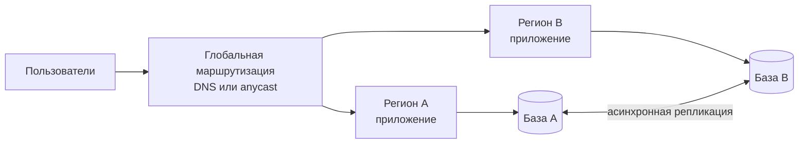
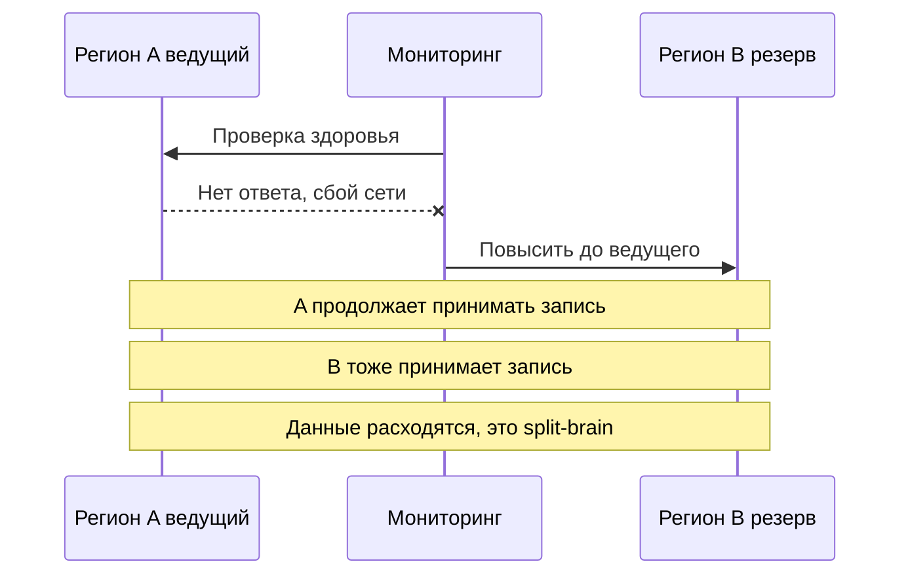

# 10.4 Отказоустойчивость, аварийное восстановление, мультирегион

## Зачем это аналитику

Любая система однажды теряет сервер, зону или целый дата-центр. Вопрос в том, сколько данных будет потеряно и сколько времени займёт восстановление, и было ли это согласовано с бизнесом заранее. RPO и RTO — бизнес-требования, которые формулирует аналитик вместе с заказчиком.

## Что понять

- [ ] RPO и RTO как бизнес-требования: сколько данных можно потерять и сколько времени можно простоять — и сколько стоит каждый порядок.
- [ ] Стратегии DR: резервные копии и восстановление, pilot light, тёплый резерв, активный-активный; стоимость и время восстановления каждой.
- [ ] Резервное копирование: полные и инкрементальные, PITR, хранение вне основной площадки, регулярная проверка восстановления.
- [ ] Мультирегион: активный-пассивный и активный-активный, репликация данных между регионами, конфликты записи, маршрутизация пользователей.
- [ ] Переключение: автоматическое и ручное, риск ложного переключения и split-brain.
- [ ] Учения (game days): проверка плана на практике.
- [ ] Зависимости: DNS, внешние провайдеры, секреты — всё это тоже должно пережить аварию.

## Урок

<!-- LESSON:START -->
### Отказоустойчивость и аварийное восстановление — разные задачи

Отказоустойчивость (high availability, HA) — способность системы продолжать работу при отказе отдельных компонентов без заметного для пользователя перерыва: упал экземпляр сервиса — трафик ушёл на соседний, упал узел базы — реплика стала ведущей. Это автоматика, которая работает постоянно.

Аварийное восстановление (disaster recovery, DR) — способность вернуть систему после крупной аварии, когда HA-механизмы не справились: потерян дата-центр или регион, повреждены данные, удалена база, скомпрометирована инфраструктура. DR — это план, процедуры и резервные ресурсы, которые большую часть времени не используются.

Хорошая HA не заменяет DR. Синхронная реплика в соседней зоне спасёт от отказа сервера, но вместе с основной базой получит и ошибочный `DELETE` без условия. От логической порчи данных защищают резервные копии и восстановление на момент времени, а не репликация.

### RPO и RTO как бизнес-требования

Две метрики задают рамку любого DR-решения.

**RPO (recovery point objective, целевая точка восстановления)** — сколько данных, измеренных во времени, допустимо потерять. RPO 15 минут означает: после аварии допустимо восстановиться в состояние, которое было не более чем за 15 минут до неё. Всё, что произошло позже, может быть потеряно.

**RTO (recovery time objective, целевое время восстановления)** — сколько времени допустимо не работать с момента аварии до восстановления сервиса.

Эти цифры — бизнес-требования. Технари не могут их выбрать сами, потому что не знают цену простоя и цену потерянных данных. Аналитик вместе с владельцем процесса выясняет:

- что конкретно теряет бизнес за час простоя: выручку, штрафы по договорам, нарушение регуляторных сроков, репутацию;
- что значит потеря данных за N минут: можно ли восстановить их из других источников (у платёжной системы партнёра, из журналов касс, из почты клиентов) или они теряются безвозвратно;
- есть ли обходной ручной процесс на время простоя.

Ключевой момент — каждый шаг вниз по RPO и RTO стоит кратно дороже. Переход от RPO в сутки к RPO в час — это частые копии журналов вместо ночного бэкапа, дёшево. Переход от часа к минутам — асинхронная репликация в другой регион, заметно дороже. Переход к нулю — синхронная запись в два места с задержкой на каждой транзакции и сложной архитектурой. Заказчик, который говорит «нам нужно ноль и ноль», должен увидеть цену каждого уровня. Обычно после этого требования становятся разумными.

Помимо RPO и RTO полезно различать уровни критичности. Не всем компонентам нужен одинаковый DR: платёжный контур и внутренняя вики — разные классы. Классификация систем по уровням (tiers) с заданными RPO/RTO для каждого уровня упрощает переговоры и планирование.

### Стратегии аварийного восстановления

Выделяют четыре классические стратегии, от дешёвой и медленной к дорогой и быстрой. Цифры в таблице — порядок величины, а не обещание: реальные значения зависят от объёма данных, автоматизации и отработанности процедур.

| Стратегия | Что есть в резервной площадке | Относительная стоимость резерва | Порядок RPO | Порядок RTO |
|---|---|---|---|---|
| Резервные копии и восстановление (backup and restore) | Только копии данных и описание инфраструктуры в коде | Минимальная: в основном хранение копий, вычислений в резерве нет | Часы (или минуты с копированием журналов) | Часы — сутки |
| Pilot light («дежурный огонёк») | Реплицируемые данные, минимальное ядро; вычисления выключены или минимальны | Низкая, небольшая доля основной | Минуты | Десятки минут — часы |
| Тёплый резерв (warm standby) | Полная, но уменьшенная копия системы, работающая постоянно | Средняя, заметная доля основной | Секунды — минуты | Минуты — десятки минут |
| Активный-активный (active-active, multi-site) | Полноценная площадка, обслуживающая трафик | Высокая, порядка удвоения и выше | Близко к нулю — секунды | Близко к нулю — минуты |

**Резервные копии и восстановление.** Данные регулярно копируются в другую площадку. При аварии инфраструктура поднимается заново из кода (IaC), данные восстанавливаются из копий. Дёшево, но медленно: восстановление большой базы само по себе занимает часы, а если инфраструктура не описана кодом, её сборка вручную займёт дни.

**Pilot light.** Данные постоянно реплицируются в резервный регион, база-реплика работает. Серверы приложений описаны, образы готовы, но не запущены или запущены в минимальном количестве. При аварии их поднимают, масштабируют, переключают трафик. Название — от запальника в газовом котле: огонь маленький, но есть, разжечь быстро.

**Тёплый резерв.** В резервном регионе работает полная копия системы в уменьшенном масштабе. Она может принимать небольшой трафик, на ней можно проверять работоспособность. При аварии её масштабируют до полной мощности и переключают весь трафик.

**Активный-активный.** Обе (или все) площадки обслуживают пользователей одновременно. Отказ одной означает перераспределение трафика на оставшиеся, которые должны иметь запас мощности. Самый быстрый и самый сложный вариант, особенно для данных, о чём ниже.

### Резервное копирование

Виды копий:

- **Полная (full)** — копия всех данных. Проще всего восстанавливать, дольше всего создавать, больше всего места.
- **Инкрементальная (incremental)** — изменения с момента предыдущей копии любого типа. Быстро и компактно, но восстановление требует всей цепочки от последней полной.
- **Дифференциальная (differential)** — изменения с момента последней полной. Компромисс: для восстановления нужны полная и последняя дифференциальная.

**Восстановление на момент времени (point-in-time recovery, PITR).** Для баз данных копия дополняется непрерывным архивом журнала транзакций. В PostgreSQL это базовая копия плюс архив WAL: восстанавливается базовая копия, затем проигрываются журналы до нужного момента — например, до секунды перед ошибочным `DELETE`. Именно PITR защищает от логических ошибок, и именно он определяет, насколько мал может быть RPO у стратегии резервных копий.

**Хранение вне основной площадки.** Копия в том же дата-центре или в том же аккаунте облака, что и база, не переживёт ни пожара, ни компрометации аккаунта. Распространённое правило 3-2-1: три копии данных, на двух разных типах носителей, одна вне основной площадки. Для защиты от шифровальщиков и злонамеренного удаления добавляют неизменяемые копии (immutable, с блокировкой удаления на срок хранения) и изоляцию доступа: учётная запись, которая пишет копии, не должна иметь права их удалять.

**Проверка восстановления.** Резервная копия, из которой ни разу не восстанавливались, — это гипотеза, а не копия. Типичные сюрпризы при первом реальном восстановлении: копии создавались, но с ошибкой и были неполными; архив журналов прерывался; ключ шифрования копий хранился только в погибшей площадке; восстановление занимает в пять раз больше времени, чем RTO; никто не помнит процедуру. Регулярное автоматическое восстановление в тестовое окружение с проверкой целостности и замером времени — единственный способ знать, что RPO и RTO реальны.

### Мультирегион

Размещение в нескольких регионах защищает от отказа целого региона и может приблизить сервис к пользователям. Две основные схемы.

**Активный-пассивный (active-passive).** Трафик обслуживает один регион, второй получает реплику данных и готов принять нагрузку. Запись идёт в одно место, конфликтов нет. Цена — простой на время переключения и потеря данных, не успевших реплицироваться.

**Активный-активный (active-active).** Оба региона принимают запросы, включая запись. Здесь начинаются проблемы, которых нет в одном регионе.

**Репликация данных.** Задержка между регионами — десятки миллисекунд и больше. Синхронная репликация заставляет каждую транзакцию ждать подтверждения из другого региона, что увеличивает задержку записи и делает доступность записи зависимой от связи между регионами. Поэтому между регионами чаще используют асинхронную репликацию — со всеми последствиями: при аварии теряется хвост непереданных изменений (это и есть ненулевой RPO), а при одновременной записи возможны конфликты.

**Конфликты записи.** Если клиент изменил лимит в регионе A, а сотрудник поддержки — тот же лимит в регионе B до того, как репликация дошла, какая версия правильная? Подходы:

- **Избегать конфликтов по построению.** Каждая запись имеет «домашний» регион: например, клиент или домен закреплён за регионом, и все записи по нему идут туда. Это самый практичный способ.
- **Разрешать по правилу.** «Побеждает последняя запись» по времени (last write wins) — просто, но теряет данные и зависит от часов.
- **Структуры данных, сливающиеся без конфликтов** (CRDT) — подходят для счётчиков, множеств, но не для произвольной бизнес-логики.
- **Глобально согласованные базы** с консенсусом между регионами — платят задержкой записи.

Для денег и остатков, где двойное списание недопустимо, обычно выбирают домашний регион для записи или единый ведущий регион, а не свободную запись везде.

**Маршрутизация пользователей.** Трафик направляется по геоблизости, задержке или весам через DNS или anycast. Нужно учитывать кэширование DNS: после изменения записи часть клиентов ещё долго ходит по старому адресу, особенно если время жизни записи (TTL) большое или клиенты игнорируют его. Для быстрого переключения TTL заранее держат небольшим или используют маршрутизацию на уровне глобального балансировщика.

#### Разобранный пример: три системы, три стратегии

Банк для юрлиц, розничная сеть и внутренняя вики — разные требования.

**Платёжный шлюз банка.** Потеря принятого платёжного поручения недопустима, простой бьёт по клиентам и регламентам. Обсуждение с бизнесом даёт RPO около нуля для принятых поручений и RTO в пределах десятков минут. Решение: синхронная репликация между зонами в основном регионе (RPO ноль при отказе зоны), тёплый резерв в другом регионе с асинхронной репликацией. Чтобы не терять поручения при региональной аварии, шлюз не подтверждает клиенту приём, пока поручение не записано надёжно; после переключения на резерв последние поручения сверяются по журналу со стороной клиента и расчётной системой. Стоимость — заметная доля основной инфраструктуры, и это обосновано.

**Прогноз спроса.** Прогноз пересчитывается ночью из данных продаж, которые хранятся в других системах. Потерять сутки расчётов неприятно, но их можно пересчитать. Если прогноз недоступен день, заказы поставщикам формируются по вчерашнему прогнозу или по упрощённому правилу. RPO — сутки, RTO — несколько часов. Стратегия: резервные копии и восстановление, инфраструктура в коде. Стоимость минимальна.

**Внутренняя вики.** RPO — сутки, RTO — рабочий день. Ночные копии вне площадки, раз в квартал проверка восстановления.

Такое разделение позволяет тратить на DR там, где это окупается, а не размазывать бюджет поровну.

### Переключение: автоматическое и ручное

Переключение (failover) на резервную площадку можно запускать автоматически по сигналу мониторинга или вручную по решению дежурного.

Автоматическое переключение быстрее, но рискует **ложным срабатыванием**: сеть между мониторингом и основным регионом нарушилась, а сам регион работает. Система переключается, и в худшем случае возникает **split-brain** — обе площадки считают себя ведущими и принимают запись. Данные расходятся, и их слияние превращается в ручной разбор по каждой записи.

Как предотвращают split-brain:

- **Кворум.** Решение о смене ведущего принимает большинство участников, желательно в трёх независимых площадках (например, два региона данных и третий — лёгкий арбитр). Узел, оказавшийся в меньшинстве, прекращает принимать запись.
- **Изоляция старого ведущего (fencing).** Перед повышением резерва старого ведущего принудительно отключают от записи: отзывают доступ, выключают, переводят в режим только чтения. Номер эпохи или токен ведущего (fencing token) позволяет хранилищу отвергать запись от устаревшего ведущего.
- **Аренда (lease).** Ведущий держит аренду с ограниченным сроком; не продлив её, он сам прекращает запись до того, как новый ведущий начнёт работу.

Для межрегионального переключения многие команды сознательно выбирают **ручное решение с автоматизированным выполнением**: человек подтверждает, что авария реальна, а дальше запускается отрепетированный сценарий. Это добавляет минуты к RTO, но снижает риск ложного переключения с потерей данных. Внутри региона, между зонами, автоматическое переключение базы — обычная практика.

Отдельный вопрос — **обратное переключение (failback)**. После восстановления основного региона данные в нём устарели, их нужно синхронизировать с бывшим резервом, прежде чем возвращать трафик. Эту процедуру тоже нужно планировать и репетировать.

### Учения

План DR, который ни разу не выполнялся, не работает. Учения (game days, DR drills) — плановое воспроизведение аварии и отработка восстановления.

Как устроено учение:

1. **Цель и гипотеза.** Например: «восстановим базу заказов из резервной копии в резервном регионе за время не более RTO, потеря данных не превысит RPO».
2. **Сценарий и границы.** Что именно отключаем, где (сначала в тестовом окружении, затем в проде с ограниченным воздействием), какие условия остановки учения.
3. **Роли.** Руководитель учения, исполнители, наблюдатель с секундомером, ответственный за коммуникацию.
4. **Выполнение по runbook**, без подсказок от людей, которые «всё помнят».
5. **Измерения.** Фактические RPO и RTO, где застряли, каких доступов не хватило.
6. **Разбор без поиска виноватых** и задачи на исправление.

Учения регулярно находят вещи, которых нет ни в одной схеме: истёкший сертификат в резервном регионе, забытую зависимость от сервиса, работающего только в основном, runbook со ссылками на уволившихся людей. Хаос-инжиниринг развивает ту же идею до постоянных контролируемых экспериментов.

### Зависимости, которые тоже должны пережить аварию

Резервный регион с копией приложения и базы бесполезен, если он зависит от чего-то, что осталось в погибшем. Типичные забытые зависимости:

- **DNS.** Если зона управляется у одного провайдера и он недоступен, переключить трафик нельзя. Большой TTL замедляет переключение.
- **Секреты и ключи.** Хранилище секретов и KMS должны быть доступны в резервном регионе; ключи шифрования резервных копий — тоже. Копия, которую нечем расшифровать, бесполезна.
- **Внешние провайдеры.** Платёжные агрегаторы, SMS-шлюзы, реестры доменов: разрешён ли у них доступ с IP-адресов резервного региона, есть ли резервный провайдер.
- **Система идентификации.** Если вход сотрудников и сервисов идёт через единый сервис в основном регионе, в аварию никто не сможет войти, чтобы запустить восстановление.
- **Конвейер поставки и репозиторий артефактов.** Чтобы поднять инфраструктуру из кода, нужны доступные Git, реестр образов и CI.
- **Мониторинг и связь.** Мониторинг, размещённый в том же регионе, что и система, падает вместе с ней; каналы оповещения дежурных тоже нужно продублировать.

Хорошая практика — составить карту зависимостей для каждого критичного сервиса и для каждой ответить на вопрос: что будет, если она недоступна вместе с основным регионом.

### Типичные ошибки

- RPO и RTO задаются инженерами «на глаз», без оценки бизнесом стоимости простоя и потери данных.
- Одинаковая дорогая стратегия DR для всех систем вместо классификации по критичности.
- Резервные копии без регулярной проверки восстановления и замера времени.
- Уверенность, что репликация заменяет резервные копии: логическая ошибка реплицируется мгновенно.
- Активный-активный с асинхронной репликацией и свободной записью везде без стратегии разрешения конфликтов.
- Автоматическое межрегиональное переключение без кворума и изоляции старого ведущего, приводящее к split-brain.
- Забытые зависимости: DNS, секреты, ключи шифрования копий, доступ к внешним провайдерам из резервного региона.

### Как говорить об этом на собеседовании

Сильный ответ начинается не с технологий, а с вопроса к бизнесу: сколько стоит час простоя и сколько данных можно потерять. Покажите, что RPO и RTO задаются для каждого класса систем отдельно и что каждый шаг к нулю стоит кратно дороже. Назовите четыре стратегии и их примерное соотношение цены и времени восстановления, а затем выберите одну для конкретной системы с обоснованием.

На уровне senior ожидают понимания подводных камней: что репликация не заменяет резервные копии, что активный-активный упирается в конфликты записи и их обычно избегают через домашний регион, что автоматическое переключение без кворума и fencing ведёт к split-brain. Упоминание учений с измерением фактических RPO/RTO и карты зависимостей (DNS, секреты, внешние провайдеры) отличает человека, который проходил через реальную аварию или готовился к ней, от того, кто знает только схемы.

### Коротко

- HA закрывает отказы компонентов автоматически, DR — крупные аварии и порчу данных по плану.
- RPO и RTO — бизнес-требования; каждый шаг к нулю стоит кратно дороже.
- Четыре стратегии DR: копии, pilot light, тёплый резерв, активный-активный — от дешёвой и медленной к дорогой и быстрой.
- Копия ценна только с проверенным восстановлением; PITR защищает от логических ошибок, хранение вне площадки и неизменяемость — от аварий и злоумышленников.
- Мультирегион активный-активный требует стратегии разрешения конфликтов; практичнее всего закреплять запись за домашним регионом.
- Split-brain предотвращают кворумом, изоляцией старого ведущего и арендой; межрегиональное переключение часто подтверждает человек.
- Учения — единственный способ проверить план; зависимости вроде DNS, секретов и внешних провайдеров должны пережить аварию вместе с системой.
<!-- LESSON:END -->

## Читать дальше

- AWS, «Disaster Recovery of Workloads on AWS» (whitepaper) — хорошее описание стратегий, применимое к любому облаку.
- Google SRE Workbook — главы о управлении инцидентами и надёжности.

На system-design.space:

- [Аварийное восстановление: RTO, RPO и game days](https://system-design.space/chapter/disaster-recovery/)
- [Многорегиональные и глобальные системы](https://system-design.space/chapter/multi-region-global-systems/)
- [Лаба: Учение по переключению региона](https://system-design.space/labs/multi-region-failover-drill/)
- [Визуализация: Межрегиональные топологии](https://system-design.space/visuals/multi-region-topologies/)
- [Практика системного дизайна: многорегиональная система](https://system-design.space/practice/multi-region/)

## Практика

1. Для трёх обезличенных систем (платёжный шлюз, прогноз спроса, внутренняя вики) согласовать RPO и RTO, выбрать стратегию DR и оценить её стоимость относительно основной инфраструктуры.
2. Написать план учения по восстановлению базы данных из резервной копии: шаги, ответственные, критерии успеха.
3. Пройти лабу по переключению региона на system-design.space.

## Вопросы для самопроверки

1. Что такое RPO и RTO и кто должен их определять?
2. Какие стратегии аварийного восстановления вы знаете и чем они отличаются по стоимости?
3. Почему резервная копия без проверки восстановления — не резервная копия?
4. Какие проблемы возникают в активной-активной мультирегиональной схеме?
5. Что такое split-brain и как его предотвращают?

## Заметки

<!-- Свои формулировки, ошибки, ссылки. -->
