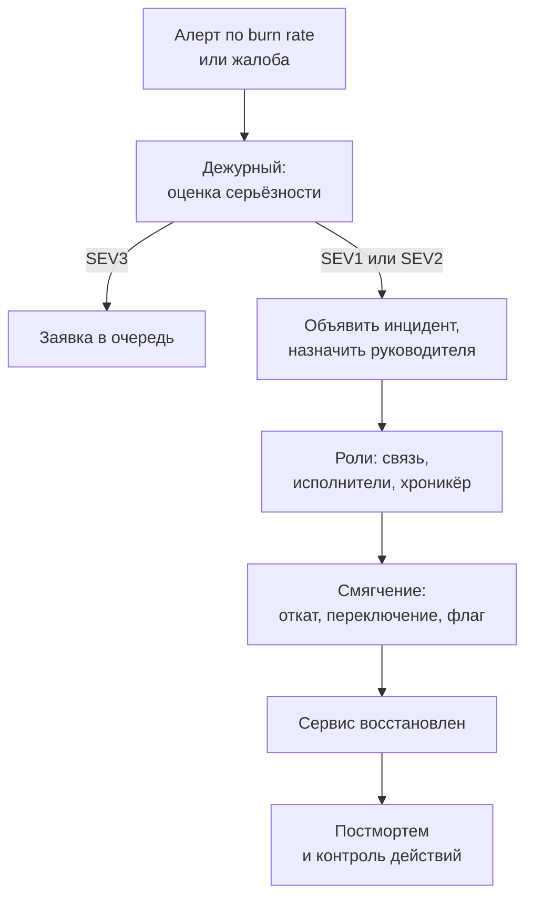

# 10.5 SRE-практики, управление инцидентами и стоимость (FinOps)

## Зачем это аналитику

Надёжность и стоимость — два атрибута качества, которые бизнес чувствует напрямую. SRE даёт язык для надёжности (SLO, бюджет ошибок, разбор инцидентов без поиска виноватых), FinOps — для стоимости. Архитектор, который считает стоимость своих решений, выгодно отличается на собеседовании.

## Что понять

- [ ] SRE как подход: надёжность — функция продукта, бюджет ошибок как механизм баланса скорости и стабильности (связь с модулем 3.7).
- [ ] Алертинг по скорости расходования бюджета ошибок (burn rate) вместо порогов.
- [ ] Управление инцидентами: роли (руководитель инцидента, связь, исполнители), коммуникация, эскалация.
- [ ] Постмортем без поиска виноватых: хронология, причины, действия, проверка выполнения.
- [ ] Toil: ручная рутинная работа и её автоматизация.
- [ ] FinOps: видимость затрат, распределение по командам и продуктам, оптимизация (размер ресурсов, резервирование, spot-инстансы, хранение по классам).
- [ ] Стоимость как архитектурное требование: цена транзакции, пользователя, прогноза; компромиссы стоимости и надёжности.
- [ ] Инженерия производительности: нагрузочное тестирование, профилирование, планирование мощностей.

## Урок

<!-- LESSON:START -->
### SRE как подход: надёжность — это функция продукта

Инженерия надёжности сервисов (Site Reliability Engineering, SRE) начинается с простой мысли: надёжность не бесплатна и не абсолютна. Пользователь не отличит 99,99% от 100%, потому что между ним и сервисом стоят его собственный Wi-Fi, мобильная сеть и браузер. А каждая следующая «девятка» стоит заметно дороже предыдущей: резервирование, дежурства, медленнее релизы. Значит, уровень надёжности — это продуктовое решение с ценой, как любая другая функция.

Из модуля 3.7 уже знакомы три понятия. Показатель уровня сервиса (SLI) — что измеряем, например долю успешных ответов API оформления заказа. Целевой уровень (SLO) — внутренняя цель, например 99,9% за скользящие 30 дней. Соглашение (SLA) — внешнее обязательство с последствиями, обычно мягче SLO, чтобы между ними был запас.

Бюджет ошибок (error budget) — это разрешённая доля неудач: `1 − SLO`. При SLO 99,9% бюджет равен 0,1% событий за окно. Главная ценность бюджета не в числе, а в том, что он превращает спор «разработка хочет релизить, эксплуатация хочет стабильности» в арифметику:

- бюджет не израсходован — команда релизит в обычном темпе, может рисковать (эксперименты, крупные миграции);
- бюджет исчерпан — действует политика бюджета ошибок (error budget policy): заморозка функциональных релизов, приоритет задачам надёжности, до восстановления бюджета.

Политика должна быть согласована с владельцем продукта заранее, письменно. Иначе при первом же исчерпании бюджета бизнес скажет «эту фичу всё равно выпускаем», и механизм потеряет смысл. Для аналитика это прямое требование: SLO и политика — такие же атрибуты качества, как время отклика, и их нужно фиксировать в постановке.

#### Пример расчёта бюджета

Сервис приёма заказов интернет-магазина. SLI — доля HTTP-запросов к API оформления заказа, завершившихся без ошибки 5xx и быстрее 2 секунд. SLO — 99,9% за скользящие 30 дней. Нагрузка — около 10 млн запросов в месяц.

- Бюджет в событиях: 10 000 000 × 0,001 = 10 000 «плохих» запросов за 30 дней.
- Бюджет во времени (если считать полную недоступность): 30 × 24 × 60 × 0,001 = 43,2 минуты за 30 дней.
- Неудачный релиз дал 15 минут полной недоступности при средней нагрузке около 230 запросов в минуту: примерно 3 500 плохих запросов, то есть 35% месячного бюджета.

После такого релиза у команды остаётся 65% бюджета. Решение о следующем крупном релизе принимается с оглядкой на это: например, выкатывать его через канареечный выпуск на 5% трафика, чтобы в худшем случае сжечь малую долю остатка.

### Алертинг по скорости расходования бюджета

Классический алерт «доля ошибок больше 1% за 5 минут» плох в обе стороны. Короткий всплеск на 2% в течение минуты будит дежурного, хотя почти не трогает бюджет. А тихая деградация на 0,5% ошибок в течение суток порог не пересекает, хотя за три дня съедает половину месячного бюджета, а за шесть — весь.

Скорость расходования (burn rate) — это во сколько раз текущая доля ошибок превышает допустимую:

```
burn_rate = наблюдаемая_доля_ошибок / (1 − SLO)
```

Burn rate 1 означает, что бюджет закончится ровно к концу окна SLO. Burn rate 10 — что при 30-дневном окне он закончится за 3 дня. Доля бюджета, съеденная за период наблюдения:

```
доля_бюджета = burn_rate × длительность_периода / длительность_окна_SLO
```

Для SLO 99,9% (допустимо 0,1% ошибок) и окна 30 дней (720 часов):

| Наблюдаемая доля ошибок | Burn rate | Бюджет закончится через | Съедено за 1 час |
|---|---|---|---|
| 0,1% | 1 | 30 дней | 0,14% |
| 0,5% | 5 | 6 дней | 0,7% |
| 1,44% | 14,4 | около 2 суток | 2% |
| 5% | 50 | 14,4 часа | 6,9% |

Отсюда распространённая схема из практики SRE — алерты в нескольких окнах и с несколькими порогами (multi-window, multi-burn-rate):

- burn rate ≥ 14,4 в окне 1 час (2% бюджета за час) — вызвать дежурного немедленно;
- burn rate ≥ 6 в окне 6 часов (5% бюджета) — тоже вызов, деградация серьёзная, но медленнее;
- burn rate ≥ 1 в окне 3 дня (10% бюджета) — заявка в очередь, без ночного звонка.

Каждый длинный порог дополняется коротким окном (примерно 1/12 длинного: 5 минут для часа, 30 минут для 6 часов), и алерт срабатывает, только когда оба условия истинны. Короткое окно нужно, чтобы алерт быстро гас после устранения проблемы, а не висел ещё час из-за «хвоста» в длинном окне. Конкретные пороги — отправная точка, их подбирают под свой SLO и трафик.

Главное, что это меняет: алерт отвечает на вопрос «угрожает ли это обещанию пользователям», а не «превышено ли какое-то число». Отсюда меньше ложных вызовов и меньше пропущенных медленных деградаций. Ограничение — при малом трафике доля ошибок сильно шумит: 1 ошибка из 20 запросов уже 5%. Для таких сервисов нужны более длинные окна, минимальное число событий в условии или синтетические проверки.

### Управление инцидентами

Инцидент — событие, которое нарушает или угрожает нарушить обещанный уровень сервиса. Самая дорогая ошибка при крупном инциденте — не техническая, а организационная: десять человек в одном чате одновременно чинят, спорят и отвечают бизнесу, и никто не знает, кто что делает.

Поэтому роли разделяют:

- **Руководитель инцидента (incident commander).** Не чинит сам. Держит общую картину, распределяет задачи, принимает решения (откатывать ли, переключать ли на резерв), решает, когда эскалировать и когда объявить инцидент закрытым.
- **Ответственный за связь (communications lead).** Пишет регулярные обновления для заказчиков, поддержки и руководства в отдельный канал по заранее оговорённому ритму, например раз в 30 минут, даже если новостей нет. Защищает исполнителей от вопросов «ну что там».
- **Исполнители (operations, subject matter experts).** Диагностируют и устраняют, докладывают руководителю инцидента.
- **Хроникёр (scribe).** В небольших командах эту роль часто совмещают со связью: фиксирует действия и время, что потом станет основой хронологии постмортема.

Уровни серьёзности (severity) задаются заранее и объективно: по доле затронутых пользователей, деньгам, данным. Например, SEV1 — недоступна оплата или потеряны данные; SEV2 — деградация ключевого сценария; SEV3 — неудобство с обходным путём. От уровня зависят каналы оповещения, кого будят и срок постмортема.



Эскалация — нормальный инструмент, а не признание слабости. Правило для регламента: если за оговорённое время (например, 30 минут для SEV1) нет понятной гипотезы, руководитель инцидента зовёт следующий уровень экспертизы. Для контрактора, работающего на нескольких заказчиков, важно ещё одно: заранее выяснить, кто со стороны заказчика вправе принять решение об откате или о ручных корректировках данных. Ночью этот вопрос решать поздно.

Первоочередная задача — смягчить последствия (mitigation), а не найти корневую причину. Откат релиза, выключение функции через флаг, переключение трафика восстанавливают сервис за минуты. Расследование подождёт до утра.

### Постмортем без поиска виноватых

Постмортем без поиска виноватых (blameless postmortem) исходит из того, что люди действовали разумно с учётом информации, которая у них была. Если инженер выполнил команду на боевой базе вместо тестовой, вопрос не «кто это сделал», а «почему система позволила это сделать и почему последствия не были перехвачены». Когда за ошибки наказывают, люди перестают о них рассказывать, и организация учится меньше.

Структура хорошего постмортема:

1. **Краткое резюме и влияние.** Что случилось, сколько длилось, сколько пользователей, заказов или денег затронуто, сколько бюджета ошибок израсходовано.
2. **Хронология.** С точностью до минут: когда началось, когда обнаружили, когда объявили, какие гипотезы проверяли, когда смягчили. Промежутки между этими точками часто интереснее самой причины: 40 минут от начала до обнаружения — это проблема мониторинга.
3. **Причины и способствующие факторы.** Обычно их несколько: изменение, которое спровоцировало сбой, отсутствие проверки, которая бы его поймала, и условия, которые усилили последствия.
4. **Что сработало и что нет.** В том числе в коммуникации.
5. **Действия (action items).** У каждого — владелец, срок, тип (предотвратить, обнаружить раньше, смягчить быстрее) и ссылка на задачу в трекере.

Постмортем становится формальностью, когда действия звучат как «быть внимательнее» или «провести обучение», не имеют владельца или никто не проверяет их выполнение. Полезная практика — ежемесячный обзор открытых действий по всем постмортемам и вопрос на следующем постмортеме: «было ли это действие в предыдущих разборах?».

### Toil: рутина, которая масштабируется вместе с системой

Toil в терминологии SRE — ручная, повторяющаяся работа, которую можно автоматизировать, которая не оставляет долговременной ценности и растёт линейно с ростом сервиса. Примеры: ручной перезапуск зависшей выгрузки остатков каждое утро, ручное продление сертификатов, ручная сверка выписок, которые не сошлись.

Не всякая операционная работа — toil. Разбор инцидента или проектирование новой схемы мониторинга оставляют ценность. Toil опасен тем, что незаметно съедает время команды: при росте числа магазинов вдвое ручной перезапуск выгрузок растёт тоже вдвое. В книге Google указан ориентир — держать долю такой работы у SRE-инженеров ниже половины времени.

Для аналитика toil — источник требований. Если поддержка каждую неделю вручную исправляет статусы «зависших» платёжных поручений, это сигнал о недостающем сценарии в постановке: повторная отправка, сверка, автоматический перевод в финальный статус по таймауту.

### FinOps: стоимость как управляемая величина

FinOps — практика совместного управления облачными затратами инженерами, финансами и бизнесом. Её обычно описывают циклом из трёх фаз: информирование (видимость затрат), оптимизация, эксплуатация (постоянное управление и принятие решений).

**Видимость и распределение.** Первое условие — понимать, кто и на что тратит. Для этого все ресурсы помечают метками (теги или labels): команда, продукт, окружение, центр затрат. Без меток счёт за облако — одна большая цифра, с которой невозможно работать. Дальше затраты распределяют: прямые (виртуальные машины сервиса прогноза) относят на продукт, общие (кластер Kubernetes, сеть, мониторинг) делят по правилу — пропорционально запрошенным ресурсам, трафику или поровну. Показ затрат командам без выставления счёта называют showback, внутреннее выставление счёта — chargeback.

**Оптимизация.** Основные рычаги:

| Рычаг | Суть | Когда подходит | Риск или ограничение |
|---|---|---|---|
| Правильный размер (rightsizing) | Уменьшить ресурсы до фактического использования | Машины загружены на 10–20% | Нужны данные о пиках, а не о среднем |
| Резервирование и обязательства | Скидка за обязательство использовать ресурсы 1–3 года | Стабильная базовая нагрузка | Переплата, если нагрузка упадёт или архитектура изменится |
| Прерываемые (spot) инстансы | Излишки мощности провайдера со значительной скидкой | Пакетные задачи, которые переживут прерывание | Могут отобрать с коротким уведомлением |
| Классы хранения | Горячее, холодное, архивное хранилище по цене и скорости доступа | Старые данные читают редко | Плата и задержка за извлечение из архива |
| Выключение по расписанию | Тестовые стенды не работают ночью и в выходные | Непромышленные окружения | Нужна автоматизация включения |
| Архитектурные изменения | Кэш, пакетная обработка, отказ от лишних копий данных | Затраты растут быстрее нагрузки | Дороже всего по усилиям |

Скидки конкретных провайдеров меняются, поэтому в расчётах лучше держать их параметром, а не константой.

### Стоимость как архитектурное требование

Общий счёт за облако мало что говорит архитектору. Полезнее удельная стоимость (unit cost): цена одного заказа, одного активного клиента, одного прогноза, одного платёжного поручения. Удельная метрика показывает, масштабируется ли система экономически: если заказов стало вдвое больше, а стоимость выросла втрое, есть архитектурная проблема.

#### Пример: цена прогноза в розничной сети

Сеть из 400 магазинов, ассортимент 25 000 товаров, ежедневный ночной пересчёт прогноза спроса на пару «товар — магазин». Всего 10 млн рядов в сутки. Цены ниже условные, в условных единицах (у.е.).

- Вычисления: кластер на 4 часа, 64 виртуальных процессора, условно 0,05 у.е. за процессор-час: 64 × 4 × 0,05 = 12,8 у.е. за ночь.
- Хранение истории продаж и прогнозов, база данных, мониторинг, делённые на 30 дней: условно 20 у.е. в сутки.
- Итого около 33 у.е. в сутки, или около 0,0000033 у.е. за один прогноз ряда (3,3 у.е. за миллион рядов).

Три способа снизить стоимость, у каждого — свой компромисс:

1. Перевести ночной пересчёт на прерываемые инстансы. Задача пакетная и делится на независимые части по магазинам, поэтому прерывание одной машины означает лишь повторный расчёт её части. Нужно запускать расчёт с запасом по времени, чтобы к утру заказы поставщикам точно сформировались.
2. Не пересчитывать ряды без изменений. Товары с нулевыми продажами и неизменными параметрами (а это нередко заметная доля длинного хвоста) пересчитывать раз в неделю.
3. Перенести историю продаж старше двух лет в холодное хранилище с партиционированием по месяцу. Модели обучаются на ней редко, и задержка извлечения допустима.

Компромисс стоимости и надёжности виден в каждом пункте: прерываемые инстансы дешевле, но добавляют риск не успеть к утру; меньше реплик — дешевле, но дольше восстановление. Поэтому стоимость должна стоять в списке атрибутов качества рядом с доступностью, а в архитектурном решении (ADR) должно быть написано, сколько стоит каждый вариант. Хороший вопрос заказчику: «Сколько стоит час простоя этой системы?» Если час простоя автопополнения стоит меньше, чем год горячего резерва, горячий резерв не нужен.

### Инженерия производительности

Производительность связывает надёжность и стоимость: система, которая держит нагрузку на меньшем числе машин, дешевле, а система с запасом по мощности надёжнее при пиках.

**Нагрузочное тестирование (load testing)** бывает нескольких видов:

- нагрузочное — ожидаемый пик, проверка SLO по времени отклика;
- стресс-тест — рост нагрузки до отказа, чтобы узнать предел и характер отказа (плавная деградация или обрушение);
- тест на выносливость (soak) — умеренная нагрузка несколько часов или суток, ловит утечки памяти и переполнение соединений;
- тест на всплеск (spike) — резкий скачок, например старт распродажи или аукциона по освободившемуся домену.

Сценарий нагрузки должен отражать реальный профиль: соотношение чтений и записей, распределение по товарам (горячие позиции), размеры ответов. Тест с одним и тем же запросом проверяет только кэш.

**Профилирование** отвечает на вопрос, куда уходит время: CPU, ожидание базы, блокировки, сборка мусора, сеть. Для аналитика ближе всего профилирование SQL: план выполнения и медленные запросы в PostgreSQL. Оптимизировать без профиля — угадывать.

**Планирование мощностей (capacity planning)** опирается на прогноз роста и измеренную ёмкость одного экземпляра. Полезная опора — закон Литтла: среднее число запросов в системе равно интенсивности поступления, умноженной на среднее время обработки. При 200 запросах в секунду и времени ответа 0,25 секунды в системе одновременно около 50 запросов. Если один экземпляр держит 20 одновременных запросов без деградации, нужно минимум 3 экземпляра, а с запасом на отказ одного и на рост — 4–5. Запас (headroom) и есть точка, где встречаются стоимость и надёжность.

### Типичные ошибки

- SLO 99,99% «потому что так солиднее», без расчёта, что это 4 минуты недоступности в месяц и что обеспечит их только дорогая инфраструктура и круглосуточное дежурство.
- Бюджет ошибок посчитан, но политика его исчерпания не согласована с владельцем продукта, поэтому ни на что не влияет.
- Алерты по сырым порогам на каждую метрику: дежурный получает десятки уведомлений, привыкает их игнорировать и пропускает настоящий инцидент.
- Во время инцидента руководитель сам полез чинить, и координация развалилась; бизнес узнаёт новости от случайных людей.
- Постмортем с действиями вроде «быть внимательнее» и без владельцев и сроков; через полгода тот же инцидент.
- Стоимость считается только общим счётом, без удельных метрик и меток, поэтому никто не знает, какой продукт растит затраты.
- Нагрузочный тест на синтетике, не похожей на реальный профиль, и выводы о мощности на его основе.

### Как говорить об этом на собеседовании

Уровень senior проявляется в том, что надёжность и стоимость звучат как требования с числами, а не как пожелания. Хорошая формулировка: «Для API оформления заказа согласовали SLO 99,9% за 30 дней, это около 43 минут в месяц. Алерты строили по burn rate: вызов дежурного при расходе 2% бюджета за час. Политика — при исчерпании бюджета замораживаем фичи». Покажите, что вы понимаете, откуда берутся пороги, и готовы их пересчитать.

По стоимости расскажите про удельную метрику и компромисс: «Считали стоимость прогноза на пару товар-магазин, перевели ночной пересчёт на прерываемые машины, добавив запас по времени; отказались от горячего резерва для пакетного контура, потому что час его простоя стоил меньше резерва». По инцидентам — назовите роли, ритм коммуникации и одно действие из постмортема, которое реально изменило систему.

### Коротко

- Надёжность — продуктовое решение с ценой; бюджет ошибок `1 − SLO` превращает спор о релизах в арифметику, если политика согласована заранее.
- Burn rate показывает, во сколько раз расход бюджета быстрее допустимого; алерты в нескольких окнах ловят и резкие сбои, и медленные деградации.
- При крупном инциденте роли разделены: руководитель координирует, связь информирует, исполнители чинят; сначала смягчение, потом причины.
- Постмортем полезен, когда у действий есть владелец, срок и контроль выполнения, а разбор ищет слабые места системы, а не виноватых.
- Toil растёт вместе с системой; повторяющаяся ручная работа — источник требований на автоматизацию.
- FinOps начинается с меток и распределения затрат, продолжается рычагами: размер, резервирование, прерываемые инстансы, классы хранения.
- Удельная стоимость (заказ, прогноз, клиент) — архитектурный атрибут качества, её сравнивают с ценой простоя.
- Производительность, мощности и стоимость связаны: закон Литтла и измеренная ёмкость экземпляра дают число машин и запас.
<!-- LESSON:END -->

## Читать дальше

- Google, *Site Reliability Engineering* — главы об SLO, мониторинге, управлении инцидентами и постмортемах (sre.google/books).
- FinOps Foundation, «FinOps Framework» (finops.org).

На system-design.space:

- [Зачем нужны надёжность и инженерия надёжности сервисов (SRE)](https://system-design.space/chapter/sre-operations-overview/)
- [Показатель уровня сервиса (SLI), целевой уровень сервиса (SLO), соглашение об уровне сервиса (SLA) и бюджет ошибок](https://system-design.space/chapter/sli-slo-sla-error-budgets/)
- [Алертинг по бюджету ошибок: multi-window multi-burn-rate](https://system-design.space/chapter/multi-burn-rate-alerting/)
- [Управление инцидентами как инженерная дисциплина](https://system-design.space/chapter/incident-management-discipline/)
- [Оптимизация стоимости и FinOps](https://system-design.space/chapter/cost-optimization-finops/)
- [Инженерия производительности](https://system-design.space/chapter/performance-engineering/)

## Практика

1. Написать постмортем по реальному инциденту из своей практики (обезличенно) в формате без поиска виноватых.
2. Посчитать стоимость одной операции (например, одного прогноза или одного заказа) для обезличенной системы и найти три способа её снизить.
3. Сформулировать регламент управления инцидентами для небольшой команды: уровни, роли, каналы связи, сроки постмортема.

## Вопросы для самопроверки

1. Что такое бюджет ошибок и как он влияет на решения о релизах?
2. Почему алертинг по burn rate лучше алертинга по порогу ошибок?
3. Какие роли нужны при управлении крупным инцидентом?
4. Что делает постмортем полезным, а не формальным?
5. Как посчитать и снизить стоимость инфраструктуры системы?
6. Как вы включаете стоимость в архитектурные решения?

## Заметки

<!-- Свои формулировки, ошибки, ссылки. -->
