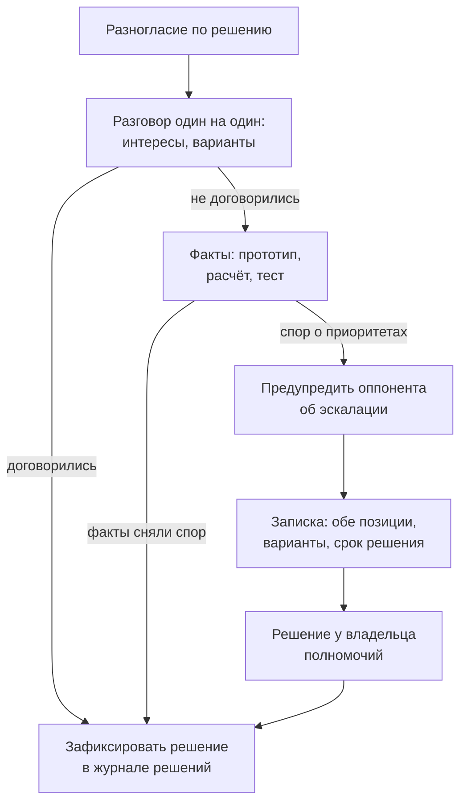

# 11.1 Работа со стейкхолдерами и влияние без полномочий

## Зачем это аналитику

У архитектора обычно нет прямой власти над командами, а решения нужно проводить через заказчиков, руководителей, безопасность, эксплуатацию. Умение понять интересы каждого, говорить на их языке и добиваться решений без приказов — то, что отличает архитектора от сильного технического специалиста.

## Что понять

- [ ] Карта стейкхолдеров: влияние и интерес, позиция по решению; кто принимает решение, кто влияет, кто исполняет.
- [ ] Интересы против позиций: за требованием «нужна своя база» стоит страх зависимости от другой команды.
- [ ] «Лифт архитектора» Хопа: умение переходить между уровнем кода и уровнем правления и переводить между ними.
- [ ] Как говорить с разными аудиториями: бизнесу — деньги, риски и сроки; разработке — ограничения и компромиссы; безопасности — угрозы и меры.
- [ ] Влияние без полномочий: доверие, репутация экспертизы, союзники, прототипы вместо споров.
- [ ] Как говорить «нет» и предлагать альтернативу; эскалация как инструмент, а не жалоба.
- [ ] Письменная коммуникация: документ на одну страницу, рекомендация в начале, решение, которое нужно от читателя.
- [ ] RACI и договорённости об ответственности.

## Урок

<!-- LESSON:START -->
### Почему это отдельный навык

Архитектурное решение, которое никто не принял, равно отсутствию решения. У аналитика и архитектора почти никогда нет права приказать: разработчики подчиняются своему руководителю, безопасность — своему, бюджет держит заказчик. Остаётся влияние: понимание чужих интересов, доверие и умение сформулировать вопрос так, чтобы на него было легко ответить «да».

У контрактора, который ведёт несколько заказчиков одновременно, задача сложнее. Он внешний человек в каждой организации, не знает её неформальной истории, видит её несколько часов в неделю и конкурирует за внимание с внутренними сотрудниками. Зато у него есть преимущество: он не участвует во внутренней политике, и его позиция может восприниматься как независимая. Этим преимуществом нужно пользоваться сознательно.

### Карта стейкхолдеров

Стейкхолдер — любой, кто влияет на решение или на кого решение влияет. Карта нужна не для отчёта, а чтобы не узнать о ключевом человеке на приёмке.

Базовая сетка — влияние и интерес. Высокое влияние и высокий интерес: работать плотно, вовлекать в решения. Высокое влияние и низкий интерес: держать в курсе коротко, не перегружать, но заранее проверять, что решение их не задевает. Низкое влияние и высокий интерес: информировать, использовать как источник знаний и союзников. Низкое и низкое: наблюдать.

Сетки недостаточно. Для каждого значимого человека полезно зафиксировать ещё три вещи: позицию по конкретному решению (за, против, нейтрален, не знает), что ему важно (его интерес) и роль в решении — принимает, влияет или исполняет.

#### Пример карты: модернизация биллинга у регистратора доменов

Контрактор проектирует вынос расчёта продлений доменов из монолита в отдельный сервис.

| Роль | Влияние | Интерес | Позиция | Что важно | Как работать |
|---|---|---|---|---|---|
| Операционный директор (спонсор) | Высокое | Средний | За | Сроки, отсутствие сбоев в продлениях | Раз в две недели одностраничный статус, решения — с вариантами |
| Руководитель команды монолита | Высокое | Высокий | Против | Не хочет потерять контроль и получить поток доработок | Совместный разбор границ, его люди в ревью контрактов |
| Финансовый контролёр | Среднее | Высокий | Нейтрален | Сверка выручки не должна сломаться | Показать сверку до и после, дать тест на реальных данных |
| Безопасность | Среднее, право вето | Низкий | Не знает | Платёжные данные, доступы | Вовлечь до ревью, а не на нём |
| Поддержка | Низкое | Высокий | За | Меньше ручных исправлений продлений | Источник кейсов и союзник на комитете |

Строка про безопасность показывает типичную ловушку: низкий интерес и «среднее» влияние превращаются в блокирующее, если вспомнить о них в последний момент.

#### Кто на самом деле принимает решение

Формальная оргструктура отвечает на этот вопрос плохо. Рабочие приёмы:

- Спросить прямо, но через процесс: «Кто подписывает приёмку этого этапа? Чьё согласие нужно, чтобы изменить объём работ?» У контрактора ответ часто есть в договоре или техническом задании — там указаны ответственные за приёмку.
- Проследить за прошлым спорным решением: кто в итоге сказал последнее слово, после чьего письма изменили план.
- Смотреть, кого приглашают на встречи и кто отвечает на вопросы о деньгах. Человек, после которого все замолкают, важнее человека с большим титулом, который молчит.
- Различать право решить и право заблокировать. Безопасность, юристы, эксплуатация часто не решают, но могут остановить.

### Интересы против позиций

Позиция — то, что человек требует. Интерес — почему он этого хочет. Идея из книги Фишера и Юри о принципиальных переговорах: договориться о позициях часто невозможно, а об интересах — обычно можно, потому что под одной позицией может лежать несколько интересов, и некоторые из них удовлетворяются иначе.

Примеры из заказной разработки:

- Позиция: «Нашей команде нужна своя база с копией клиентов». Интерес: не зависеть от сроков чужой команды и не ловить их инциденты. Альтернатива: публикация изменений клиентов через события и локальная проекция с чётким владельцем эталона.
- Позиция: «Отчёт должен строиться онлайн по всем данным». Интерес: финансовый директор утром на совещании не хочет видеть вчерашние цифры, которые не сходятся с кассой. Альтернатива: витрина, обновляемая каждые 15 минут, с явной отметкой времени актуальности.
- Позиция: «Никаких изменений в API до конца квартала». Интерес: у партнёров заморозка, и любое изменение — риск штрафов по SLA. Альтернатива: новая версия эндпоинта рядом со старой без изменений существующей.

Инструмент один — вопрос «зачем» в корректной форме: «Помогите понять, какую проблему это решает», «Что будет плохого, если сделать иначе?», «Как вы поймёте, что стало хорошо?». Ответ почти всегда даёт интерес.

### Лифт архитектора

Грегор Хоп описывает архитектора как человека, который ездит на лифте между «машинным отделением» (код, инфраструктура) и «пентхаусом» (правление, стратегия). Ценность не в том, чтобы жить на одном этаже, а в том, чтобы переносить смысл между ними: объяснить правлению, почему решение про очереди сообщений влияет на выручку, и объяснить разработчикам, почему стратегия выхода в новый регион меняет требования к хранению данных.

Для контрактора лифт часто ещё и между организациями: заказчик, его подрядчики, вендоры коробочных систем. Если вы застряли только наверху, ваши схемы оторваны от реальности и команда их не уважает. Если только внизу — вас воспринимают как исполнителя, и решения принимают без вас.

### Как говорить с разными аудиториями

Одно и то же решение описывается разными словами. Пример — переход прогноза спроса с ночного пересчёта на пересчёт по событиям.

| Аудитория | Что их волнует | Как сформулировать |
|---|---|---|
| Финансовый директор, бизнес | Деньги, риски, сроки | «Заказы поставщикам будут учитывать продажи текущего дня. Ожидаем снижения списаний по скоропортящимся товарам; стоимость — два месяца работы команды и рост инфраструктуры примерно на треть» |
| Разработка | Ограничения, сложность, компромиссы | «Потребуются идемпотентные обработчики и хранение состояния по паре товар-магазин; упрощаем за счёт отказа от пересчёта исторических периодов» |
| Безопасность | Угрозы и меры | «Появляется новый поток данных от касс; доступ по сервисной учётной записи с минимальными правами, данные без персональных полей» |
| Эксплуатация | Что будет ночью в 3 часа | «Новый процесс, который нужно мониторить; при сбое откатываемся на ночной пересчёт, это документированный режим» |

Технические решения финансовому директору объясняют через три вопроса: что мы получим в деньгах или рисках, сколько это стоит, что будет, если не делать. Архитектурные термины — только если без них нельзя, и с переводом. Хорошая проверка — уложить суть в две фразы без жаргона.

### Влияние без полномочий

Влияние накапливается до спорного решения, а не во время него.

- **Доверие.** Выполненные обещания, в том числе мелкие: пришёл с ответом к обещанному сроку, признал ошибку в своей постановке раньше, чем её нашли другие. Контрактору доверие нужно заработать в каждой организации заново, и первые недели важнее последующих месяцев.
- **Репутация экспертизы.** Не спорить о том, в чём вы не разбираетесь. Знать систему заказчика лучше, чем ожидают от внешнего человека: сходить в базу, прочитать код интеграции, посмотреть логи.
- **Союзники.** Поговорить с ключевыми людьми до общей встречи (предварительное согласование). На встрече никто не должен впервые слышать о решении, которое его касается. Если руководитель команды монолита видел черновик и его замечания учтены, на комитете он не будет противником.
- **Прототип вместо спора.** Спор «выдержит ли PostgreSQL такую нагрузку» решается двумя днями нагрузочного теста, а не двумя неделями переписки. Прототип переводит разговор из мнений в факты.
- **Делиться заслугой.** Решение, которое команда считает своим, реализуют лучше, чем навязанное. Формулировка «как предложил Андрей на разборе» стоит дешевле, чем кажется.

### Как говорить «нет» и предлагать альтернативу

«Нет» без альтернативы воспринимается как блокировка. Рабочая формула — «да, если» или «нет, но»: признать цель, назвать цену или риск, предложить варианты и попросить решение.

Пример. Заказчик в банке для юрлиц просит за две недели до релиза добавить массовую отправку платёжных поручений из файла.

> Понимаю, зачем это нужно: крупные клиенты загружают реестры по несколько сотен платежей. В текущий релиз это не помещается без риска: нужны проверка реестра, частичный успех и отчёт об ошибках, иначе поддержка утонет в звонках. Предлагаю два варианта: а) релиз в срок, массовая отправка отдельным релизом через месяц; б) сдвиг релиза на три недели. Рекомендую вариант а. Нужно ваше решение до пятницы.

Здесь нет слова «нельзя». Есть признание интереса, конкретный риск, варианты с ценой, рекомендация и срок.

Для контрактора граница часто проходит по договору. Запрос за рамками объёма — не повод отказать, а повод оформить изменение (change request) с оценкой. Формулировка без конфликта: «Это хорошее дополнение, оно не входит в согласованный объём этапа. Подготовлю оценку, решите, берём ли его в этот этап или в следующий».

#### Эскалация как инструмент

Эскалация — это перенос решения на уровень, где есть полномочия его принять, а не жалоба на коллег. Хорошая эскалация:

- делается после попытки договориться на своём уровне, и другая сторона знает о ней заранее: «Мы не сходимся, предлагаю вынести вопрос к операционному директору, подготовлю короткую записку с обеими позициями»;
- описывает обе позиции честно, чтобы оппонент подписался под описанием своей;
- содержит варианты, последствия и дату, к которой нужно решение.

Эскалация «через голову» без предупреждения сжигает доверие, которое потом не восстановить. Отсутствие эскалации там, где решение застряло, стоит проекту сроков.

### Письменная коммуникация

У занятого руководителя заказчика на ваше письмо есть 30 секунд. Принцип пирамиды Барбары Минто: сначала вывод, потом аргументы, потом детали. Для запроса решения структура такая:

1. Первая строка: какое решение нужно и к какому сроку.
2. Рекомендация и одна фраза почему.
3. Варианты с последствиями (2–3, не больше).
4. Детали, расчёты, ссылки — ниже или во вложении.

Тема письма или первая строка сообщения в мессенджере тоже работает: «Нужно решение до 15.10: хранение истории выписок — 3 года или 5 лет» лучше, чем «Вопрос по хранению».

Документ на одну страницу для решений среднего масштаба дисциплинирует автора: если не помещается, значит, вы ещё не поняли, что предлагаете. Длинный архитектурный документ полезен как приложение, но решение принимается по первой странице.

Контрактору с несколькими заказчиками письменная коммуникация даёт ещё одно: журнал решений (decision log) по каждому проекту. Через два месяца никто, включая вас, не вспомнит, почему выбрали вариант а. Запись «дата, решение, кто принял, почему, что отвергли» защищает и проект, и вас при споре о приёмке.

### RACI и договорённости об ответственности

Матрица RACI распределяет роли по задачам и решениям: R (responsible) — делает, A (accountable) — отвечает за результат и принимает, один на задачу, C (consulted) — консультирует до решения, I (informed) — информируется после.

Пример для интеграции выписок в банке, где работают команда заказчика, внешний вендор АБС и контрактор-архитектор:

| Задача | Контрактор | Владелец продукта | Команда заказчика | Вендор АБС | Безопасность |
|---|---|---|---|---|---|
| Контракт API выписок | R | A | C | C | I |
| Реализация адаптера | C | I | R, A | C | I |
| Доступы и сертификаты | I | I | R | C | A |
| Приёмка на тестовом контуре | C | A | R | C | I |

Ценность RACI не в таблице, а в разговоре при её составлении. Типичные находки: у задачи два «A» (значит, решения будут пересматриваться), нет ни одного «A» (решение не примет никто), контрактор помечен «A» за то, на что у него нет полномочий, например за сроки вендора. Последнее для контрактора критично: брать на себя ответственность без полномочий — прямой путь к конфликту на приёмке.

### Типичные ошибки

- Карта стейкхолдеров по оргструктуре без учёта права вето: безопасность или эксплуатация появляются в конце и блокируют решение.
- Спор о позициях («своя база или общая») без вопроса об интересах, из-за чего стороны упираются, хотя есть решение для обоих.
- Одинаковая презентация для всех: финансовому директору показывают диаграмму развёртывания, разработчикам — только сроки.
- «Нет» без альтернативы и срока решения; заказчик воспринимает архитектора как препятствие.
- Сюрприз на встрече: ключевые люди впервые видят решение на комитете и защищаются, а не обсуждают.
- Эскалация через голову без предупреждения или, наоборот, многонедельное молчание по застрявшему решению.
- Контрактор принимает на себя «A» за результат, который зависит от команд заказчика и вендоров.

### Как говорить об этом на собеседовании

Интервьюер проверяет, что вы видите людей за решениями и умеете провести решение без приказа. Отвечайте историями в формате «ситуация — чьи интересы — что сделал — результат». Сильный ответ на «кто принимает решение» — не «заказчик», а конкретный разбор: кто подписывает приёмку, у кого право вето, как вы это выяснили.

Приготовьте две истории. Первая — «нет» заказчику с альтернативой: что просили, какой был риск, какие варианты вы предложили, что выбрали и чем закончилось. Вторая — решение, которое не удалось провести, и честный разбор: чей интерес вы не учли и что сделали бы иначе. Вторая история часто убедительнее первой, потому что показывает рефлексию. Для роли контрактора стоит упомянуть работу через договор и журнал решений: это показывает, что вы защищаете и проект, и отношения.

### Коротко

- Архитектор влияет, а не приказывает; влияние накапливается до спорного решения.
- Карта стейкхолдеров — влияние, интерес, позиция, интерес за позицией и роль в решении; отдельно отмечать право вето.
- Кто решает, выясняется через приёмку, договор и историю прошлых решений, а не через оргструктуру.
- Спорить о позициях бесполезно; вопрос «какую проблему это решает» открывает интерес и новые варианты.
- С каждой аудиторией говорить на её языке: бизнесу — деньги и риски, разработке — ограничения, безопасности — угрозы и меры.
- «Нет» звучит как варианты с ценой, рекомендация и срок решения; эскалация — с предупреждением и честным описанием обеих позиций.
- Письмо с решением начинается с вывода и просьбы; журнал решений защищает проект и контрактора.
- RACI полезен разговором при составлении: один «A» на задачу, и только там, где есть полномочия.
<!-- LESSON:END -->

## Читать дальше

- Gregor Hohpe, *The Software Architect Elevator* — части о коммуникации и организации.
- Fisher, Ury, *Getting to Yes* — принципиальные переговоры.
- Barbara Minto, *The Pyramid Principle* («Принцип пирамиды Минто») — структура письменной аргументации.

На system-design.space:

- [Software Architecture for Busy Developers (краткий обзор)](https://system-design.space/chapter/busy-developers-book/)
- [Архитектура в масштабе: как мы принимаем архитектурные решения](https://system-design.space/chapter/architecture-decisions-scale/)

## Практика

1. Составить карту стейкхолдеров для текущего проекта (обезличенно): роли, влияние, интерес, позиция, что им важно, как с ними работать.
2. Переписать одно своё письмо или сообщение с просьбой о решении по принципу пирамиды: вывод и просьба в первом абзаце, аргументы ниже.
3. Вспомнить ситуацию, когда решение не удалось провести. Разобрать: чьи интересы не были учтены, что можно было сделать иначе.

## Вопросы для самопроверки

1. Как вы определяете, кто на самом деле принимает решение в проекте?
2. Чем интерес отличается от позиции? Приведите пример из практики.
3. Как убедить команду принять решение, если у вас нет над ней полномочий?
4. Как объяснить техническое решение финансовому директору?
5. Расскажите о случае, когда вам пришлось сказать «нет» заказчику.

## Заметки

<!-- Свои формулировки, ошибки, ссылки. -->
