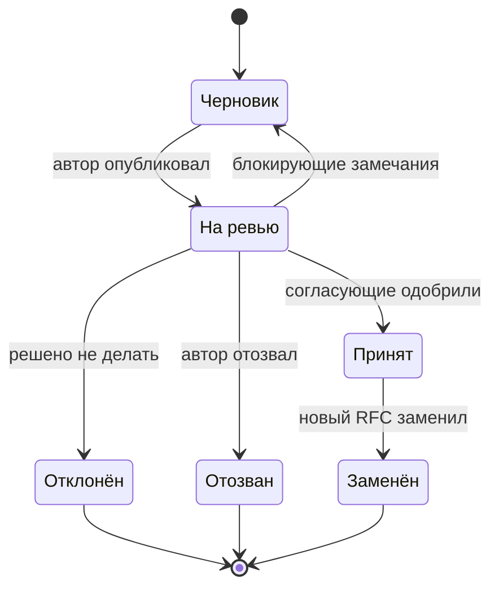

# 11.2 Архитектурное ревью: как проводить и как проходить

## Зачем это аналитику

Ревью — основной механизм качества архитектурных решений в компаниях. Архитектор и проводит ревью чужих решений, и защищает свои. Хорошее ревью находит риски до реализации и не превращается ни в формальность, ни в экзамен с придирками.

## Что понять

- [ ] Цели ревью: найти риски и пробелы, проверить соответствие стандартам, распространить знания; не цель — переписать решение под вкус ревьюера.
- [ ] Форматы: асинхронное ревью документа (RFC), архитектурный комитет, парное ревью; когда какой.
- [ ] Чек-лист ревью: требования и атрибуты качества, границы и данные, интеграции, отказы, безопасность, эксплуатация, стоимость, миграция.
- [ ] Как давать обратную связь: вопросы вместо приговоров, разделение «блокирующее» и «на подумать».
- [ ] Как готовиться к защите своего решения: документ заранее, альтернативы и компромиссы, ответы на ожидаемые вопросы.
- [ ] Как реагировать на критику: отделять замечания по существу от вкусовых, фиксировать решения по спорным пунктам.
- [ ] Процесс RFC: статусы, сроки, кто согласует, что делать при несогласии.

## Урок

<!-- LESSON:START -->
### Зачем нужно ревью и чем оно не является

Архитектурное ревью — дешёвый способ найти дорогие ошибки. Пробел в обработке отказов, найденный на уровне документа, стоит часа обсуждения. Тот же пробел, найденный на проде, стоит инцидента и переделки.

У ревью три законные цели:

- **Найти риски и пробелы.** Непроработанные сценарии отказа, неучтённые нагрузки, неясные границы ответственности, миграция, о которой забыли.
- **Проверить соответствие стандартам.** Принятые в организации технологии, требования безопасности, правила интеграции, форматы API. Это защищает от зоопарка решений, который потом кто-то будет сопровождать.
- **Распространить знания.** Ревьюеры узнают о новом решении до того, как оно появится в их зоне, а автор узнаёт о подводных камнях, которые уже встречали другие.

Чем ревью не является: способом переписать решение под вкус ревьюера и экзаменом, где проверяют автора, а не решение. Если ревьюер предлагает другую очередь сообщений, потому что ему она больше нравится, а у выбранной нет доказуемых проблем для этого случая, — это вкус, а не риск. Хорошее ревью оценивает, достигает ли решение своих целей при известных ограничениях, а не совпадает ли оно с тем, что сделал бы ревьюер.

Для контрактора ревью бывает в обе стороны. Ваше решение проходит архитектурный комитет заказчика, где вас видят в первый или второй раз. И вас приглашают проверить решение другого подрядчика или вендора — здесь к обычным целям добавляется защита интересов заказчика, который не может сам оценить предложение.

### Форматы ревью

| Формат | Как устроен | Когда подходит | Слабые места |
|---|---|---|---|
| Асинхронное ревью документа (RFC) | Документ публикуется, ревьюеры комментируют в течение оговорённого срока | Большинство решений; распределённые команды и разные часовые пояса | Затягивается без дедлайна; сложные споры в комментариях буксуют |
| Архитектурный комитет | Регулярная встреча, автор защищает решение перед группой архитекторов | Решения с широким влиянием: новые технологии, изменения общих платформ, крупные бюджеты | Дорого по времени; риск театра и формальных «одобрений» |
| Парное ревью | Автор и один опытный коллега разбирают решение вместе | Раннее состояние решения, локальные изменения, обучение младших | Одна точка зрения; ничего не остаётся письменно, если не зафиксировать |

Рабочая комбинация: парное ревью на раннем черновике, асинхронное ревью документа, и комитет — только для решений, которые требуют полномочий комитета или по которым не сошлись асинхронно. Комитет, который разбирает каждый второй эндпоинт, быстро превращается в очередь, и команды начинают его обходить.

Критерий, куда направлять решение, стоит сформулировать заранее: например, в комитет идут решения, которые вводят новую технологию в промышленную эксплуатацию, меняют общий контракт между командами, затрагивают персональные или платёжные данные или стоят дороже оговорённого порога.

### Чек-лист ревью

Чек-лист защищает от главной ошибки ревьюера — обсудить то, что интересно, и пропустить то, что важно. Порядок имеет значение: сначала требования и цели, потому что без них невозможно оценить остальное.

Ниже сокращённый пример, по 2–3 вопроса на раздел. Полный список на 20–30 пунктов — задача практики.

**Требования и атрибуты качества**
- Какие бизнес-цели решает решение и как будет измерен успех?
- Какие атрибуты качества приоритетны (доступность, задержка, стоимость, сопровождаемость) и в каких числах?

**Границы и данные**
- Кто владелец каждой сущности и где её эталон?
- Какие данные копируются между системами и как обеспечивается их согласованность?
- Какой объём данных через год и через три?

**Интеграции**
- Для каждой интеграции: синхронно или асинхронно, контракт, версионирование, идемпотентность?
- Что происходит, когда внешняя система отвечает медленно или неправильно?

**Отказы**
- Что будет при отказе каждого компонента и каждой зависимости? Есть ли единые точки отказа?
- Как повторные попытки взаимодействуют с таймаутами, не устроит ли система сама себе нагрузку?

**Безопасность**
- Какие данные чувствительны, где они хранятся и кто к ним имеет доступ?
- Как аутентифицируются сервисы между собой, где хранятся секреты?

**Эксплуатация**
- Какие SLO, метрики и алерты? Кто дежурит?
- Как откатить релиз и есть ли инструкция на типовые сбои?

**Стоимость**
- Сколько стоит решение в инфраструктуре и в сопровождении, как растёт стоимость с нагрузкой?

**Миграция**
- Как перейти с текущего состояния, можно ли работать в режиме параллельного запуска, что делать с историческими данными?
- Какая точка невозврата и как откатиться до неё?

Два общих вопроса стоит задавать всегда: «Какие альтернативы рассматривали и почему отвергли?» и «Что должно случиться, чтобы это решение оказалось ошибкой?». Отсутствие ответа на первый — сигнал, что решение не выбиралось, а было взято по привычке.

Формальная основа для таких вопросов — метод анализа компромиссов архитектуры (ATAM), разработанный в SEI (Казман, Кляйн, Клементс) и описанный в книге Басса, Клементса и Казмана. Его ключевые идеи полезны даже без полного процесса: атрибуты качества уточняются через конкретные сценарии («при отказе основной базы операции продления продолжаются через 60 секунд»), а в решении ищут точки чувствительности (параметр, от которого сильно зависит один атрибут) и точки компромисса (параметр, влияющий на несколько атрибутов в разные стороны).

### Как давать обратную связь

Цель замечания — чтобы решение стало лучше, а не чтобы ревьюер оказался прав. Автор принимает критику, когда она конкретна, обоснована и не звучит как приговор.

**Вопросы вместо приговоров.** «Здесь нет обработки отказов» ставит автора в оборону. «Что происходит с поручением, если АБС не ответила за 30 секунд — повторяем, ставим в очередь, показываем клиенту ошибку?» заставляет автора думать и часто приводит к тому, что он сам находит пробел. Если у автора есть ответ, который просто не записан, — замечание снимается за минуту.

**Сценарий вместо абстракции.** Не «это плохо масштабируется», а «в день продления пула доменов в конце года поток запросов вырастает в несколько раз; где в этой схеме узкое место?».

**Разделять серьёзность.** Каждое замечание помечается:

- **блокирующее** — без исправления решение нельзя принимать: риск потери данных, нарушение требований безопасности, недостижимый SLO, отсутствие плана миграции;
- **рекомендация** — стоит исправить, но решение можно принимать, если автор осознанно откажется, записав почему;
- **вопрос** — ревьюеру непонятно, ответ может ничего не изменить;
- **мелочь** — стиль, именование, форматирование диаграмм.

Без такой разметки двадцать равноценных комментариев выглядят как разгром, и автор тратит силы на мелочи, пропуская один важный. Хорошее правило для ревьюера: если у вас больше трёх блокирующих замечаний, сначала проверьте, не спутали ли вы свой вкус с риском.

#### Пример замечаний

Документ: сервис приёма заказов поставщикам в розничной сети отправляет заказы в систему поставщика по HTTP.

- Блокирующее: «Если ответ поставщика потерян по таймауту, повторная отправка может создать дубль заказа. Есть ли у поставщика ключ идемпотентности или способ проверить, что заказ уже принят? Без этого возможна двойная поставка».
- Рекомендация: «Хранение ответов поставщика только в логах усложнит разбор споров о приёмке. Рассмотрите таблицу истории отправок со статусами».
- Вопрос: «Почему выбрано формирование заказов раз в сутки, а не по событию снижения остатка? Если причина в ограничениях поставщика — стоит записать это в разделе альтернатив».
- Мелочь: «На диаграмме последовательности перепутаны подписи ответов 2 и 3».

Хвалить тоже нужно, но конкретно: «Хорошо, что заранее описан режим ручной отправки при недоступности поставщика — это снимает вопрос эксплуатации». Конкретная похвала сообщает автору, что именно стоит сохранить.

### Как готовиться к защите своего решения

Защита выигрывается до встречи.

1. **Документ заранее.** Разослать за несколько рабочих дней, а не утром в день комитета. Первая страница — контекст, проблема, рекомендация и что нужно от комитета: одобрить, выбрать вариант, выделить ресурс.
2. **Альтернативы и компромиссы.** Два-три рассмотренных варианта с честными плюсами и минусами. Если в документе один вариант, ревьюеры сами начнут предлагать альтернативы, и встреча уйдёт в сравнение, к которому вы не готовились.
3. **Явные допущения и ограничения.** «Предполагаем, что поставщик поддерживает повторную отправку с тем же номером заказа — подтверждено письмом от такого-то числа». Спорить с записанным допущением проще и спокойнее, чем с неявным.
4. **Ожидаемые вопросы.** Пройти свой документ по чек-листу ревьюера и подготовить ответы. Отдельно вспомнить, что спрашивает каждый постоянный член комитета: безопасник всегда спросит про секреты, эксплуатация — про откат, финансы — про стоимость.
5. **Предварительные разговоры.** С теми, кто может быть против, поговорить до встречи (см. модуль 11.1). Замечание, учтённое заранее, не станет возражением на комитете.

Контрактору важно ещё одно: знать правила комитета заказчика. Какой шаблон документа, какие разделы обязательны, кто имеет право вето, что считается одобрением. Незнание формальностей у внешнего человека воспринимается как неуважение к процессу, даже если решение хорошее.

### Как реагировать на критику

На ревью легко перейти в защиту: замечание звучит как атака на вашу компетентность. Несколько приёмов, чтобы остаться в содержании:

- **Сначала понять, потом отвечать.** Переспросить: «Правильно понимаю, что риск в том, что при отказе брокера мы теряем события оплат?». Половина споров снимается уточнением.
- **Отделять суть от вкуса.** Вопрос к себе: «Если я не приму это замечание, что конкретно сломается и при каком сценарии?». Если сценарий есть — это риск, его нужно закрыть или принять осознанно. Если сценария нет и речь о предпочтении, можно вежливо не согласиться: «Понимаю, что этот вариант тоже рабочий; выбрали текущий из-за опыта команды, других различий для этого случая не видим».
- **Не решать всё на встрече.** Для сложного замечания нормальный ответ: «Хороший вопрос, у меня нет готового ответа. Проверю и отвечу письменно до четверга».
- **Фиксировать решения по спорным пунктам.** Протокол: замечание, решение (принято, отклонено с обоснованием, отложено), кто принял. Без протокола тот же спор повторится на следующем ревью, а при проблемах на проде будет неясно, кто и почему принял риск.

Если ревьюер настаивает на решении, с которым вы не согласны, есть последовательность шагов. Первый — выяснить, какой риск он пытается закрыть: часто его интерес можно удовлетворить без смены решения. Второй — перевести спор в факты: прототип, расчёт, нагрузочный тест. Третий — если спор остался о приоритетах, записать обе позиции и передать решение тому, у кого есть полномочия: архитектурному комитету, владельцу продукта. Решение, принятое вопреки вашему мнению, после этого нужно реализовать добросовестно («не согласен, но выполняю» — disagree and commit), зафиксировав в журнале решений отклонённую альтернативу и условия, при которых её стоит пересмотреть.

### Процесс RFC

Запрос на комментарии (RFC, request for comments) — документ с предложением и формальный процесс его обсуждения. Цель процесса — чтобы у каждого документа было понятное состояние и никто не гадал, принято ли решение.

Элементы процесса, которые нужно договорить заранее:

- **Шаблон.** Контекст, проблема, цели и нецели, предлагаемое решение, альтернативы, риски, план миграции, открытые вопросы.
- **Сроки.** Период ревью, например 5–10 рабочих дней в зависимости от масштаба. Молчание после срока — не одобрение по умолчанию для обязательных согласующих, но и не бесконечная блокировка: автор вправе эскалировать.
- **Согласующие.** Кто обязан одобрить (владельцы затронутых систем, безопасность при работе с чувствительными данными), а кто приглашён комментировать. Обязательных согласующих должно быть немного.
- **Правило при несогласии.** Сначала попытка договориться между автором и ревьюером; затем обсуждение на встрече; если не сошлись — решение принимает заранее назначенный владелец (архитектурный комитет, ведущий архитектор). Все отклонённые возражения записываются в документ.
- **Связь с ADR.** Принятый RFC порождает одну или несколько записей архитектурных решений; RFC — про обсуждение, ADR — про итог.

Для контрактора, работающего с несколькими заказчиками, удобно держать один свой шаблон RFC и адаптировать его под формальности каждого заказчика. Это экономит время и делает качество документов предсказуемым, где бы вы ни работали.

### Типичные ошибки

- Ревью как экзамен: ревьюер демонстрирует эрудицию, автор защищается, решение не становится лучше.
- Замечания без разметки серьёзности: мелочи и риски потери данных идут одним списком.
- Ревью без чек-листа: полчаса обсуждают выбор библиотеки и не задают ни одного вопроса про миграцию и откат.
- Документ с единственным вариантом и без раздела альтернатив; на комитете вместо обсуждения решения начинается выбор решения.
- Документ разослан в день встречи; ревьюеры читают его на встрече и задают поверхностные вопросы.
- Спорные пункты не зафиксированы: через месяц никто не помнит, кто принял риск и почему.
- Процесс RFC без сроков и владельца решения: документы месяцами висят «на ревью», и команды начинают делать без него.

### Как говорить об этом на собеседовании

На вопрос о цели ревью сильный ответ называет и цели, и антицели: риски, стандарты, распространение знаний — и явно «не переписать под свой вкус». Расскажите, с чего начинаете проверку: с требований и атрибутов качества в числах, затем отказы, данные и миграция, потому что там самые дорогие ошибки. Упомяните разметку замечаний на блокирующие и рекомендации — это сразу показывает опыт.

Приготовьте две истории. Одна — ревью, где вы нашли серьёзный риск и как сформулировали замечание, чтобы автор его принял. Другая — защита своего решения: как готовились, какие альтернативы показали, какое возражение было самым трудным и что с ним сделали. На вопрос о несогласии с ревьюером опишите последовательность: понять риск за его позицией, перевести в факты, эскалировать к владельцу решения с обеими позициями, после решения — выполнять и фиксировать. Слова «disagree and commit» уместны, если вы можете показать их на примере.

### Коротко

- Цель ревью — найти риски, проверить соответствие стандартам и распространить знания; не цель — переписать решение под вкус ревьюера.
- Формат выбирают по масштабу: парное ревью для черновика, асинхронное ревью документа для большинства решений, комитет — для решений с широким влиянием.
- Чек-лист начинается с требований и атрибутов качества и обязательно включает отказы, данные, безопасность, эксплуатацию, стоимость и миграцию.
- Замечания формулируются как вопросы и сценарии и размечаются: блокирующее, рекомендация, вопрос, мелочь.
- Защита выигрывается до встречи: документ заранее, альтернативы, явные допущения, подготовленные ответы и предварительные разговоры.
- На критику — уточнить, отделить риск от вкуса, не решать сложное на ходу, фиксировать решения по спорным пунктам.
- Процесс RFC нужен ради понятного состояния каждого документа: статусы, сроки, обязательные согласующие и правило при несогласии.
<!-- LESSON:END -->

## Читать дальше

- Статьи о процессах RFC в инженерных командах (например, «Scaling Engineering Teams via RFCs» от Gergely Orosz, The Pragmatic Engineer).
- Bass, Clements, Kazman — глава об оценке архитектуры.

На system-design.space:

- [Архитектура в масштабе: как мы принимаем архитектурные решения](https://system-design.space/chapter/architecture-decisions-scale/)
- [Fundamentals of Software Architecture (краткий обзор)](https://system-design.space/chapter/fundamentals-arch-book/)

## Практика

1. Составить свой чек-лист архитектурного ревью на 20–30 пунктов, сгруппированных по разделам.
2. Провести ревью одной обезличенной постановки или архитектурного документа по чек-листу и оформить замечания с разделением на блокирующие и рекомендации.
3. Подготовить свой архитектурный документ из итогового проекта к ревью: список ожидаемых вопросов и ответов.

## Вопросы для самопроверки

1. Какова цель архитектурного ревью и чем оно не должно быть?
2. Что вы проверяете при ревью архитектурного решения в первую очередь?
3. Как давать критическую обратную связь, чтобы автор её принял?
4. Как вы готовитесь к защите своего решения на архитектурном комитете?
5. Что делать, если ревьюер настаивает на решении, с которым вы не согласны?

## Заметки

<!-- Свои формулировки, ошибки, ссылки. -->
