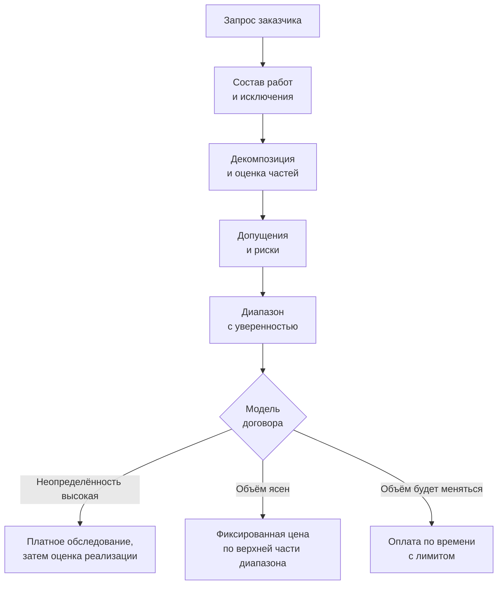

# 11.3 Оценка трудоёмкости и работа с неопределённостью

## Зачем это аналитику

«Сколько это займёт?» — вопрос, который архитектору и аналитику задают постоянно, в том числе на пресейле. Оценка — это не обещание, а прогноз с неопределённостью. Умение давать оценки диапазоном, объяснять допущения и уточнять оценку по ходу работы экономит проектам месяцы и нервы.

## Что понять

- [ ] Оценка, цель и обязательство — три разные вещи, которые часто смешивают.
- [ ] Конус неопределённости: почему ранние оценки ошибаются в разы и как это объяснять.
- [ ] Декомпозиция: работа на уровне задач, которые можно оценить; неучтённая работа (интеграция, тестирование, миграция данных, документация, стабилизация).
- [ ] Методы: аналогия, экспертная оценка, трёхточечная оценка (PERT), планирование покером, оценка по историческим данным.
- [ ] Диапазоны и уверенность: «с вероятностью 80% — от 6 до 10 недель».
- [ ] Допущения и риски как часть оценки; буферы и где их держать.
- [ ] Оценка при пресейле и фиксированной цене: как не подписаться под нереальным.
- [ ] Пересмотр оценки по ходу работы и коммуникация отклонений.

## Урок

<!-- LESSON:START -->
### Три разных числа: оценка, цель и обязательство

Большинство конфликтов вокруг сроков начинается с того, что в одном разговоре смешаны три разных числа.

- **Оценка (estimate)** — прогноз того, сколько займёт работа при известных допущениях. Она по природе вероятностная и имеет разброс. Оценка не бывает «правильной» или «неправильной» заранее — она бывает обоснованной или необоснованной.
- **Цель (target)** — желаемый бизнесом результат: «запуститься до начала сезона», «уложиться в бюджет квартала». Цель задаётся извне и может не иметь отношения к объёму работы.
- **Обязательство (commitment)** — обещание поставить определённый объём к определённой дате. Это управленческое решение: команда выбирает точку внутри распределения оценки, с которой готова жить, и берёт на себя ответственность за неё.

Типичная ловушка: заказчик называет цель («нам нужно к первому марта»), команда слышит это как вопрос об оценке, подгоняет цифры под цель — и через месяц подгонку все воспринимают как обязательство. Правильный ход — развести числа явно: «Наша оценка — от 8 до 12 недель. Ваша цель — 7 недель. Разрыв можно закрыть сокращением объёма, вот варианты». Дальше идёт торг об объёме, а не о том, насколько быстро команда умеет работать.

Отсюда практическое правило: оценку нельзя «сократить» уговорами. Можно изменить объём, допущения, состав команды или уровень риска, который вы готовы принять. Если после разговора оценка уменьшилась, а ни одно допущение не поменялось, — это не новая оценка, а новое обещание без основания.

### Конус неопределённости

Конус неопределённости (cone of uncertainty) — наблюдение, которое популяризировал Стив Макконнелл: на ранних этапах проекта разброс между лучшим и худшим исходом огромен и сужается по мере того, как принимаются решения. По данным, которые он приводит (они восходят к исследованиям Барри Боэма), на стадии первоначальной идеи фактическая трудоёмкость может оказаться примерно от 0,25 до 4 раз от оценки; после согласования продуктового видения — примерно от 0,5 до 2 раз; после проработки требований — порядка от 0,67 до 1,5 раза. Точные коэффициенты важны меньше, чем форма: разброс в начале измеряется разами, а не процентами.

Два неочевидных следствия, которые стоит уметь объяснить заказчику.

Первое: конус описывает лучший случай. Он сужается не сам по себе, а только тогда, когда команда действительно снимает неопределённость — принимает архитектурные решения, фиксирует требования, проверяет интеграции. Проект, где через три месяца всё ещё не решено, с какой системой лояльности интегрироваться, остаётся в широкой части конуса, сколько бы времени ни прошло.

Второе: ошибка в начале — не признак плохого оценщика. Это свойство информации. Поэтому ранние оценки надо давать широким диапазоном и привязывать к этапу: «на стадии идеи — от 3 до 12 месяцев; после двухнедельного обследования дадим диапазон в пределах ±50%».

Удобная формулировка для заказчика: «Сейчас мы знаем о задаче примерно столько, что ошибка в два раза в любую сторону — нормальна. Каждое решение из этого списка сужает диапазон. Давайте начнём с тех, что сужают его сильнее всего».

### Декомпозиция и работа, которую забывают

Оценивать крупный блок целиком бессмысленно: человек не умеет интуитивно оценить «интеграцию с банком-партнёром». Декомпозиция доводит работу до уровня, где каждую часть можно представить конкретно — кто, что делает и как понять, что готово. Практический ориентир: части по 1–10 человеко-дней. Если часть больше двух недель, внутри неё прячутся неизвестные.

У декомпозиции есть и статистическая польза: ошибки в оценках отдельных частей частично компенсируют друг друга. Но только если частей достаточно и они не завязаны на одно общее допущение.

Главный источник систематического занижения — не ошибки в оценке известных задач, а задачи, которые не попали в список. Чаще всего это:

- **интеграция и согласование контрактов** со смежными системами, особенно чужими: ожидание доступа к стенду, расхождения в форматах, повторные итерации;
- **тестирование**: не только функциональное, но и регрессионное, нагрузочное, приёмочное с участием бизнеса;
- **миграция и подготовка данных**: выгрузка, очистка, сверка, повторные прогоны; в легаси-проектах это часто самый большой и самый недооценённый кусок;
- **нефункциональные требования**: безопасность, журналирование, мониторинг, отказоустойчивость;
- **документация и передача сопровождению**: инструкции, регламенты, обучение пользователей;
- **стабилизация после запуска**: исправление дефектов, найденных в эксплуатации, настройка параметров;
- **управленческие накладные расходы**: встречи, согласования, ревью, демонстрации;
- **окружения и развёртывание**: стенды, доступы, CI, согласование релизов.

Полезно держать этот список как чек-лист и проходить его при каждой оценке. Если пункт осознанно не входит в объём — он должен появиться в разделе «исключения», а не просто отсутствовать.

### Методы оценки

Ни один метод не универсален. Опытный оценщик комбинирует два-три и смотрит, сходятся ли результаты.

| Метод | Суть | Когда уместен | Слабое место |
|---|---|---|---|
| Аналогия | Сравнить с похожим завершённым проектом и скорректировать на различия | Ранняя стадия, есть похожий опыт | Проекты похожи меньше, чем кажется |
| Экспертная оценка | Опытный человек называет число | Быстро, мало данных | Оптимизм, зависимость от одного человека |
| Трёхточечная (PERT) | Оптимистичная, наиболее вероятная, пессимистичная оценки на каждую часть | Есть декомпозиция, важен диапазон | Предполагает независимость частей |
| Покер планирования (planning poker) | Команда оценивает одновременно, расхождения обсуждаются | Команда уже есть, задачи уровня бэклога | Даёт относительные единицы, не сроки |
| По историческим данным | Скорость, пропускная способность, время цикла прошлых задач | Команда работает стабильно, есть учёт | Бесполезно для принципиально новой работы |

Групповые методы — покер планирования и метод, из которого он вырос, — «широкополосный Дельфи» (wideband Delphi) — ценны не столько числом, сколько обсуждением расхождений. Если один оценил задачу в 2 дня, а другой в 8, почти всегда один из них знает о задаче что-то, чего не знает второй. Это знание и есть результат.

Оценка по историческим данным — самая честная, если данные есть: вместо вопроса «сколько, по-вашему» задаётся вопрос «сколько обычно занимали задачи такого размера». Даниэль Вакканти развивает этот подход до вероятностного прогноза по потоку: по распределению времени цикла или пропускной способности строится прогноз вида «с вероятностью 85% завершим к такой-то дате».

#### Задача, которую команда никогда не делала

Когда аналогий нет, работают так:

1. Разделить задачу на знакомую и незнакомую части. Обычно незнакомое — это 20–30% объёма, остальное — привычные экраны, API и таблицы.
2. Знакомую часть оценить обычными методами.
3. Для незнакомой — предложить короткое исследование с ограниченным сроком (spike, timebox): «три дня на прототип интеграции, после чего даём оценку». Это превращает неопределённость в управляемую работу.
4. Если исследование невозможно — давать по незнакомой части явно широкий диапазон и выносить её в риски.
5. Поискать внешние аналогии: опыт коллег, открытые описания похожих решений, поставщика технологии.

### Трёхточечная оценка: разобранный пример

Ситуация: розничная сеть использует систему автопополнения, которая формирует заказы поставщикам на основе прогноза спроса. Нужно научить её учитывать промо-акции: получать календарь акций из системы промо, поднимать прогноз на период акции и корректировать заказ. Оцениваем в человеко-днях.

Для каждой части называем три значения: оптимистичное (O) — если всё пойдёт гладко; наиболее вероятное (M); пессимистичное (P) — если сработают реалистичные, а не катастрофические риски. Ожидаемое значение по формуле PERT: E = (O + 4M + P) / 6. Оценка стандартного отклонения части: σ = (P − O) / 6.

| Часть работы | O | M | P | E | σ |
|---|---|---|---|---|---|
| Анализ, постановка, согласование с категорийными менеджерами | 3 | 5 | 9 | 5,33 | 1,00 |
| Модель данных и изменения схемы | 1 | 2 | 4 | 2,17 | 0,50 |
| Интеграция с системой промо (получение календаря акций) | 3 | 5 | 12 | 5,83 | 1,50 |
| Доработка расчёта заказа | 4 | 6 | 10 | 6,33 | 1,00 |
| Загрузка исторических данных по акциям | 2 | 3 | 8 | 3,67 | 1,00 |
| Тестирование, включая регресс расчёта | 4 | 6 | 10 | 6,33 | 1,00 |
| Опытная эксплуатация на пилотных магазинах | 3 | 5 | 10 | 5,50 | 1,17 |
| Документация и передача сопровождению | 1 | 2 | 3 | 2,00 | 0,33 |
| **Итого** | **21** | **34** | **66** | **37,2** | **≈2,8** |

Как получены итоговые цифры:

- Сумма ожидаемых значений: 5,33 + 2,17 + 5,83 + 6,33 + 3,67 + 6,33 + 5,50 + 2,00 ≈ 37,2 человеко-дня.
- Стандартное отклонение суммы при допущении независимости частей — корень из суммы дисперсий: 1,00 + 0,25 + 2,25 + 1,00 + 1,00 + 1,00 + 1,36 + 0,11 ≈ 7,97; корень ≈ 2,8.
- При нормальном приближении 80% двусторонний интервал — примерно ±1,28σ: 37,2 ± 3,6, то есть от 34 до 41 человеко-дня. Уровень «не больше чем, с вероятностью около 80%» — E + 0,84σ ≈ 39,6.

Что стоит заметить в этом примере.

Сумма наиболее вероятных оценок — 34 дня — меньше ожидаемой суммы 37,2. Распределения трудоёмкости скошены вправо: задача может сделаться чуть быстрее, но может и затянуться намного. Поэтому сложение «самых вероятных» оценок систематически даёт оптимистичный итог.

Расчётный разброс получился узким — ±10%. Это следствие допущения о независимости, и на практике оно почти всегда нарушается. Если окажется, что система промо отдаёт данные в неожиданном формате, пострадают сразу интеграция, загрузка истории и тестирование. Поэтому формальный интервал PERT стоит воспринимать как нижнюю границу неопределённости и расширять его — например, ориентироваться на диапазон между суммой M и суммой, где части с общими рисками взяты ближе к P. Если взять интеграцию, загрузку истории и тестирование по P, сумма ожидаемых значений вырастет примерно до 51. Честная формулировка для заказчика здесь — «35–50 человеко-дней, ориентир около 40», а не «37».

Человеко-дни — не календарь. Чтобы получить срок, учитывают, сколько людей параллельно работают, какая доля их времени реально уходит на задачу (при нескольких параллельных проектах она заметно меньше 100%) и какие части нельзя распараллелить. Опытная эксплуатация, например, занимает календарное время независимо от численности команды.

К оценке прикладываются допущения: у системы промо есть API или регулярная выгрузка; история акций доступна минимум за год; категорийные менеджеры выделяют время на согласование; изменения формата заказа поставщику не требуются. Каждое допущение — это кандидат в риски: если оно не подтвердится, оценка пересматривается.

### Диапазоны и уровень уверенности

Одно число без уровня уверенности вводит в заблуждение: слушатель воспринимает его как обещание. Диапазон с вероятностью — как прогноз. Сравните:

- «Шесть недель» — звучит как обязательство.
- «С вероятностью около 80% — от 6 до 10 недель; самое вероятное — около 7» — звучит как прогноз и даёт заказчику материал для решения.

Люди систематически дают слишком узкие диапазоны, даже когда их просят указать интервал 90%. Полезная самопроверка: насколько бы вы удивились, если бы факт вышел за границы? Если «не очень» — диапазон узкий. Ещё один приём — отслеживать собственную калибровку: записывать диапазоны и потом проверять, какая доля фактов в них попала.

Выбор точки внутри диапазона для обязательства зависит от цены ошибки. Для внутреннего планирования можно ориентироваться на медиану. Для фиксированной цены или внешнего дедлайна с санкциями — на 80–90-й перцентиль.

### Допущения, риски и буферы

Оценка без списка допущений неполна: через два месяца никто не вспомнит, при каких условиях называлось число. Допущение — это условие, при котором оценка верна; риск — событие, которое может сделать допущение ложным.

У каждого значимого риска стоит указать, как он повлияет на оценку: «если API системы промо отсутствует и придётся разбирать файловую выгрузку — плюс 5–8 дней». Это превращает абстрактное «есть риски» в управляемый список.

Про буферы важны два принципа.

**Буфер держат на уровне проекта, а не в каждой задаче.** Если каждый исполнитель добавит 30% к своей части, запас будет израсходован незаметно: работа расширяется до выделенного срока, а задержки не компенсируются опережениями. Общий буфер проекта меньше суммы локальных, прозрачен и расходуется по решению, которое видно всем. Эту идею хорошо развивает метод критической цепи Голдратта.

**Буфер должен быть видим и обоснован.** Спрятанный запас рано или поздно обнаруживается и подрывает доверие ко всем оценкам. Открытый буфер с формулировкой «запас на реализацию рисков из списка» воспринимается как профессионализм.

Отдельно — резерв на неизвестные неизвестные. Его размер обычно берут по опыту похожих проектов; для легаси-модернизации он заметно выше, чем для типовой доработки.

### Пресейл и фиксированная цена

На пресейле давление максимальное: информации мало, конкуренты называют меньшие цифры, продажникам нужен контракт. Задача архитектора — не отказаться оценивать, а сделать так, чтобы оценка честно отражала неопределённость, а договор — распределял риски.

Приёмы, которые защищают от подписания нереального:

- **Разбить проект на фазы.** Первая — обследование и проектирование с фиксированной ценой; оценка реализации даётся по его итогам, когда конус уже сузился.
- **Фиксировать объём так же жёстко, как цену.** Фиксированная цена имеет смысл только вместе со списком работ, исключений и допущений. Всё, что вне списка, — через запрос на изменение.
- **Брать для фиксированной цены верхнюю часть диапазона** и объяснять, почему она выше, чем у конкурента, который назвал оптимистичную точку.
- **Вынести самые неопределённые части** в опции или в оплату по времени: например, миграцию данных из системы, которую никто не видел.
- **Выписать зависимости от заказчика**: сроки предоставления доступов, ответов, стендов. Задержка с их стороны — основание для сдвига срока.

Шаблон пресейл-оценки состоит из одних и тех же блоков: цель и контекст, состав работ, исключения, допущения, риски с влиянием на оценку, диапазон и уровень уверенности, модель договора, зависимости от заказчика.

### Пересмотр оценки и коммуникация отклонений

Оценка — живой артефакт. Её пересматривают в контрольных точках: после обследования, после проектирования, после первых итераций, а также при срабатывании риска или изменении объёма.

Отклонение обнаруживается по сравнению плана и факта: израсходовано 60% бюджета, закрыто 40% объёма. Чем раньше это замечено и сказано, тем больше вариантов у заказчика — сократить объём, сдвинуть дату, добавить людей на распараллеливаемые части.

Сообщение о росте оценки строится по схеме: что изменилось, почему, как это влияет, какие есть варианты, что вы рекомендуете. Пример:

«При подключении к системе промо выяснилось, что календарь акций хранится не по магазинам, а по кластерам, и справочник кластеров нужно синхронизировать отдельно. Это не было учтено в допущениях. Влияние — плюс 6–9 человеко-дней, срок пилота сдвигается на полторы недели. Варианты: запустить пилот на одном кластере в исходный срок и расширять после; либо сдвинуть весь пилот. Рекомендуем первый вариант».

Важно, чтобы такое сообщение ссылалось на исходное допущение. Именно поэтому допущения записывают заранее: они превращают разговор «вы ошиблись» в разговор «условие изменилось».

Второй навык — ретроспектива оценок. По завершении задачи сравнить оценку с фактом по частям и найти, что не было учтено. Обычно выясняется, что ошибка сидит не в оценке известных задач, а в тех, которых не было в списке. Это прямо пополняет чек-лист забытой работы.

### Типичные ошибки

- Называть одно число вместо диапазона и не указывать допущения — через месяц число станет обязательством без контекста.
- Путать цель с оценкой: подгонять оценку под желаемую дату вместо переговоров об объёме.
- Суммировать наиболее вероятные оценки частей и считать это итогом — результат систематически оптимистичен.
- Верить узкому интервалу PERT, не учитывая, что части зависят от общих рисков.
- Забывать интеграцию, миграцию данных, тестирование, стабилизацию и накладные расходы.
- Прятать буферы в каждой задаче вместо одного видимого буфера проекта.
- Молчать об отклонении до последнего, надеясь наверстать, — к моменту признания вариантов у заказчика уже не остаётся.

### Как говорить об этом на собеседовании

Уровень senior показывают не формулы, а управление ожиданиями. Хорошо звучит ответ, в котором вы разводите оценку и обязательство, даёте диапазон с уверенностью, называете допущения и объясняете, что делаете, когда они не подтверждаются. На вопрос «как вы оцениваете новую для команды задачу» — отделить известное от неизвестного, предложить исследование с ограниченным сроком, дать широкий диапазон на неизвестную часть.

Сильный пример из практики — история, где оценка выросла, и вы вовремя это увидели, объяснили причину через нарушенное допущение и предложили варианты. Для контрактора полезно рассказать, как вы оцениваете на пресейле: фазирование, исключения, зависимости от заказчика. Избегайте позиции «я всегда укладываюсь в оценку» — она звучит либо как неправда, либо как признак больших скрытых буферов.

### Коротко

- Оценка — прогноз, цель — желание бизнеса, обязательство — решение; их надо разводить явно.
- Ранние оценки ошибаются в разы; конус сужается только за счёт принятых решений.
- Основная ошибка — в работе, которой нет в списке: интеграция, данные, тестирование, стабилизация.
- PERT: E = (O + 4M + P) / 6; сумма M оптимистичнее суммы E; формальный интервал обычно слишком узок.
- Давайте диапазон с уровнем уверенности, а точку для обязательства выбирайте по цене ошибки.
- Допущения и риски — часть оценки; буфер один на проект и видимый.
- На пресейле защищают фазирование, жёсткий состав работ и исключения, зависимости от заказчика.
- Отклонения сообщают рано, через изменившееся допущение и с вариантами решения.
<!-- LESSON:END -->

## Читать дальше

- Steve McConnell, *Software Estimation: Demystifying the Black Art* — главы о конусе неопределённости и методах.
- Daniel Vacanti, *When Will It Be Done?* — прогнозирование по потоку (по желанию).

## Практика

1. Оценить обезличенную задачу из своей практики трёхточечным методом с декомпозицией на 10–15 частей; явно выписать допущения и риски.
2. Сравнить свою прошлую оценку с фактом по завершённой задаче и разобрать, что не было учтено.
3. Составить шаблон оценки для пресейла: состав работ, допущения, исключения, риски, диапазон.

## Вопросы для самопроверки

1. Чем оценка отличается от обязательства?
2. Что такое конус неопределённости?
3. Как вы оцениваете задачу, которую команда никогда не делала?
4. Какую работу чаще всего забывают включить в оценку?
5. Как сообщить заказчику, что оценка выросла?

## Заметки

<!-- Свои формулировки, ошибки, ссылки. -->
