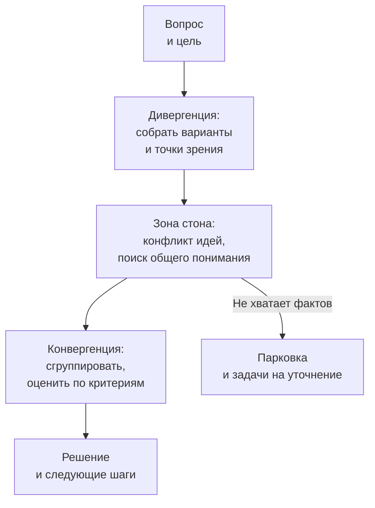

# 11.4 Фасилитация: воркшопы, групповые решения, конфликты

## Зачем это аналитику

Требования и архитектурные решения рождаются на встречах. Архитектор, который умеет провести воркшоп — Event Storming, обсуждение альтернатив, приоритизацию — получает решения быстрее и с большей поддержкой, чем тот, кто приходит с готовой схемой. Это также ответ на частый вопрос «как вы выявляете требования».

## Что понять

- [ ] Роль фасилитатора: отвечает за процесс, а не за содержание; нейтральность.
- [ ] Подготовка: цель встречи, желаемый результат, участники, повестка, материалы, правила.
- [ ] Форматы: Event Storming с живой командой, story mapping, приоритизация (MoSCoW, dot voting), пре-мортем, ретроспектива.
- [ ] Дивергенция и конвергенция: сначала собрать варианты, потом сузить; «ромб» принятия решений.
- [ ] Способы принятия решения группой: консенсус, согласие без возражений, решение лица, принимающего решение, после обсуждения.
- [ ] Трудные ситуации: доминирующий участник, молчуны, уход в сторону, открытый конфликт.
- [ ] Удалённые воркшопы: доски (Miro, FigJam), тайминг, вовлечение.
- [ ] Фиксация результатов и следующие шаги.

## Урок

<!-- LESSON:START -->
### Роль фасилитатора: процесс, а не содержание

Фасилитатор (facilitator) отвечает за то, как группа работает: чтобы у встречи была цель, чтобы все высказались, чтобы обсуждение не ушло в сторону и чтобы в конце было решение или понятный следующий шаг. За содержание — какое решение будет принято — отвечает группа или назначенное лицо, принимающее решение.

Для архитектора это непривычно. Он обычно приходит с мнением, и часто с правильным. Но если он одновременно ведёт встречу и продвигает свой вариант, участники быстро это замечают: альтернативы обсуждаются формально, возражения не звучат, а решение потом саботируется. Нейтральность фасилитатора — не отсутствие мнения, а отказ использовать власть над процессом ради своего мнения.

На практике у архитектора три режима, и их полезно явно переключать:

- **Фасилитатор** — ведёт процесс, не высказывается по существу.
- **Эксперт** — даёт информацию и оценки: «у этого варианта будет проблема с идемпотентностью при повторной отправке».
- **Участник с позицией** — отстаивает вариант.

Переключение проговаривается вслух: «Сейчас сниму шляпу ведущего и скажу как архитектор: я против варианта Б, потому что...». Когда на кону крупное решение, в котором у вас сильная позиция, лучше попросить вести встречу кого-то другого — аналитика, скрам-мастера, коллегу из соседней команды.

### Подготовка: встреча, которая заканчивается решением

Большинство неудачных встреч проваливаются до их начала. Подготовка сводится к ответам на несколько вопросов.

**Цель.** Зачем встречаемся — одной фразой. «Обсудить интеграцию» — не цель. «Выбрать способ получения выписок из АБС для нового ДБО» — цель.

**Желаемый результат (outcome).** Что будет на руках в конце: решение, список вариантов с критериями, карта процесса, приоритизированный бэклог, список рисков. Результат формулируется как артефакт, который можно проверить.

**Участники.** Кто нужен для результата: носители знаний, те, кто будет исполнять, тот, кто утверждает. Отдельно — кого не звать: лишние участники увеличивают время на каждый шаг. Если без лица, принимающего решение, решение не состоится, — без него встречу не проводят.

**Способ принятия решения.** Объявляется заранее, а не после спора: «Обсуждаем, потом решение принимает владелец продукта» или «Ищем вариант, против которого никто не возражает».

**Повестка с таймингом.** Не список тем, а последовательность шагов с продолжительностью и ожидаемым результатом каждого шага.

**Материалы.** Что участники должны прочитать заранее и что будет на доске: контекст, ограничения, варианты. Предварительное чтение сокращает первую часть встречи вдвое, но только если оно короткое — страница, а не спецификация на сорок листов.

**Правила.** Несколько договорённостей: одна тема за раз, отложенные вопросы — на парковку (parking lot), камеры включены на удалённых встречах, ноутбуки закрыты на очных.

Хороший тест подготовки: можете ли вы заранее написать шаблон протокола с пустыми полями под результат? Если нет — непонятно, что встреча должна произвести.

### Дивергенция и конвергенция: ромб принятия решений

Групповое решение проходит две фазы с противоположной логикой. Сэм Канер описывает это как ромб: сначала группа расходится — собирает варианты, точки зрения, факты; затем сходится — группирует, оценивает, выбирает. Между ними лежит «зона стона» (groan zone): неприятный период, когда вариантов много, мнения сталкиваются и кажется, что встреча зашла в тупик. Это нормальная часть процесса, а не признак провала.

Главная ошибка — смешивать фазы. Если первый же высказанный вариант сразу начинают критиковать, остальные варианты не прозвучат. Если группа бесконечно генерирует идеи, но не переходит к выбору, встреча кончается ничем.

Приёмы для дивергенции: тихая генерация (каждый пишет на стикерах 5–7 минут молча, потом выкладывает), круг высказываний, запрет на оценку до конца фазы. Для конвергенции: группировка похожего, явные критерии оценки, голосование точками, матрица «ценность — сложность».

Фасилитатор объявляет переход между фазами вслух: «Сейчас собираем всё, без критики. Через 15 минут переходим к оценке».

### Форматы воркшопов

#### Event Storming

Event Storming — формат Альберто Брандолини для совместного исследования бизнес-процесса. Участники выкладывают на длинную ленту доменные события (domain events) в прошедшем времени — «Платёжное поручение подписано», «Заказ поставщику отправлен» — сначала хаотично, потом выстраивают по времени. Затем отмечают горячие точки (hotspots): противоречия, вопросы, боли. На следующих уровнях добавляют команды, акторов, внешние системы, политики и агрегаты.

Фасилитационная суть формата: на стене видны все разногласия. Когда операционист и специалист по безопасности по-разному называют один и тот же шаг или ставят его в разное место, это сразу видно и превращается в горячую точку, а не в тихое недопонимание, которое всплывёт на тестировании.

Правила ведущего: не останавливать поток на хаотичной фазе, не исправлять формулировки участников, фиксировать спорное как горячую точку и двигаться дальше, возвращаться к горячим точкам в конце.

#### Story mapping

Карта пользовательских историй (story mapping, Джефф Паттон) раскладывает работу пользователя слева направо по шагам, а под каждым шагом — варианты реализации от необходимого к желательному. Горизонтальная линия отделяет первый релиз. Формат хорош, когда нужно договориться о границах MVP: спор «нужна ли эта функция» превращается в спор «в какой срез она попадает», а это гораздо легче.

#### Приоритизация

- **MoSCoW** — must, should, could, won't. Работает, если заранее договориться, что must — это «без этого релиз не имеет смысла», и ограничить долю must. Иначе всё оказывается в must.
- **Голосование точками (dot voting)** — у каждого участника ограниченное число голосов. Быстро выявляет предпочтения группы. Слабость — стадный эффект, если голосуют по очереди; лучше голосовать одновременно или скрыто.
- **Сравнение по критериям** — варианты в строках, взвешенные критерии в столбцах. Медленнее, но делает основания решения явными; удобно для архитектурных альтернатив.

#### Пре-мортем

Пре-мортем (premortem) предложил психолог Гэри Кляйн. Группе говорят: «Представьте, что прошёл год, проект провалился. Напишите, почему это произошло». Каждый молча пишет причины, потом их собирают, группируют и по самым вероятным и тяжёлым намечают меры.

Почему это работает лучше, чем вопрос «какие видите риски»: формулировка снимает социальный запрет на пессимизм. Спросить «что может пойти не так» — значит сомневаться в плане; объяснить уже случившийся провал — интеллектуальная задача. Пре-мортем особенно полезен перед стартом фазы с фиксированной ценой и перед запуском, где откат дорог.

#### Ретроспектива

Ретроспектива — регулярный разбор прошедшего периода: что получилось, что нет, что меняем. Фасилитационно важны безопасность (обсуждаются процессы, а не виноватые), ограничение числа действий по итогам (два-три реальных изменения лучше десяти пожеланий) и проверка на следующей ретроспективе, выполнены ли прошлые действия.

### Как группа принимает решение

Способ принятия решения выбирается под ситуацию и объявляется заранее. Вот основные варианты.

| Способ | Как работает | Когда уместен | Риск |
|---|---|---|---|
| Консенсус | Все поддерживают решение | Решение касается всех, исполнение требует общей поддержки | Долго, может не состояться |
| Согласие без возражений (consent) | Решение принимается, если никто не видит в нём неприемлемого вреда | Нужно двигаться, достаточно «можем с этим жить» | Тихие возражения, которые не прозвучали |
| Решение ответственного после обсуждения | Группа высказывается, решает один человек | Есть явный владелец, решение срочное или экспертное | Если обсуждение было формальным, — потеря доверия |
| Большинство | Голосование | Много равноправных участников, низкая цена ошибки | Проигравшее меньшинство не поддержит исполнение |
| Делегирование | Группа поручает решение подгруппе или эксперту | Вопрос узкий и технический | Остальные не понимают оснований |

Для архитектурных решений на практике чаще всего подходит третий вариант: обсуждение с вовлечением всех, решение архитектора или владельца продукта, фиксация в ADR с рассмотренными альтернативами. Для требований на стыке нескольких подразделений — согласие без возражений: полного консенсуса между безопасностью, операционным блоком и продуктом не бывает, но можно найти вариант, против которого нет блокирующих возражений.

Полезный инструмент проверки поддержки — шкала согласия (Канер называет её градиентами согласия): от «полностью поддерживаю» через «есть оговорки, но поддержу» до «блокирую». Быстрый вариант — «кулак — пять пальцев» (fist of five). Он показывает не только есть ли решение, но и насколько оно прочное.

### Трудные ситуации

**Доминирующий участник.** Часто это самый старший или самый знающий, и его не хочется останавливать. Приёмы по нарастанию жёсткости: структура, которая выравнивает голоса (тихая генерация, круг высказываний, письменное голосование); прямое приглашение других («Хочу услышать тех, кто ещё не говорил»); фиксация его мысли на доске, чтобы он видел, что услышан, и не повторял; разговор один на один в перерыве. Если доминирует руководитель, до встречи стоит договориться, что он высказывается последним.

**Молчуны.** Молчание не означает согласия. Помогают письменные форматы, работа в парах перед общим обсуждением, адресный вопрос к носителю знания («Как это устроено у операционистов?»), анонимные доски.

**Уход в сторону.** Тема важная, но не для этой встречи. Фасилитатор не обрывает, а переносит: записывает на парковку, называет владельца и срок. В конце встречи парковку обязательно разбирают, иначе люди перестают ей доверять.

**Открытый конфликт.** Сначала отделить позиции от интересов: за «нам нужна синхронная интеграция» может стоять «нам нужно, чтобы операционист сразу видел статус платежа». Затем перевести спор с людей на критерии: «Давайте договоримся, по каким критериям сравниваем, а потом сравним варианты». Если конфликт касается фактов — назначить проверку. Если ценностей или полномочий — эскалировать к тому, кто решает, с чётко сформулированными вариантами. Кто-то в конфликте должен почувствовать, что его позицию поняли, — иногда достаточно пересказать её точнее, чем это сделал автор.

### Разобранный пример: требования при несогласных сторонах

Ситуация: банк развивает интернет-банк для юрлиц. Нужно определить правила подписания платёжных поручений с несколькими подписями. Продукт хочет гибкие схемы подписи, настраиваемые клиентом. Безопасность хочет жёстких ограничений. Операционный блок жалуется, что текущие схемы непонятны клиентам и порождают звонки в поддержку. Три предыдущие встречи кончились спором.

Подготовка:

- Цель: согласовать модель правил подписи для первого релиза.
- Результат: список сценариев подписи с пометкой «в релизе / позже / не делаем» и открытые вопросы с владельцами.
- Способ решения: согласие без возражений; если по сценарию есть блокирующее возражение — решает владелец продукта после встречи с учётом записанных аргументов.
- Участники: продукт, безопасность, операционный блок, аналитик, архитектор; от каждой стороны — один человек с правом говорить за подразделение.
- Предварительное чтение: одна страница с текущими схемами и статистикой обращений в поддержку.

Ход встречи:

1. Десять минут — каждая сторона без возражений излагает, что для неё важно. Фасилитатор записывает интересы, а не позиции: «клиент должен понимать, почему платёж не ушёл», «ни одно поручение выше порога не уходит с одной подписью».
2. Двадцать минут — тихая генерация сценариев подписи на стикерах, затем группировка.
3. Тридцать минут — прогон сценариев через интересы всех сторон. Спорные помечаются как горячие точки.
4. Двадцать минут — разметка сценариев по релизам. Для каждого — проверка на блокирующие возражения.
5. Десять минут — разбор парковки, открытые вопросы с владельцами и сроками.

Ключевой момент: спор «гибко или жёстко» оказался спором о разных сценариях. Для малых сумм безопасность не возражала против гибкости, для крупных продукт соглашался на ограничения. Это стало видно только когда интересы были записаны отдельно от позиций.

### Удалённые воркшопы

Удалённый формат требует больше структуры, а не меньше.

- **Доска.** Miro, FigJam или аналог. Шаблон готовится заранее: зоны под каждый шаг, легенда цветов, инструкция на полях. Если участники новы для доски — пять минут разминки на простом упражнении.
- **Тайминг.** Внимание на удалённой встрече держится хуже. Блоки по 45–60 минут с перерывами; длинные сессии лучше разбить на несколько дней. Виден таймер.
- **Вовлечение.** Больше индивидуальной и парной работы в отдельных комнатах, меньше общего обсуждения. Каждый участник что-то делает руками на доске в первые десять минут — это снижает барьер.
- **Каналы.** Чат для вопросов, отдельный помощник следит за чатом и доской, если группа большая.
- **Ограничения.** Хаотичная фаза Event Storming удалённо работает хуже из-за того, что люди не видят, кто что делает; её полезно дробить на области процесса по подгруппам.

### Фиксация результатов

Встреча без зафиксированного результата почти не отличается от несостоявшейся. Минимальный протокол:

- принятые решения — с формулировкой и способом принятия;
- рассмотренные альтернативы и причины отказа (для архитектурных решений — в ADR);
- открытые вопросы — с владельцем и сроком;
- следующие шаги — кто, что, когда;
- ссылка на доску или фото.

Протокол рассылается в тот же день и с явной просьбой поправить, если что-то зафиксировано неверно. Молчание в течение оговорённого срока считается согласием. Это защищает от ситуации, когда через месяц кто-то говорит, что решение было другим.

### Типичные ошибки

- Проводить встречу без сформулированного результата и способа принятия решения — она заканчивается «обсудили, надо ещё подумать».
- Совмещать роль ведущего с продвижением своего варианта и не проговаривать переключение ролей.
- Критиковать идеи на фазе сбора вариантов — альтернативы не прозвучат.
- Принимать молчание за согласие, а громкость — за важность.
- Не разбирать парковку и не фиксировать владельцев следующих шагов.
- Переносить очный формат в онлайн без изменений: длинные сессии, общее обсуждение на пятнадцать человек, доска без шаблона.
- Звать всех, кто может быть заинтересован, вместо тех, кто нужен для результата.

### Как говорить об этом на собеседовании

На вопрос «как вы выявляете требования» ответ уровня senior — не список техник, а процесс: как вы определяете стороны и их интересы, какой формат выбираете под ситуацию, как доводите встречу до решения и как фиксируете результат. Хорошо работает короткая история: несколько несогласных подразделений, повторяющийся спор, ваш ход (разделили позиции и интересы, объявили способ решения, использовали тихую генерацию), результат и то, что изменилось после.

Полезные формулировки: «Я разделяю роль ведущего и роль архитектора и проговариваю, в какой я сейчас»; «Способ принятия решения объявляю до обсуждения»; «Перед рискованными этапами провожу пре-мортем». Если спросят о доминирующем участнике — показать градацию приёмов от структуры до разговора один на один, а не единственный приём.

### Коротко

- Фасилитатор отвечает за процесс; своё мнение по существу архитектор высказывает, явно сменив роль.
- Встреча начинается с цели, результата в виде артефакта, нужных участников и заранее объявленного способа решения.
- Сначала расходимся, потом сходимся; зона стона — нормальная часть пути.
- Формат под задачу: Event Storming для процесса, story mapping для границ релиза, MoSCoW и голосование для приоритетов, пре-мортем для рисков.
- Способ решения выбирают под ситуацию: консенсус редок, согласие без возражений и решение ответственного после обсуждения — рабочие варианты.
- Трудные ситуации решаются в первую очередь структурой встречи, а не уговорами.
- Удалённо нужно больше подготовки, короче блоки и больше индивидуальной работы.
- Результат фиксируется в тот же день: решения, альтернативы, открытые вопросы с владельцами, следующие шаги.
<!-- LESSON:END -->

## Читать дальше

- Sam Kaner et al., *Facilitator's Guide to Participatory Decision-Making*.
- Alberto Brandolini, *Introducing EventStorming* — разделы о фасилитации.
- Jeff Patton, *User Story Mapping*.

На system-design.space:

- [Learning Domain-Driven Design (short summary)](https://system-design.space/chapter/learning-ddd-book/)

## Практика

1. Подготовить сценарий двухчасового удалённого Event Storming для обезличенного процесса: цель, участники, этапы, тайминг, правила, что делать с конфликтами.
2. Провести пре-мортем (представить, что проект провалился, и найти причины) по текущему проекту с одним-двумя коллегами или самостоятельно.
3. Вспомнить встречу, которая прошла плохо, и разобрать, что можно было сделать как фасилитатор.

## Вопросы для самопроверки

1. Как вы выявляете требования, когда заинтересованных сторон много и они не согласны друг с другом?
2. Как подготовить воркшоп, чтобы он закончился решением?
3. Что делать, если один участник доминирует в обсуждении?
4. Какими способами группа может принять решение и когда какой уместен?
5. Что такое пре-мортем и зачем он нужен?

## Заметки

<!-- Свои формулировки, ошибки, ссылки. -->
