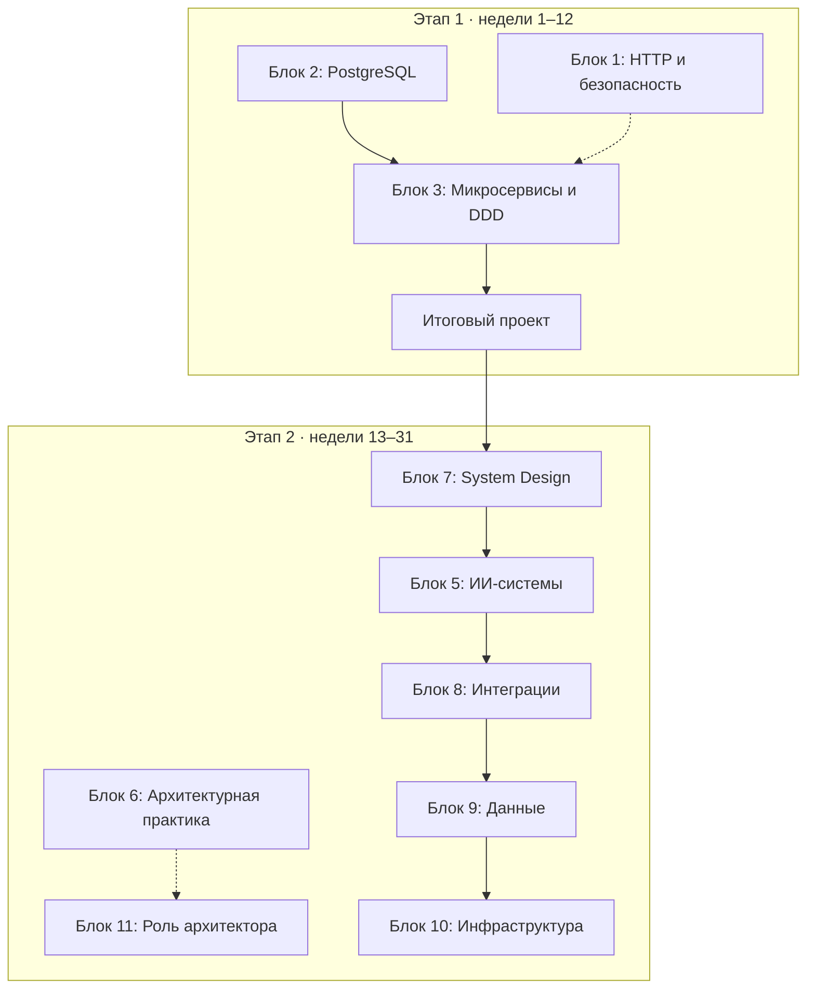

# Architect Study Plan

Личная программа прокачки для системного аналитика / архитектора решений. В каждом модуле — урок на 15–20 минут чтения, практика на своём материале и вопросы в формате собеседования. Одиннадцать блоков: от того, как устроены интеграции и PostgreSQL «под капотом», через микросервисы, System Design и ИИ-системы — к архитектурной практике и роли архитектора.

Цель не «знать определения», а **уметь объяснить механизм и обосновать выбор**: почему здесь Saga, а не распределённая транзакция; почему планировщик не взял индекс; почему gateway и балансировщик — разные компоненты. Именно это спрашивают на собеседованиях уровня senior и именно это отличает сильную постановку от слабой.

## Дорожная карта

Программа идёт в два этапа по 4–6 часов в неделю. Первый этап (12 недель) — фундамент: PostgreSQL, интеграции, микросервисы и итоговый проект. Второй (19 недель) — всё, что спрашивают у архитектора сверх фундамента.

Основной трек — одна тема в неделю; параллельный — по часу в неделю, небольшими порциями.

### Этап 1. Фундамент

| Неделя | Основной трек | Параллельный трек |
|---|---|---|
| 1 | [2.1 MVCC и хранение](02-postgresql/2.1-mvcc-storage.md) | [1.1 Путь HTTP-запроса](01-http-rest-security/1.1-request-lifecycle.md) |
| 2 | [2.2 Изоляция транзакций](02-postgresql/2.2-isolation.md) + [лаба 1](02-postgresql/labs/lab-01-isolation.md) | [1.2 TLS и PKI](01-http-rest-security/1.2-tls-pki.md) |
| 3 | [2.3 Блокировки](02-postgresql/2.3-locks.md) + [лаба 2](02-postgresql/labs/lab-02-locks.md) | [1.2 TLS и PKI](01-http-rest-security/1.2-tls-pki.md) |
| 4 | [2.4 Планировщик](02-postgresql/2.4-planner.md) + [2.5 Индексы](02-postgresql/2.5-indexes.md) + [лаба 3](02-postgresql/labs/lab-03-planner.md) | [1.3 REST-семантика](01-http-rest-security/1.3-rest-semantics.md) |
| 5 | [2.6 WAL, репликация, миграции](02-postgresql/2.6-wal-replication-migrations.md) · [3.1 Зачем микросервисы](03-microservices-ddd/3.1-why-microservices.md) | [1.3 REST-семантика](01-http-rest-security/1.3-rest-semantics.md) |
| 6 | [3.2 Стратегический DDD](03-microservices-ddd/3.2-strategic-ddd.md) | [1.4 OAuth 2.0, OIDC, JWT](01-http-rest-security/1.4-oauth-oidc-jwt.md) |
| 7 | [3.3 Сеть: OSI, балансировщик, gateway, mesh](03-microservices-ddd/3.3-network-gateway-lb.md) | [1.4 OAuth 2.0, OIDC, JWT](01-http-rest-security/1.4-oauth-oidc-jwt.md) |
| 8 | [3.4 Коммуникация и брокеры](03-microservices-ddd/3.4-communication.md) | [1.5 Защита API](01-http-rest-security/1.5-api-security.md) |
| 9 | [3.5 Данные: Saga, Outbox, CQRS](03-microservices-ddd/3.5-data-patterns.md) | [1.5 Защита API](01-http-rest-security/1.5-api-security.md) |
| 10 | [3.6 Устойчивость](03-microservices-ddd/3.6-resilience.md) · [3.7 Наблюдаемость](03-microservices-ddd/3.7-observability.md) | — |
| 11–12 | [Итоговый проект](04-capstone/README.md) | — |

### Этап 2. Архитектор

| Неделя | Основной трек | Параллельный трек |
|---|---|---|
| 13 | [7.1 Метод интервью](07-system-design/7.1-interview-method.md) | [6.1 Атрибуты качества](06-architecture-practice/6.1-quality-attributes.md) |
| 14 | [7.2 Оценки на салфетке](07-system-design/7.2-estimation.md) | [6.1 Атрибуты качества](06-architecture-practice/6.1-quality-attributes.md) |
| 15 | [7.3 Кэширование](07-system-design/7.3-caching.md) | [6.2 ADR](06-architecture-practice/6.2-adr.md) |
| 16 | [7.4 Масштабирование данных](07-system-design/7.4-scaling-data.md) | [6.3 C4 и arc42](06-architecture-practice/6.3-c4-arc42.md) |
| 17 | [7.5 Строительные блоки](07-system-design/7.5-building-blocks.md) | [6.4 Анализ компромиссов](06-architecture-practice/6.4-tradeoff-analysis.md) |
| 18 | [7.6 Классические задачи](07-system-design/7.6-classic-cases.md) | [6.5 Эволюция и легаси](06-architecture-practice/6.5-evolutionary-architecture.md) |
| 19 | [5.1 Как работают LLM](05-ai-engineering/5.1-llm-basics.md) | [11.1 Стейкхолдеры](11-architect-role/11.1-stakeholders.md) |
| 20 | [5.2 RAG](05-ai-engineering/5.2-rag.md) | [11.2 Архитектурное ревью](11-architect-role/11.2-architecture-review.md) |
| 21 | [5.3 Агенты, инструменты, MCP](05-ai-engineering/5.3-agents-tools-mcp.md) | [11.3 Оценка трудоёмкости](11-architect-role/11.3-estimation.md) |
| 22 | [5.4 Оценка качества](05-ai-engineering/5.4-evals.md) | [11.4 Фасилитация](11-architect-role/11.4-facilitation.md) |
| 23 | [5.5 Безопасность LLM](05-ai-engineering/5.5-llm-security.md) | [11.5 Поведенческое интервью](11-architect-role/11.5-behavioral-interview.md) |
| 24 | [5.6 ML-системы в эксплуатации](05-ai-engineering/5.6-ml-in-production.md) | [11.5 Поведенческое интервью](11-architect-role/11.5-behavioral-interview.md) |
| 25 | [5.7 Требования к ИИ-функции](05-ai-engineering/5.7-ai-feature-requirements.md) | — |
| 26 | [8.1 EIP](08-integration-patterns/8.1-eip.md) · [8.2 gRPC и GraphQL](08-integration-patterns/8.2-grpc-graphql.md) | — |
| 27 | [8.3 Жизненный цикл API](08-integration-patterns/8.3-api-lifecycle.md) · [8.4 Пакетные интеграции](08-integration-patterns/8.4-batch-file-integration.md) · [8.5 CDC](08-integration-patterns/8.5-cdc-data-sync.md) · [8.6 Легаси и шины](08-integration-patterns/8.6-legacy-esb.md) | — |
| 28 | [9.1 OLTP и OLAP](09-data-platforms/9.1-oltp-olap.md) · [9.2 Моделирование DWH](09-data-platforms/9.2-dwh-modeling.md) | — |
| 29 | [9.3 Конвейеры и потоки](09-data-platforms/9.3-pipelines-streaming.md) · [9.4 Аналитические СУБД](09-data-platforms/9.4-analytical-engines.md) · [9.5 Качество данных](09-data-platforms/9.5-data-quality-governance.md) | — |
| 30 | [10.1 Kubernetes](10-infrastructure-delivery/10.1-containers-kubernetes.md) · [10.2 CI/CD и релизы](10-infrastructure-delivery/10.2-cicd-release.md) | — |
| 31 | [10.3 Облака](10-infrastructure-delivery/10.3-cloud.md) · [10.4 DR](10-infrastructure-delivery/10.4-dr-multiregion.md) · [10.5 SRE и FinOps](10-infrastructure-delivery/10.5-sre-finops.md) | — |

Блоки 8–10 плотнее по графику: многое там знакомо по практике, и задача — систематизировать, а не учить с нуля. Если тема идёт тяжело — растягивайте, график ориентировочный.

## Как устроен каждый модуль

- **Зачем это аналитику** — где тема всплывает в постановках, интеграциях и на собеседовании.
- **Что понять** — механизмы, которые нужно усвоить; работает как чек-лист.
- **Урок** — основной текст: механизмы, примеры, схемы, типичные ошибки, как говорить об этом на собеседовании.
- **Читать дальше** — книги, документация и главы [system-design.space](https://system-design.space/) для углубления. Необязательно.
- **Практика** — руками, на своём материале и стенде (никогда не на базе или стенде заказчика).
- **Вопросы для самопроверки** — в формате собеседования. Модуль закрыт, когда на каждый вопрос можешь ответить вслух за 2–3 минуты, с примером и без подглядывания.
- **Заметки** — свои формулировки, ошибки, находки. Самое ценное в репозитории.

## Отслеживание прогресса

- Каждый модуль — отдельный issue, каждый блок — milestone. Общая картина — на странице [Прогресс](progress.md): полоски по блокам и статус каждого модуля. В начале каждого модуля тоже есть плашка со статусом и ссылкой на его issue.
- Внутри issue — чек-лист «прочитал / сделал практику / ответил на вопросы / записал заметки». Issue закрывается, только когда отмечены все четыре пункта.
- Заметки коммитятся прямо в файл модуля, в раздел «Заметки». Коммит со ссылкой `Closes #N` закрывает issue автоматически.
- Issues и milestones создаёт скрипт [`scripts/create-issues.ps1`](https://github.com/PaulJurichM/architect-study-plan/blob/main/scripts/create-issues.ps1) по данным из `scripts/modules.json` (нужен GitHub CLI). Добавили модуль — дописали его в JSON и запустили скрипт снова: новые issues он создаст, у существующих (их он находит по пути к файлу модуля) обновит заголовок, milestone и метку.

## Блоки

1. [HTTP, REST и безопасность интеграций](01-http-rest-security/README.md)
2. [PostgreSQL изнутри](02-postgresql/README.md)
3. [Микросервисы, DDD и устойчивость](03-microservices-ddd/README.md)
4. [Итоговый проект](04-capstone/README.md)
5. [ИИ в архитектуре систем](05-ai-engineering/README.md)
6. [Архитектурная практика и документирование](06-architecture-practice/README.md)
7. [System Design для собеседований](07-system-design/README.md)
8. [Интеграционные паттерны за пределами REST](08-integration-patterns/README.md)
9. [Данные и аналитические системы](09-data-platforms/README.md)
10. [Инфраструктура и поставка](10-infrastructure-delivery/README.md)
11. [Архитектор как роль](11-architect-role/README.md)

[Общая библиография](resources.md)

## Правило репозитория

Репозиторий публичный. Никаких названий заказчиков, внутренних систем, схем, логов и данных с реальных проектов — только обезличенные учебные примеры. Тексты уроков — собственные; материалы других авторов только упоминаются в разделах «Читать дальше».
