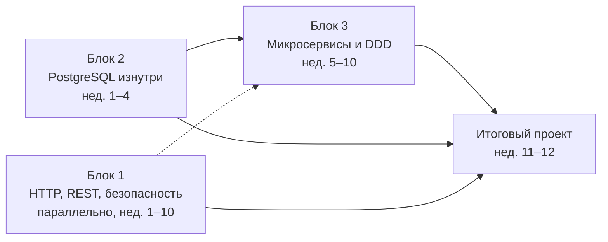

# Architect Study Plan

Личная программа прокачки для системного аналитика / архитектора решений: как устроены интеграции «под капотом», как PostgreSQL на самом деле выполняет запросы и держит конкурентный доступ, и зачем нужны паттерны микросервисной архитектуры.

Цель не «знать определения», а **уметь объяснить механизм и обосновать выбор**: почему здесь Saga, а не распределённая транзакция; почему планировщик не взял индекс; почему gateway и балансировщик — разные компоненты. Именно это спрашивают на собеседованиях уровня senior и именно это отличает сильную постановку от слабой.

## Дорожная карта

Блок 2 идёт первым: он самый конкретный и сразу даёт отдачу в текущей работе. Блок 3 — главный для собеседований. Блок 1 читается параллельно небольшими порциями (≈1 час в неделю). Бюджет: 4–6 часов в неделю, около 12 недель.

| Неделя | Основной трек | Параллельный трек |
|---|---|---|
| 1 | [2.1 MVCC и хранение](02-postgresql/2.1-mvcc-storage.md) | [1.1 Путь HTTP-запроса](01-http-rest-security/1.1-request-lifecycle.md) |
| 2 | [2.2 Изоляция транзакций](02-postgresql/2.2-isolation.md) + [лаба 1](02-postgresql/labs/lab-01-isolation.md) | [1.2 TLS и PKI](01-http-rest-security/1.2-tls-pki.md) |
| 3 | [2.3 Блокировки](02-postgresql/2.3-locks.md) + [лаба 2](02-postgresql/labs/lab-02-locks.md) | [1.2 TLS и PKI](01-http-rest-security/1.2-tls-pki.md) |
| 4 | [2.4 Планировщик](02-postgresql/2.4-planner.md) + [2.5 Индексы](02-postgresql/2.5-indexes.md) + [лаба 3](02-postgresql/labs/lab-03-planner.md) | [1.3 REST-семантика](01-http-rest-security/1.3-rest-semantics.md) |
| 5 | [2.6 WAL, репликация, миграции](02-postgresql/2.6-wal-replication-migrations.md) · [3.1 Зачем микросервисы](03-microservices-ddd/3.1-why-microservices.md) | [1.3 REST-семантика](01-http-rest-security/1.3-rest-semantics.md) |
| 6 | [3.2 Стратегический DDD](03-microservices-ddd/3.2-strategic-ddd.md) | [1.4 OAuth 2.0, OIDC, JWT](01-http-rest-security/1.4-oauth-oidc-jwt.md) |
| 7 | [3.3 Сеть: OSI, балансировщик, gateway, mesh](03-microservices-ddd/3.3-network-gateway-lb.md) | [1.4 OAuth 2.0, OIDC, JWT](01-http-rest-security/1.4-oauth-oidc-jwt.md) |
| 8 | [3.4 Коммуникация и брокеры](03-microservices-ddd/3.4-communication.md) | [1.5 Защита API](01-http-rest-security/1.5-api-security.md) |
| 9 | [3.5 Данные: Saga, Outbox, CQRS](03-microservices-ddd/3.5-data-patterns.md) | [1.5 Защита API](01-http-rest-security/1.5-api-security.md) |
| 10 | [3.6 Устойчивость](03-microservices-ddd/3.6-resilience.md) · [3.7 Наблюдаемость](03-microservices-ddd/3.7-observability.md) | — |
| 11–12 | [Итоговый проект](04-capstone/README.md) | — |

## Как устроен каждый модуль

- **Зачем это аналитику** — где тема всплывает в постановках, интеграциях и на собеседовании.
- **Что понять** — механизмы, а не определения.
- **Читать** — конкретные главы, а не «всю книгу».
- **Практика** — руками, на своём стенде (никогда не на базе или стенде заказчика).
- **Вопросы для самопроверки** — в формате собеседования. Модуль закрыт, когда на каждый вопрос можешь ответить вслух за 2–3 минуты, с примером и без подглядывания.
- **Заметки** — свои формулировки, ошибки, находки. Самое ценное в репозитории.

## Отслеживание прогресса

- Каждый модуль — отдельный issue, каждый блок — milestone. Общая картина — на странице [Прогресс](progress.md): полоски по блокам и статус каждого модуля. В начале каждого модуля тоже есть плашка со статусом и ссылкой на его issue.
- Внутри issue — чек-лист «прочитал / сделал практику / ответил на вопросы / записал заметки». Issue закрывается, только когда отмечены все четыре пункта.
- Заметки коммитятся прямо в файл модуля, в раздел «Заметки». Коммит со ссылкой `Closes #N` закрывает issue автоматически.
- Issues и milestones создаёт скрипт [`scripts/create-issues.ps1`](https://github.com/PaulJurichM/architect-study-plan/blob/main/scripts/create-issues.ps1) по данным из `scripts/modules.json` (нужен GitHub CLI). Добавили модуль — дописали его в JSON и запустили скрипт снова, существующие issues он пропустит.

## Блоки

1. [HTTP, REST и безопасность интеграций](01-http-rest-security/README.md)
2. [PostgreSQL изнутри](02-postgresql/README.md)
3. [Микросервисы, DDD и устойчивость](03-microservices-ddd/README.md)
4. [Итоговый проект](04-capstone/README.md)

[Общая библиография](resources.md)

## Правило репозитория

Репозиторий публичный. Никаких названий заказчиков, внутренних систем, схем, логов и данных с реальных проектов — только обезличенные учебные примеры.
